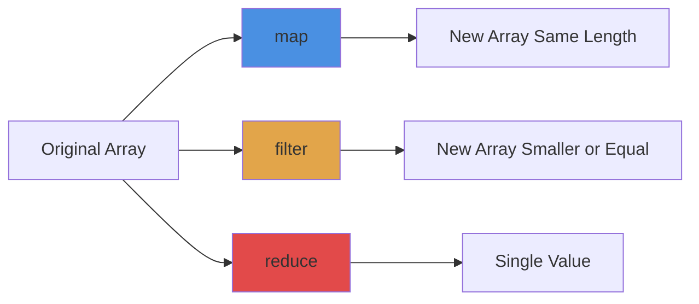

# Array Methods in JavaScript

## What are Array Methods?

Array methods are built-in functions that help you work with arrays without writing loops. They make your code cleaner, more readable, and easier to maintain.

Instead of writing a for loop every time you need to transform or filter data, you use methods like `map`, `filter`, and `reduce` that do the heavy lifting for you.

## Why use them?

**Old way (manual loops):**
```javascript
const numbers = [1, 2, 3, 4, 5];
const doubled = [];

for (let i = 0; i < numbers.length; i++) {
  doubled.push(numbers[i] * 2);
}
```

**Modern way (array methods):**
```javascript
const numbers = [1, 2, 3, 4, 5];
const doubled = numbers.map(n => n * 2);
```

Benefits:
- Less code to write and maintain
- Easier to understand at a glance
- Fewer bugs (no index errors)
- Chainable for complex operations
- Functional programming style

## Core array methods

### map() - Transform each item

Takes each item in an array and transforms it into something else.

```javascript
const numbers = [1, 2, 3, 4];
const doubled = numbers.map(num => num * 2);
// [2, 4, 6, 8]

const users = [{name: 'John'}, {name: 'Jane'}];
const names = users.map(user => user.name);
// ['John', 'Jane']
```

**Use when:** You need to transform every item in an array.

### filter() - Select items that match a condition

Returns a new array with only the items that pass your test.

```javascript
const numbers = [1, 2, 3, 4, 5, 6];
const evens = numbers.filter(num => num % 2 === 0);
// [2, 4, 6]

const users = [
  {name: 'John', age: 25},
  {name: 'Jane', age: 17}
];
const adults = users.filter(user => user.age >= 18);
// [{name: 'John', age: 25}]
```

**Use when:** You need to keep only certain items based on a condition.

### reduce() - Combine items into a single value

Takes an array and reduces it to a single value (number, string, object, etc).

```javascript
const numbers = [1, 2, 3, 4];
const sum = numbers.reduce((total, num) => total + num, 0);
// 10

const items = [
  {name: 'apple', price: 2},
  {name: 'banana', price: 1}
];
const total = items.reduce((sum, item) => sum + item.price, 0);
// 3
```

**Use when:** You need to calculate a single value from an array.

## Visual comparison



## Method chaining

You can chain methods together for complex operations:

```javascript
const numbers = [1, 2, 3, 4, 5, 6];

const result = numbers
  .filter(n => n % 2 === 0)  // Get evens: [2, 4, 6]
  .map(n => n * 2)            // Double them: [4, 8, 12]
  .reduce((sum, n) => sum + n, 0); // Sum: 24

console.log(result); // 24
```

This reads like: "Filter evens, then double them, then sum them up."

## Other useful methods

### find() - Get first matching item

```javascript
const users = [
  {id: 1, name: 'John'},
  {id: 2, name: 'Jane'}
];

const user = users.find(u => u.id === 2);
// {id: 2, name: 'Jane'}
```

### some() - Check if any item matches

```javascript
const numbers = [1, 2, 3, 4];
const hasEven = numbers.some(n => n % 2 === 0);
// true
```

### every() - Check if all items match

```javascript
const numbers = [2, 4, 6];
const allEven = numbers.every(n => n % 2 === 0);
// true
```

### forEach() - Do something with each item

```javascript
const names = ['John', 'Jane', 'Bob'];
names.forEach(name => console.log(name));
// Prints each name
```

**Note:** forEach doesn't return anything, unlike map.

### includes() - Check if array has a value

```javascript
const fruits = ['apple', 'banana', 'orange'];
console.log(fruits.includes('banana')); // true
console.log(fruits.includes('grape')); // false
```

## Common patterns

**1. Transform and filter together**

```javascript
const products = [
  {name: 'Laptop', price: 1000, inStock: true},
  {name: 'Phone', price: 500, inStock: false},
  {name: 'Tablet', price: 300, inStock: true}
];

const availablePrices = products
  .filter(p => p.inStock)
  .map(p => p.price);
// [1000, 300]
```

**2. Group items by property**

```javascript
const students = [
  {name: 'John', grade: 'A'},
  {name: 'Jane', grade: 'B'},
  {name: 'Bob', grade: 'A'}
];

const grouped = students.reduce((acc, student) => {
  if (!acc[student.grade]) {
    acc[student.grade] = [];
  }
  acc[student.grade].push(student.name);
  return acc;
}, {});
// {A: ['John', 'Bob'], B: ['Jane']}
```

**3. Remove duplicates**

```javascript
const numbers = [1, 2, 2, 3, 3, 4];
const unique = [...new Set(numbers)];
// [1, 2, 3, 4]
```

**4. Flatten nested arrays**

```javascript
const nested = [[1, 2], [3, 4], [5]];
const flat = nested.flat();
// [1, 2, 3, 4, 5]

// Or with flatMap
const numbers = [1, 2, 3];
const doubled = numbers.flatMap(n => [n, n * 2]);
// [1, 2, 2, 4, 3, 6]
```

## Common mistakes

**1. Forgetting to return in map**

```javascript
// Wrong - returns undefined
const doubled = numbers.map(n => {
  n * 2; // Missing return!
});

// Correct
const doubled = numbers.map(n => {
  return n * 2;
});

// Or use implicit return
const doubled = numbers.map(n => n * 2);
```

**2. Mutating the original array**

```javascript
// Wrong - modifies original
const numbers = [1, 2, 3];
numbers.map(n => numbers.push(n * 2)); // Don't do this!

// Correct - creates new array
const doubled = numbers.map(n => n * 2);
```

**3. Using forEach when you need map**

```javascript
// Wrong - forEach doesn't return anything
const doubled = numbers.forEach(n => n * 2);
console.log(doubled); // undefined

// Correct
const doubled = numbers.map(n => n * 2);
```

**4. Not providing initial value to reduce**

```javascript
// Can cause issues with empty arrays
const sum = numbers.reduce((acc, n) => acc + n);

// Better - always provide initial value
const sum = numbers.reduce((acc, n) => acc + n, 0);
```

## Performance considerations

**These methods are slower than for loops** for simple operations, but:
- The difference is negligible for most cases
- Readability matters more than micro-optimizations
- Modern JavaScript engines optimize them well

**Use for loops when:**
- Processing millions of items
- Need to break early (use `find()` or `some()` instead)
- Performance is critical

**Use array methods when:**
- Readability matters (most of the time)
- Working with typical data sizes
- Building data transformations

## Real-world example

```javascript
// Get total price of available products over $100
const products = [
  {name: 'Laptop', price: 1000, available: true},
  {name: 'Mouse', price: 25, available: true},
  {name: 'Keyboard', price: 75, available: false},
  {name: 'Monitor', price: 300, available: true}
];

const total = products
  .filter(p => p.available)           // Only available
  .filter(p => p.price > 100)         // Over $100
  .map(p => p.price)                  // Get prices
  .reduce((sum, price) => sum + price, 0); // Sum them

console.log(total); // 1300
```

## Best practices

**Return new values, don't mutate:**
```javascript
// Good
const doubled = numbers.map(n => n * 2);

// Bad
numbers.forEach((n, i) => numbers[i] = n * 2);
```

**Use descriptive variable names:**
```javascript
// Good
const activeUsers = users.filter(user => user.isActive);

// Less clear
const filtered = users.filter(u => u.isActive);
```

**Chain methods for readable pipelines:**
```javascript
const result = data
  .filter(item => item.active)
  .map(item => item.value)
  .reduce((sum, val) => sum + val, 0);
```

**Use arrow functions for simple operations:**
```javascript
// Simple operation - arrow function is fine
const doubled = numbers.map(n => n * 2);

// Complex logic - regular function might be clearer
const processed = data.map(function(item) {
  // Multiple lines of logic
  const value = complexCalculation(item);
  return value;
});
```

## Things to remember

1. `map()` always returns a new array of the same length
2. `filter()` returns a new array with 0 to n items
3. `reduce()` returns a single value (any type)
4. These methods don't modify the original array
5. Always provide an initial value to `reduce()`
6. Use arrow functions for concise callbacks
7. Chain methods for complex transformations
8. `forEach()` returns undefined, not an array

## Related topics

- Closures - Array method callbacks use closures
- Higher-order functions - Functions that take functions
- Spread operator - Often used with arrays
- Destructuring - Useful with array methods