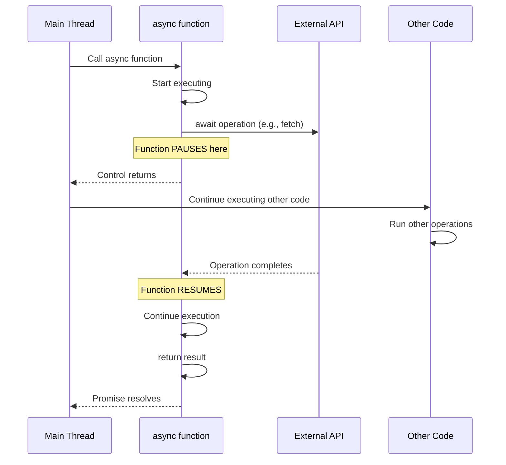

# Async/Await in JavaScript

## What is it?

Async/await makes asynchronous code easier to write and read. Instead of chaining `.then()` calls, you can write async code that looks like normal synchronous code.

It's built on top of Promises - so you need to understand Promises first. Think of async/await as a cleaner way to work with Promises.

**Simple analogy:** When you order food online, you don't sit and stare at the app until it arrives. You do other things and come back when you get the notification. That's basically what await does - it lets JavaScript do other work while waiting for something to complete.


## Why use it?

Promise chains get messy quickly:
```javascript
// With Promises
fetchUser()
  .then(user => fetchPosts(user.id))
  .then(posts => fetchComments(posts[0].id))
  .then(comments => console.log(comments))
  .catch(error => console.error(error));
```

With async/await, it's much cleaner:

```javascript
// With async/await
try {
  const user = await fetchUser();
  const posts = await fetchPosts(user.id);
  const comments = await fetchComments(posts[0].id);
  console.log(comments);
} catch (error) {
  console.error(error);
}
```

Main benefits:
- Easier to read and understand
- Simple error handling with try/catch
- Easier to debug


## How it works




## Key concepts

**The `async` keyword:**
- Put it before a function to make it async
- The function automatically returns a Promise

```javascript
async function example() {
  return 42;
}
// This is the same as returning Promise.resolve(42)
```

**The `await` keyword:**
- Only works inside async functions
- Pauses the function until the Promise is done
- Returns the actual value (not the Promise)

**Error handling:**
Use try/catch blocks. Without them, errors will crash your app.

**Sequential vs Parallel:**
This is important for performance.

```javascript
// Sequential - each waits for previous (SLOW - 6 seconds)
const a = await fetchA(); // 2s
const b = await fetchB(); // 2s  
const c = await fetchC(); // 2s

// Parallel - all run at once (FAST - 2 seconds)
const [a, b, c] = await Promise.all([
  fetchA(),
  fetchB(),
  fetchC()
]);
```


## Common mistakes I've seen

**1. Forgetting the `await` keyword**
```javascript
// Wrong
const data = fetchData();
console.log(data); // Promise { <pending> }

// Correct
const data = await fetchData();
console.log(data); // Actual data
```

**2. Not handling errors**
```javascript
// Wrong - will crash
async function getData() {
  const data = await fetchData();
  return data;
}

// Correct - handles errors
async function getData() {
  try {
    const data = await fetchData();
    return data;
  } catch (error) {
    console.error('Failed:', error);
    return null;
  }
}
```

**3. Running things sequentially when they could be parallel**
```javascript
// Slow - waits for each one
async function slow() {
  const users = await fetchUsers();     // waits
  const posts = await fetchPosts();     // waits
  const comments = await fetchComments(); // waits
}

// Fast - all at once
async function fast() {
  const [users, posts, comments] = await Promise.all([
    fetchUsers(),
    fetchPosts(),
    fetchComments()
  ]);
}
```

**4. Using await inside loops**
```javascript
// Very slow - one by one
for (const id of userIds) {
  const user = await fetchUser(id);
  console.log(user);
}

// Much faster - all at once
const users = await Promise.all(
  userIds.map(id => fetchUser(id))
);
```


## Best practices

**Always handle errors with try/catch:**
```javascript
async function robustFunction() {
  try {
    const data = await fetchData();
    return data;
  } catch (error) {
    console.error('Error:', error.message);
    return null;
  }
}
```

**Use parallel execution when operations don't depend on each other:**
```javascript
const [profile, settings, notifications] = await Promise.all([
  fetchProfile(),
  fetchSettings(),
  fetchNotifications()
]);
```

**Name your functions clearly:**
```javascript
// Good
async function fetchUserProfile() { }
async function saveUserData() { }

// Not clear
async function getData() { }
async function process() { }
```

**Return early when possible:**
```javascript
async function processData(id) {
  if (!id) return null;
  
  try {
    const data = await fetchData(id);
    if (!data) return null;
    return processResult(data);
  } catch (error) {
    console.error(error);
    return null;
  }
}
```


## Things to remember

1. `async` makes a function return a Promise
2. `await` pauses the function until the Promise finishes
3. Always use try/catch for error handling
4. Use `Promise.all()` for parallel operations
5. `await` only works inside async functions


## Related topics

- Promises - The foundation of async/await
- Event Loop - How JavaScript handles async operations
- Fetch API - Common use case for async/await