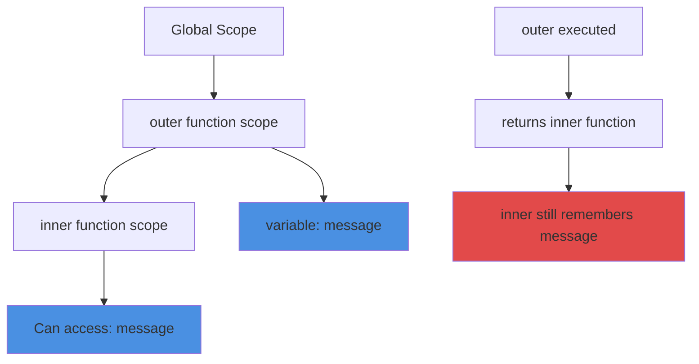
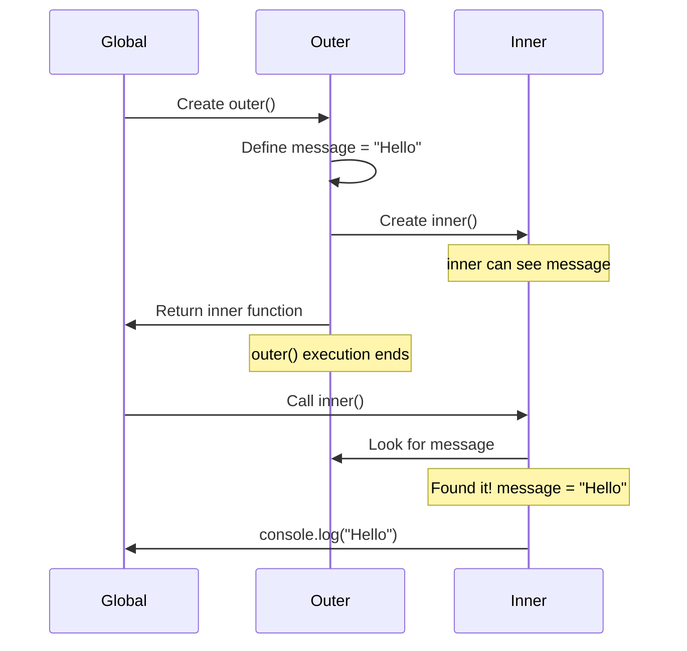

# Closures in JavaScript

## What are Closures?

A closure is when a function remembers and accesses variables from outside its own scope, even after the outer function has finished executing.

Think of it like this: you write a note, put it in a box, and give that box to someone. Even after you leave, they can still open the box and read your note. That's essentially what a closure does - it "boxes up" the variables for the inner function to use later.

## Why are Closures important?

Closures are everywhere in JavaScript, whether you realize it or not:

- Event handlers and callbacks
- Data privacy and encapsulation
- Function factories
- Maintaining state in async operations

Understanding closures helps you write better code and avoid common bugs.

## How Closures work

Here's the basic pattern:

```javascript
function outer() {
  const message = "Hello";
  
  function inner() {
    console.log(message); // Can access outer's variable
  }
  
  return inner;
}

const myFunction = outer();
myFunction(); // Prints "Hello"
```

Even though `outer()` finished executing, `inner()` still has access to `message`. That's a closure.

## Visual explanation



## Scope chain visualization



## Real-world example - Counter

```javascript
function createCounter() {
  let count = 0;
  
  return {
    increment() {
      count++;
      return count;
    },
    decrement() {
      count--;
      return count;
    },
    getCount() {
      return count;
    }
  };
}

const counter = createCounter();
console.log(counter.increment()); // 1
console.log(counter.increment()); // 2
console.log(counter.getCount());  // 2
```

The `count` variable is private - you can't access it directly, only through the methods. This is data privacy using closures.

## Common patterns

**1. Function factory**

```javascript
function multiplyBy(factor) {
  return function(number) {
    return number * factor;
  };
}

const double = multiplyBy(2);
const triple = multiplyBy(3);

console.log(double(5)); // 10
console.log(triple(5)); // 15
```

**2. Event handlers**

```javascript
function setupButtons() {
  for (let i = 1; i <= 3; i++) {
    document.getElementById(`btn-${i}`).addEventListener('click', function() {
      console.log(`Button ${i} clicked`); // Closure remembers 'i'
    });
  }
}
```

**3. Private variables**

```javascript
function createUser(name) {
  let password = 'secret123'; // Private
  
  return {
    getName() {
      return name;
    },
    checkPassword(input) {
      return input === password;
    }
    // No way to directly access 'password'
  };
}
```

## Common mistakes

**1. Closure in loops with var**

```javascript
// Wrong - all functions share same 'i'
for (var i = 0; i < 3; i++) {
  setTimeout(function() {
    console.log(i); // Prints 3, 3, 3
  }, 1000);
}

// Right - 'let' creates new binding each iteration
for (let i = 0; i < 3; i++) {
  setTimeout(function() {
    console.log(i); // Prints 0, 1, 2
  }, 1000);
}

// Right - using closure properly with var
for (var i = 0; i < 3; i++) {
  (function(index) {
    setTimeout(function() {
      console.log(index); // Prints 0, 1, 2
    }, 1000);
  })(i);
}
```

**2. Memory leaks**

```javascript
// Careful - this keeps large object in memory
function problematic() {
  const hugeData = new Array(1000000).fill('data');
  
  return function() {
    console.log('Hello');
    // Even though we don't use hugeData, it's still in closure
  };
}

// Better - only close over what you need
function better() {
  const hugeData = new Array(1000000).fill('data');
  const smallThing = hugeData[0];
  
  return function() {
    console.log(smallThing); // Only keeps 'smallThing'
  };
}
```

**3. Accidental global variables**

```javascript
// Wrong - forgot to use const/let/var
function oops() {
  count = 0; // This becomes global!
  
  return function() {
    count++;
    return count;
  };
}

// Correct
function proper() {
  let count = 0; // Properly scoped
  
  return function() {
    count++;
    return count;
  };
}
```

## Best practices

**Keep closures small**

```javascript
// Good - only close over what's needed
function createGreeter(name) {
  return function(greeting) {
    return `${greeting}, ${name}!`;
  };
}

// Avoid - closing over unnecessary data
function createGreeterBad(user) { // Whole user object
  return function(greeting) {
    return `${greeting}, ${user.name}!`; // Only need name
  };
}
```

**Be aware of memory**

If a closure keeps a reference to large objects, they won't be garbage collected. Only close over what you actually need.

**Use closures for privacy**

```javascript
function createBankAccount(initialBalance) {
  let balance = initialBalance; // Private
  
  return {
    deposit(amount) {
      balance += amount;
      return balance;
    },
    withdraw(amount) {
      if (amount <= balance) {
        balance -= amount;
        return balance;
      }
      return 'Insufficient funds';
    },
    getBalance() {
      return balance;
    }
  };
}

const account = createBankAccount(100);
console.log(account.balance); // undefined - can't access directly
console.log(account.getBalance()); // 100 - must use method
```

## Things to remember

1. Closures happen automatically when inner functions reference outer variables
2. The inner function keeps a reference to outer variables, not copies
3. Closures are useful for data privacy and creating function factories
4. Be careful with closures in loops (use `let` not `var`)
5. Closures can cause memory leaks if not careful
6. Every function in JavaScript is a closure

## Related topics

- Scope and Scope Chain - How JavaScript looks up variables
- Event Loop - Closures in async callbacks
- this keyword - Different from closures but often confused
- Module Pattern - Uses closures for encapsulation