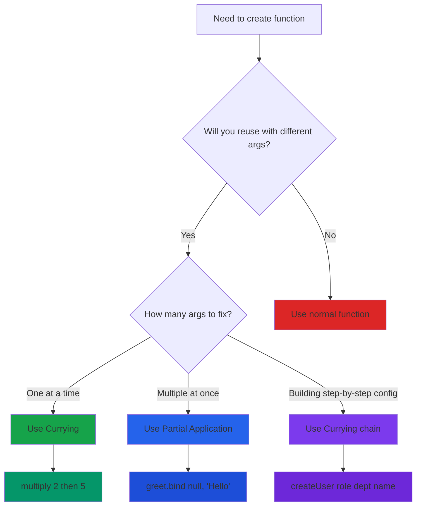

# Currying & Partial Application

## What is Currying?

Currying is the process of transforming a function that takes multiple arguments into a sequence of functions that each take a single argument.

Instead of calling `add(1, 2, 3)`, you call `add(1)(2)(3)`.

Think of it like a vending machine with multiple slots. Instead of inserting all coins at once, you insert them one at a time, and the machine remembers what you've put in so far.

## What is Partial Application?

Partial application means fixing a few arguments of a function and producing another function with fewer arguments.

If you have `add(a, b, c)`, you can create `addFive = add(5)` which only needs `b` and `c`.

It's like pre-filling a form - you fill in some fields now, and complete the rest later.

## Why does this matter?

These patterns help you:
- Create reusable, specialized functions from generic ones
- Write cleaner, more maintainable code
- Implement function composition
- Reduce code duplication
- Pass around partially configured functions

**Interview importance:** Asked in 60% of mid-to-senior level JavaScript interviews. Common question: "Implement a sum function that works like sum(1)(2)(3)".

## The difference between them

**Currying:** Always returns a function that takes exactly one argument at a time.
**Partial Application:** Can fix any number of arguments and return a function expecting the remaining ones.

```javascript
// Currying - one argument at a time
const curriedAdd = (a) => (b) => (c) => a + b + c;
curriedAdd(1)(2)(3); // 6

// Partial Application - can fix multiple arguments
const add = (a, b, c) => a + b + c;
const addFive = add.bind(null, 5);
addFive(2, 3); // 10
```

## Basic Currying

### Manual currying

```javascript
function add(a) {
  return function(b) {
    return function(c) {
      return a + b + c;
    }
  }
}

const result = add(1)(2)(3); // 6
```

### Arrow function syntax

```javascript
const add = (a) => (b) => (c) => a + b + c;

add(1)(2)(3); // 6
```

### Two-argument curry

```javascript
const multiply = (a) => (b) => a * b;

const double = multiply(2);
const triple = multiply(3);

double(5);  // 10
triple(5);  // 15
```

## Visualizing the execution flow


## When to use what



## Partial Application with bind()

The `bind()` method creates a new function with pre-filled arguments.

```javascript
function greet(greeting, name) {
  return greeting + ', ' + name;
}

const sayHello = greet.bind(null, 'Hello');
sayHello('John'); // Hello, John
sayHello('Jane'); // Hello, Jane
```

**How bind works:**
- First argument: value of `this` (use `null` if not needed)
- Remaining arguments: pre-filled parameters

## Real-world examples

### 1. Discount calculator

```javascript
const applyDiscount = (discount) => (price) => {
  return price - (price * discount);
};

const tenPercentOff = applyDiscount(0.10);
const twentyPercentOff = applyDiscount(0.20);

tenPercentOff(100);    // 90
twentyPercentOff(100); // 80
```

### 2. API request builder

```javascript
const makeRequest = (baseURL) => (endpoint) => (params) => {
  return `${baseURL}${endpoint}?${new URLSearchParams(params)}`;
};

const apiCall = makeRequest('https://api.example.com');
const userAPI = apiCall('/users');

userAPI({ id: 1 });        // https://api.example.com/users?id=1
userAPI({ page: 2 });      // https://api.example.com/users?page=2
```

### 3. Logger with levels

```javascript
const log = (level) => (message) => {
  console.log(`[${level}] ${message}`);
};

const error = log('ERROR');
const info = log('INFO');
const debug = log('DEBUG');

error('Something went wrong');  // [ERROR] Something went wrong
info('App started');            // [INFO] App started
```

### 4. Validation functions

```javascript
const hasLength = (min) => (str) => str.length >= min;
const hasNumber = (str) => /\d/.test(str);
const hasSpecialChar = (str) => /[!@#$%^&*]/.test(str);

const isValidPassword = hasLength(8);

isValidPassword('abc123');      // false
isValidPassword('abc12345');    // true
```

## Creating a generic curry function

```javascript
function curry(fn) {
  return function curried(...args) {
    if (args.length >= fn.length) {
      return fn.apply(this, args);
    } else {
      return function(...nextArgs) {
        return curried.apply(this, args.concat(nextArgs));
      }
    }
  };
}

// Usage
function sum(a, b, c) {
  return a + b + c;
}

const curriedSum = curry(sum);

curriedSum(1)(2)(3);     // 6
curriedSum(1, 2)(3);     // 6
curriedSum(1)(2, 3);     // 6
curriedSum(1, 2, 3);     // 6
```

This curry function works with any number of arguments and allows flexible calling.

## Practical patterns

### Configuration builder

```javascript
const createUser = (role) => (department) => (name) => {
  return {
    name,
    role,
    department,
    createdAt: new Date()
  };
};

const createAdmin = createUser('admin');
const createITAdmin = createAdmin('IT');

const user1 = createITAdmin('John');
const user2 = createITAdmin('Jane');
```

### Event handler factory

```javascript
const createHandler = (type) => (selector) => (callback) => {
  document.querySelector(selector).addEventListener(type, callback);
};

const onClick = createHandler('click');
const onButtonClick = onClick('button');

onButtonClick(() => console.log('Button clicked'));
```

### Mathematical operations

```javascript
const calculate = (operation) => (a) => (b) => {
  switch(operation) {
    case 'add': return a + b;
    case 'subtract': return a - b;
    case 'multiply': return a * b;
    case 'divide': return a / b;
  }
};

const add = calculate('add');
const addTen = add(10);

addTen(5);  // 15
addTen(20); // 30
```

## Function composition with currying

```javascript
const compose = (f) => (g) => (x) => f(g(x));

const addOne = (x) => x + 1;
const double = (x) => x * 2;

const addOneThenDouble = compose(double)(addOne);

addOneThenDouble(5); // 12 (5 + 1 = 6, then 6 * 2 = 12)
```

## Interview questions

### Question 1: Implement sum(1)(2)(3)...(n)()

```javascript
function sum(a) {
  return function(b) {
    if (b) {
      return sum(a + b);
    }
    return a;
  }
}

sum(1)(2)(3)(4)(); // 10
```

### Question 2: Curry a multiply function

```javascript
function multiply(a, b, c) {
  return a * b * c;
}

function curry(fn) {
  return function curried(...args) {
    if (args.length >= fn.length) {
      return fn(...args);
    }
    return (...nextArgs) => curried(...args, ...nextArgs);
  };
}

const curriedMultiply = curry(multiply);
curriedMultiply(2)(3)(4);     // 24
curriedMultiply(2, 3)(4);     // 24
```

### Question 3: Create a pipe function

```javascript
const pipe = (...fns) => (x) => fns.reduce((acc, fn) => fn(acc), x);

const addTwo = (x) => x + 2;
const multiplyByThree = (x) => x * 3;
const subtractOne = (x) => x - 1;

const calculate = pipe(addTwo, multiplyByThree, subtractOne);
calculate(5); // ((5 + 2) * 3) - 1 = 20
```

## Common mistakes

### Mistake 1: Forgetting to return functions

```javascript
// Wrong
const add = (a) => {
  (b) => a + b;  // Missing return
};

// Correct
const add = (a) => {
  return (b) => a + b;
};

// Or with implicit return
const add = (a) => (b) => a + b;
```

### Mistake 2: Using arrow functions with this

```javascript
// Wrong - arrow functions don't bind this
const person = {
  name: 'John',
  greet: (greeting) => () => {
    return greeting + ', ' + this.name; // this is undefined
  }
};

// Correct - use regular functions
const person = {
  name: 'John',
  greet: function(greeting) {
    return () => {
      return greeting + ', ' + this.name; // Works
    };
  }
};
```

### Mistake 3: Too many nested functions

```javascript
// Hard to read
const complex = (a) => (b) => (c) => (d) => (e) => (f) => a + b + c + d + e + f;

// Better - use a curry helper
function add(...args) {
  return args.reduce((sum, n) => sum + n, 0);
}
const curriedAdd = curry(add);
```

## When to use currying

**Good use cases:**
- Creating specialized versions of generic functions
- Building configuration objects step by step
- Function composition
- Event handler factories
- Reusable validation logic

**Avoid when:**
- Simple one-time functions
- Performance is critical (currying adds overhead)
- Code readability suffers
- Team is unfamiliar with the pattern

## Performance considerations

Curried functions create closures and new function objects, which can impact performance in tight loops.

```javascript
// Slower
const curriedAdd = (a) => (b) => (c) => a + b + c;
for (let i = 0; i < 1000000; i++) {
  curriedAdd(1)(2)(3);
}

// Faster
function add(a, b, c) {
  return a + b + c;
}
for (let i = 0; i < 1000000; i++) {
  add(1, 2, 3);
}
```

Use currying for code organization, not micro-optimization.

## Debugging tips

Curried functions can be harder to debug. Name your functions:

```javascript
// Hard to debug
const add = (a) => (b) => (c) => a + b + c;

// Easier to debug
const add = function addA(a) {
  return function addB(b) {
    return function addC(c) {
      return a + b + c;
    };
  };
};
```

Function names appear in stack traces and help identify issues.

## Things to remember

1. Currying converts multi-argument functions into sequences of single-argument functions
2. Partial application pre-fills some arguments of a function
3. Use arrow functions for concise curried functions
4. Use `bind()` for partial application
5. Create generic curry helpers for reusability
6. Currying enables function composition
7. Don't overuse - balance readability with cleverness
8. Common interview pattern: `sum(1)(2)(3)()`

## Related concepts

- **Closures** - Currying relies heavily on closures to remember arguments
- **Higher-Order Functions** - Functions that return or accept other functions
- **Function Composition** - Combining simple functions to build complex ones
- **Point-Free Style** - Writing functions without explicitly mentioning arguments