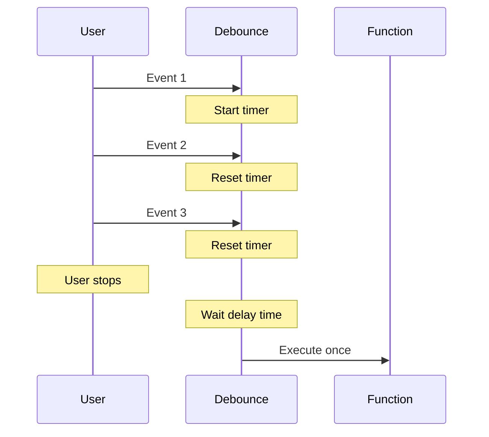
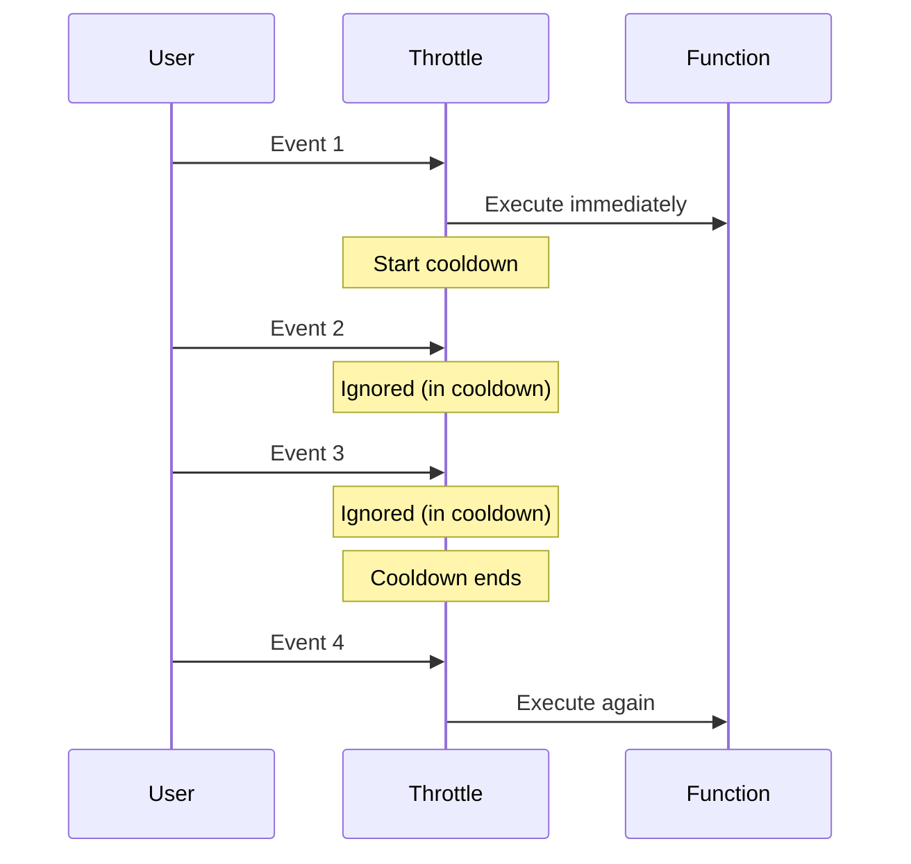

# Debouncing & Throttling

## What are they?

Debouncing and throttling are techniques to control how many times a function can execute over time. They're used to improve performance by limiting the number of times expensive operations run.

Think of it like this:
- **Debouncing** - Wait until someone stops doing something before responding
- **Throttling** - Respond at most once every X seconds, no matter how many times they ask

## Why do we need them?

Some events fire very frequently:
- Window resize events
- Scroll events
- Keystroke events in search boxes
- Mouse movement

Without debouncing or throttling, your functions could run hundreds of times per second, causing performance issues.

## Debouncing

Debouncing delays function execution until after a certain amount of time has passed since the last time it was called.

**Real-world analogy:** An elevator door. It waits a few seconds after the last person enters before closing. If someone else walks in, the timer resets.

### Basic example

```javascript
function debounce(func, delay) {
  let timeoutId;
  
  return function(...args) {
    clearTimeout(timeoutId);
    
    timeoutId = setTimeout(() => {
      func.apply(this, args);
    }, delay);
  };
}

// Usage
const searchAPI = debounce((query) => {
  console.log('Searching for:', query);
}, 500);

searchAPI('hello'); // Cancelled
searchAPI('hello w'); // Cancelled
searchAPI('hello world'); // Executes after 500ms
```

### When to use debouncing

- **Search boxes** - Wait until user stops typing
- **Window resize** - Wait until user finishes resizing
- **Form validation** - Wait until user stops typing in a field
- **Auto-save** - Save after user stops editing

## Throttling

Throttling ensures a function runs at most once in a specified time period, regardless of how many times it's triggered.

**Real-world analogy:** A bouncer at a club. Only lets people in every 5 seconds, no matter how many are waiting.

### Basic example

```javascript
function throttle(func, limit) {
  let inThrottle;
  
  return function(...args) {
    if (!inThrottle) {
      func.apply(this, args);
      inThrottle = true;
      
      setTimeout(() => {
        inThrottle = false;
      }, limit);
    }
  };
}

// Usage
const handleScroll = throttle(() => {
  console.log('Scroll position:', window.scrollY);
}, 1000);

window.addEventListener('scroll', handleScroll);
// Only logs once per second, even if scrolling continuously
```

### When to use throttling

- **Scroll events** - Update scroll position indicator
- **Mouse movement** - Track cursor position
- **Button clicks** - Prevent multiple rapid clicks
- **API rate limiting** - Don't exceed API call limits
- **Game loop** - Limit frame rate calculations

## Visual Comparison





## Debouncing vs Throttling

| Feature | Debouncing | Throttling |
|---------|------------|------------|
| When it runs | After events stop | During events at intervals |
| Use case | Search as you type | Scroll events |
| Execution | Once after delay | Every X milliseconds |
| Example | Wait until typing stops | Log scroll position every second |

**Simple rule:**
- **Debounce** - "Do this once they're done"
- **Throttle** - "Do this at most every X seconds"

## Implementation Patterns

### Debounce with immediate option

```javascript
function debounce(func, delay, immediate = false) {
  let timeoutId;
  
  return function(...args) {
    const callNow = immediate && !timeoutId;
    
    clearTimeout(timeoutId);
    
    timeoutId = setTimeout(() => {
      timeoutId = null;
      if (!immediate) {
        func.apply(this, args);
      }
    }, delay);
    
    if (callNow) {
      func.apply(this, args);
    }
  };
}

// Executes immediately on first call, then waits
const saveImmediate = debounce(saveData, 1000, true);
```

### Throttle with trailing option

```javascript
function throttle(func, limit, trailing = true) {
  let inThrottle;
  let lastArgs;
  
  return function(...args) {
    if (!inThrottle) {
      func.apply(this, args);
      inThrottle = true;
      
      setTimeout(() => {
        inThrottle = false;
        if (trailing && lastArgs) {
          func.apply(this, lastArgs);
          lastArgs = null;
        }
      }, limit);
    } else if (trailing) {
      lastArgs = args;
    }
  };
}
```

## Real-world Examples

### Search box with debouncing

```javascript
const searchBox = document.getElementById('search');

const searchAPI = debounce((query) => {
  if (query.length < 3) return;
  
  fetch(`/api/search?q=${query}`)
    .then(res => res.json())
    .then(results => displayResults(results));
}, 500);

searchBox.addEventListener('input', (e) => {
  searchAPI(e.target.value);
});
```

### Scroll tracking with throttling

```javascript
const updateScrollPosition = throttle(() => {
  const scrollPercent = (window.scrollY / document.body.scrollHeight) * 100;
  document.getElementById('progress').style.width = scrollPercent + '%';
}, 100);

window.addEventListener('scroll', updateScrollPosition);
```

### Window resize with debouncing

```javascript
const handleResize = debounce(() => {
  const width = window.innerWidth;
  const height = window.innerHeight;
  
  console.log('Window resized to:', width, 'x', height);
  // Recalculate layout, update charts, etc.
}, 250);

window.addEventListener('resize', handleResize);
```

### Button click prevention with throttling

```javascript
const submitButton = document.getElementById('submit');

const handleSubmit = throttle(() => {
  console.log('Form submitted');
  // Submit form logic
}, 2000);

submitButton.addEventListener('click', handleSubmit);
// Can only submit once every 2 seconds
```

## Common Mistakes

**1. Not storing the debounced/throttled function**

```javascript
// Wrong - creates new function every render
input.addEventListener('input', () => {
  debounce(search, 500)(); // This doesn't work!
});

// Correct - store the debounced function
const debouncedSearch = debounce(search, 500);
input.addEventListener('input', debouncedSearch);
```

**2. Using both when you need only one**

```javascript
// Wrong - unnecessary complexity
const handler = throttle(debounce(func, 500), 1000);

// Use one or the other based on your need
```

**3. Incorrect delay values**

```javascript
// Too short - defeats the purpose
const search = debounce(apiCall, 50); // Too fast

// Too long - bad UX
const search = debounce(apiCall, 5000); // Too slow

// Good - balanced
const search = debounce(apiCall, 300); // Just right
```

**4. Forgetting to cleanup**

```javascript
// In React or frameworks, cleanup on unmount
useEffect(() => {
  const debouncedFn = debounce(handler, 500);
  window.addEventListener('scroll', debouncedFn);
  
  return () => {
    window.removeEventListener('scroll', debouncedFn);
  };
}, []);
```

## Performance Impact

### Without debouncing (search box)

```
User types "hello"
h - API call
he - API call
hel - API call
hell - API call
hello - API call
Total: 5 API calls
```

### With debouncing (500ms delay)

```
User types "hello"
h - timer starts
he - timer resets
hel - timer resets
hell - timer resets
hello - timer resets
[500ms passes] - API call
Total: 1 API call
```

**Result:** 80% reduction in API calls!

## Choosing the Right Technique

**Use Debouncing when:**
- You want the final value after actions stop
- Search inputs, form validation
- Auto-save features
- Window resize calculations

**Use Throttling when:**
- You need regular updates during continuous actions
- Scroll position tracking
- Mouse movement tracking
- Button spam prevention
- Animation frame updates

## Lodash Implementation

Many use Lodash for battle-tested implementations:

```javascript
import { debounce, throttle } from 'lodash';

const debouncedSearch = debounce(searchAPI, 500);
const throttledScroll = throttle(updatePosition, 100);
```

Benefits of Lodash:
- Well-tested
- Edge cases handled
- Additional options (leading, trailing, maxWait)

## React Hooks Version

```javascript
// Custom debounce hook
function useDebounce(value, delay) {
  const [debouncedValue, setDebouncedValue] = useState(value);
  
  useEffect(() => {
    const handler = setTimeout(() => {
      setDebouncedValue(value);
    }, delay);
    
    return () => {
      clearTimeout(handler);
    };
  }, [value, delay]);
  
  return debouncedValue;
}

// Usage
function SearchComponent() {
  const [searchTerm, setSearchTerm] = useState('');
  const debouncedSearch = useDebounce(searchTerm, 500);
  
  useEffect(() => {
    if (debouncedSearch) {
      // API call here
    }
  }, [debouncedSearch]);
}
```

## Best Practices

**Choose appropriate delay times:**
```javascript
// Search: 300-500ms
const search = debounce(apiCall, 300);

// Resize: 150-250ms
const resize = debounce(recalculate, 200);

// Scroll: 100-200ms
const scroll = throttle(updateUI, 100);

// Button clicks: 1000-2000ms
const submit = throttle(submitForm, 1000);
```

**Cleanup in frameworks:**
```javascript
// Always remove event listeners
const handler = debounce(fn, 500);
element.addEventListener('input', handler);

// Later...
element.removeEventListener('input', handler);
```

**Cancel if needed:**
```javascript
const debouncedFn = debounce(fn, 1000);

// Can cancel pending execution
debouncedFn.cancel();
```

## Things to Remember

1. Debouncing delays execution until activity stops
2. Throttling limits execution to once per time period
3. Use debouncing for "wait until done" scenarios
4. Use throttling for "do this regularly" scenarios
5. Choose delay times based on UX needs
6. Always cleanup event listeners
7. Store debounced/throttled functions, don't recreate them
8. Consider using Lodash for production code

## Related Topics

- Event Loop - Understanding async timing
- Closures - How debounce/throttle maintain state
- Performance Optimization - When and why to use these
- React Hooks - Custom hooks for debouncing