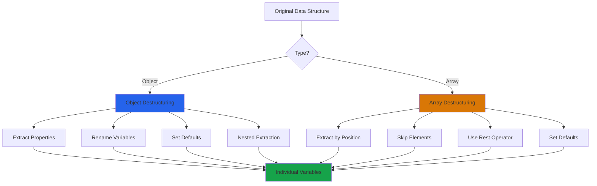

# Destructuring in JavaScript

## What is Destructuring?

Destructuring is a way to unpack values from arrays or properties from objects into separate variables. It's a shorthand syntax that makes your code cleaner and easier to read.

Instead of accessing properties or array elements one by one, you can extract multiple values in a single statement.

## Why use Destructuring?

**Before destructuring:**
```javascript
const user = { name: 'John', age: 25, city: 'NYC' };

const name = user.name;
const age = user.age;
const city = user.city;
```

**With destructuring:**
```javascript
const user = { name: 'John', age: 25, city: 'NYC' };

const { name, age, city } = user;
```

Benefits:
- Less repetitive code
- More readable
- Easier to work with function parameters
- Commonly used in React and modern JavaScript

## Object Destructuring

### Basic syntax

```javascript
const person = {
  name: 'Alice',
  age: 30,
  city: 'London'
};

const { name, age, city } = person;

console.log(name); // 'Alice'
console.log(age);  // 30
console.log(city); // 'London'
```

### Renaming variables

```javascript
const user = { name: 'Bob', age: 25 };

const { name: userName, age: userAge } = user;

console.log(userName); // 'Bob'
console.log(userAge);  // 25
```

### Default values

```javascript
const user = { name: 'Charlie' };

const { name, age = 18 } = user;

console.log(name); // 'Charlie'
console.log(age);  // 18 (default value)
```

### Nested destructuring

```javascript
const user = {
  name: 'David',
  address: {
    city: 'Paris',
    country: 'France'
  }
};

const { name, address: { city, country } } = user;

console.log(city);    // 'Paris'
console.log(country); // 'France'
```

## Array Destructuring

### Basic syntax

```javascript
const numbers = [1, 2, 3, 4, 5];

const [first, second, third] = numbers;

console.log(first);  // 1
console.log(second); // 2
console.log(third);  // 3
```

### Skipping elements

```javascript
const colors = ['red', 'green', 'blue', 'yellow'];

const [first, , third] = colors;

console.log(first); // 'red'
console.log(third); // 'blue'
```

### Rest operator with arrays

```javascript
const numbers = [1, 2, 3, 4, 5];

const [first, second, ...rest] = numbers;

console.log(first);  // 1
console.log(second); // 2
console.log(rest);   // [3, 4, 5]
```

### Default values in arrays

```javascript
const [a = 1, b = 2, c = 3] = [10];

console.log(a); // 10
console.log(b); // 2 (default)
console.log(c); // 3 (default)
```

## Visual Flow



## Function Parameters

### Object parameters

```javascript
// Without destructuring
function greet(user) {
  console.log('Hello, ' + user.name + ' from ' + user.city);
}

// With destructuring
function greet({ name, city }) {
  console.log('Hello, ' + name + ' from ' + city);
}

greet({ name: 'Emma', city: 'Berlin' });
```

### Default values in parameters

```javascript
function createUser({ name, age = 18, role = 'user' }) {
  return { name, age, role };
}

console.log(createUser({ name: 'Frank' }));
// { name: 'Frank', age: 18, role: 'user' }
```

### Array parameters

```javascript
function sum([a, b, c]) {
  return a + b + c;
}

console.log(sum([1, 2, 3])); // 6
```

## Common Patterns

### Swapping variables

```javascript
let a = 1;
let b = 2;

[a, b] = [b, a];

console.log(a); // 2
console.log(b); // 1
```

### Extracting from API responses

```javascript
const response = {
  data: {
    user: {
      id: 1,
      name: 'Grace',
      email: 'grace@example.com'
    }
  }
};

const { data: { user: { name, email } } } = response;

console.log(name);  // 'Grace'
console.log(email); // 'grace@example.com'
```

### Getting array methods results

```javascript
const users = [
  { name: 'John', age: 25 },
  { name: 'Jane', age: 30 }
];

const [firstUser, secondUser] = users;

console.log(firstUser.name);  // 'John'
console.log(secondUser.name); // 'Jane'
```

### Rest with objects

```javascript
const user = {
  name: 'Henry',
  age: 28,
  city: 'Tokyo',
  country: 'Japan'
};

const { name, ...details } = user;

console.log(name);    // 'Henry'
console.log(details); // { age: 28, city: 'Tokyo', country: 'Japan' }
```

## React Usage

Destructuring is heavily used in React:

```javascript
// Props destructuring
function UserCard({ name, age, email }) {
  return (
    <div>
      <h2>{name}</h2>
      <p>Age: {age}</p>
      <p>Email: {email}</p>
    </div>
  );
}

// State destructuring
const [count, setCount] = useState(0);

// Context destructuring
const { user, logout } = useContext(AuthContext);
```

## Common Mistakes

**1. Trying to destructure null or undefined**

```javascript
// Wrong - will throw error
const user = null;
const { name } = user; // Error!

// Correct - provide fallback
const { name } = user || {};
// Or
const { name } = user ?? {};
```

**2. Forgetting parentheses in object destructuring**

```javascript
// Wrong - syntax error
let name;
{ name } = { name: 'John' }; // Error!

// Correct
let name;
({ name } = { name: 'John' });
```

**3. Renaming confusion**

```javascript
const user = { name: 'John' };

// Wrong - trying to access 'name' variable
const { name: userName } = user;
console.log(name); // Error: name is not defined

// Correct - use the new variable name
console.log(userName); // 'John'
```

**4. Nested destructuring with missing properties**

```javascript
const data = { user: null };

// Wrong - will throw error
const { user: { name } } = data; // Error!

// Correct - provide defaults
const { user: { name } = {} } = data;
```

## Combined Destructuring

You can combine array and object destructuring:

```javascript
const users = [
  { name: 'Alice', age: 25 },
  { name: 'Bob', age: 30 }
];

const [{ name: firstName }, { name: secondName }] = users;

console.log(firstName);  // 'Alice'
console.log(secondName); // 'Bob'
```

## Dynamic Property Names

```javascript
const key = 'username';
const user = { username: 'john_doe', age: 25 };

const { [key]: value } = user;

console.log(value); // 'john_doe'
```

## Real-world Examples

**Example 1: Processing form data**

```javascript
function handleFormSubmit(event) {
  const { target: { elements } } = event;
  const { username, email, password } = elements;
  
  const formData = {
    username: username.value,
    email: email.value,
    password: password.value
  };
  
  return formData;
}
```

**Example 2: API data transformation**

```javascript
function displayUser(apiResponse) {
  const {
    data: {
      user: { name, email },
      preferences: { theme = 'light', language = 'en' }
    }
  } = apiResponse;
  
  return { name, email, theme, language };
}
```

**Example 3: Array operations**

```javascript
const numbers = [1, 2, 3, 4, 5, 6, 7, 8, 9, 10];

const [first, second, ...rest] = numbers;
const [last] = numbers.slice(-1);

console.log(first);  // 1
console.log(second); // 2
console.log(rest);   // [3, 4, 5, 6, 7, 8, 9, 10]
console.log(last);   // 10
```

## Best Practices

**Keep destructuring simple:**
```javascript
// Good - clear and readable
const { name, age } = user;

// Avoid - too complex
const { data: { users: [{ profile: { name, age } }] } } = response;
```

**Use meaningful variable names:**
```javascript
// Good
const { firstName, lastName } = user;

// Less clear
const { fn, ln } = user;
```

**Provide defaults for optional properties:**
```javascript
function createUser({ name, age = 18, role = 'guest' }) {
  return { name, age, role };
}
```

**Use rest operator for remaining properties:**
```javascript
const { id, ...userData } = user;
// Keep id separate, group rest of data
```

## Things to Remember

1. Destructuring creates new variables, doesn't modify the original
2. Works with objects and arrays
3. Can set default values
4. Can rename variables during destructuring
5. Can skip array elements
6. Use rest operator (...) for remaining items
7. Must wrap object destructuring in parentheses when reassigning
8. Can't destructure null or undefined (provide fallbacks)

## Related Topics

- Spread Operator - Often used together with destructuring
- Rest Parameters - Similar syntax in function parameters
- Array Methods - Often combined with destructuring
- React Hooks - Heavy use of array destructuring