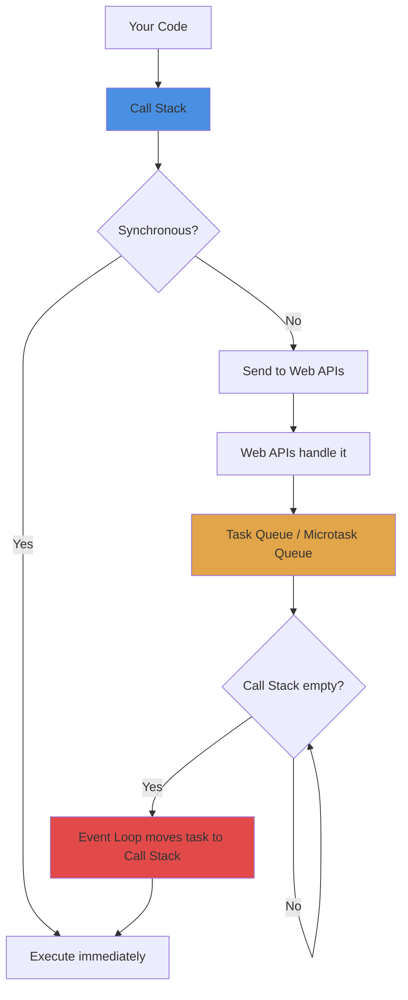
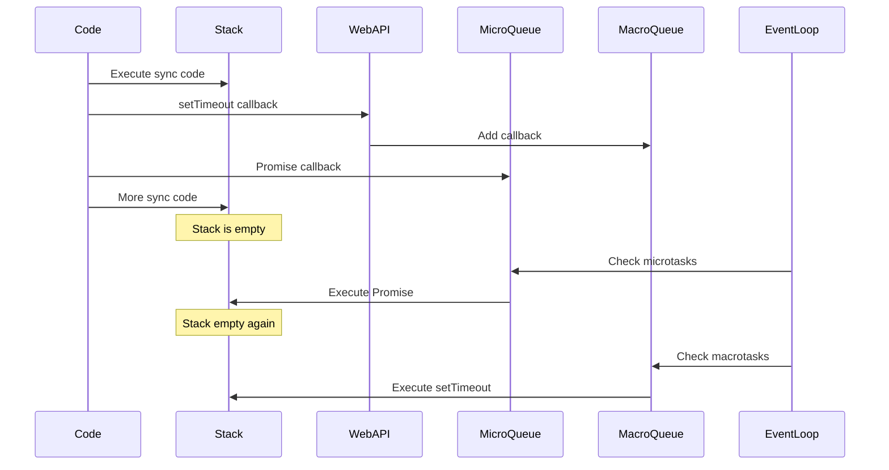

# Event Loop in JavaScript

## What is the Event Loop?

The Event Loop is the mechanism that allows JavaScript to handle asynchronous operations despite being single-threaded. It's what makes `setTimeout`, Promises, and async/await work.

Think of JavaScript as a restaurant with only one waiter (single thread). The Event Loop is like the waiter's workflow - taking orders, checking if food is ready, serving customers, and repeating. The waiter can't cook and serve at the same time, but they can check back on cooking orders while serving others.

## Why does it matter?

Understanding the Event Loop helps you:
- Write better async code
- Debug timing issues
- Understand why some code runs before other code
- Avoid blocking the main thread
- Know the difference between microtasks and macrotasks

## How JavaScript executes code

JavaScript is single-threaded, meaning it can only do one thing at a time. So how does it handle async operations?

**The answer:** It doesn't wait. It delegates.



## The components

**1. Call Stack**
- Where your code executes
- One thing at a time (LIFO - Last In, First Out)
- Must be empty before Event Loop can add new tasks

**2. Web APIs**
- Browser-provided (setTimeout, fetch, DOM events)
- Handle async operations outside JavaScript
- Not part of JavaScript itself

**3. Task Queue (Macrotask Queue)**
- Holds callbacks from setTimeout, setInterval, I/O operations
- Processed after Call Stack is empty

**4. Microtask Queue**
- Holds Promise callbacks (.then, .catch, .finally)
- Higher priority than Task Queue
- Processed before Task Queue

**5. Event Loop**
- Constantly checks if Call Stack is empty
- Moves tasks from queues to Call Stack

## Execution flow



## Code execution order

This is crucial to understand:

```javascript
console.log('Start');

setTimeout(() => {
  console.log('Timeout');
}, 0);

Promise.resolve().then(() => {
  console.log('Promise');
});

console.log('End');

// Output: Start, End, Promise, Timeout
```

**Why this order?**
1. `console.log('Start')` - synchronous, runs immediately
2. `setTimeout` - sent to Web APIs, callback goes to Macrotask Queue
3. `Promise.then` - callback goes to Microtask Queue
4. `console.log('End')` - synchronous, runs immediately
5. Call Stack empty → Event Loop checks Microtask Queue first
6. `console.log('Promise')` - from Promise (microtask)
7. Call Stack empty → Event Loop checks Macrotask Queue
8. `console.log('Timeout')` - from setTimeout (macrotask)

## Microtasks vs Macrotasks

**Microtasks** (higher priority):
- Promise callbacks (.then, .catch, .finally)
- async/await
- queueMicrotask()
- MutationObserver

**Macrotasks** (lower priority):
- setTimeout
- setInterval
- setImmediate (Node.js)
- I/O operations
- UI rendering

**Rule:** All microtasks run before the next macrotask.

```javascript
console.log('Start');

setTimeout(() => console.log('Timeout 1'), 0);
setTimeout(() => console.log('Timeout 2'), 0);

Promise.resolve()
  .then(() => console.log('Promise 1'))
  .then(() => console.log('Promise 2'));

console.log('End');

// Output:
// Start
// End
// Promise 1
// Promise 2
// Timeout 1
// Timeout 2
```

## Common patterns

**1. Deferring execution**

```javascript
// Run after current code finishes
setTimeout(() => {
  console.log('Runs later');
}, 0);

// Or with microtask (runs even sooner)
queueMicrotask(() => {
  console.log('Runs very soon');
});
```

**2. Breaking up heavy tasks**

```javascript
function processLargeArray(array) {
  const batchSize = 1000;
  let index = 0;
  
  function processBatch() {
    const batch = array.slice(index, index + batchSize);
    
    // Process batch
    batch.forEach(item => {
      // Do work
    });
    
    index += batchSize;
    
    if (index < array.length) {
      setTimeout(processBatch, 0); // Let other tasks run
    }
  }
  
  processBatch();
}
```

**3. Async/await and the Event Loop**

```javascript
async function example() {
  console.log('1');
  
  await Promise.resolve();
  
  console.log('2'); // Goes to Microtask Queue
}

console.log('3');
example();
console.log('4');

// Output: 3, 1, 4, 2
```

The `await` pauses the function and puts the rest in the Microtask Queue.

## Common mistakes

**1. Assuming setTimeout runs exactly on time**

```javascript
setTimeout(() => {
  console.log('This might not run in exactly 1000ms');
}, 1000);

// Heavy synchronous work
for (let i = 0; i < 1000000000; i++) {
  // Blocks the Call Stack
}

// setTimeout callback has to wait for Call Stack to be empty
```

**2. Creating infinite microtasks**

```javascript
// Don't do this - blocks everything
function recursiveMicrotask() {
  Promise.resolve().then(recursiveMicrotask);
}

recursiveMicrotask(); // Call Stack never empties!
```

**3. Not understanding Promise timing**

```javascript
console.log('1');

new Promise((resolve) => {
  console.log('2'); // Runs immediately (executor is sync)
  resolve();
}).then(() => {
  console.log('3'); // Runs later (microtask)
});

console.log('4');

// Output: 1, 2, 4, 3
```

## Blocking the Event Loop

When you run synchronous code that takes a long time, nothing else can happen:

```javascript
// Bad - blocks everything
function blockingOperation() {
  const start = Date.now();
  while (Date.now() - start < 3000) {
    // Blocks for 3 seconds
  }
  console.log('Done blocking');
}

// Good - breaks up work
async function nonBlockingOperation() {
  for (let i = 0; i < 3; i++) {
    await new Promise(resolve => setTimeout(resolve, 1000));
    console.log(`Step ${i + 1}`);
  }
}
```

## Visualizing with real code

```javascript
console.log('Start');                    // 1. Call Stack

setTimeout(() => {                        // 2. Web APIs → Macrotask Queue
  console.log('Timeout');
}, 0);

Promise.resolve()                         // 3. Microtask Queue
  .then(() => console.log('Promise 1'))
  .then(() => console.log('Promise 2'));

async function test() {                   // 4. Call Stack
  console.log('Async start');
  await Promise.resolve();                // 5. Rest goes to Microtask Queue
  console.log('Async end');
}

test();

console.log('End');                       // 6. Call Stack

// Execution order:
// 1. Start (sync)
// 2. Async start (sync)
// 3. End (sync)
// 4. Promise 1 (microtask)
// 5. Async end (microtask)
// 6. Promise 2 (microtask)
// 7. Timeout (macrotask)
```

## Best practices

**Don't block the Event Loop:**
- Break up heavy computations
- Use Web Workers for CPU-intensive tasks
- Avoid long synchronous loops

**Understand timing:**
- Microtasks run before macrotasks
- setTimeout(fn, 0) doesn't mean immediate
- Promises are microtasks

**Use the right tool:**
- setTimeout/setInterval for delays
- Promises for async operations
- async/await for cleaner Promise code

## Things to remember

1. JavaScript is single-threaded
2. Event Loop manages async operations
3. Microtasks (Promises) run before macrotasks (setTimeout)
4. All microtasks run before next macrotask
5. Call Stack must be empty for Event Loop to work
6. setTimeout(fn, 0) doesn't mean "immediate"
7. Don't block the Event Loop with heavy sync code

## Related topics

- Async/Await - Uses the Event Loop for async operations
- Promises - Create microtasks in the Event Loop
- Closures - Often used in async callbacks
- Web Workers - For true parallel processing