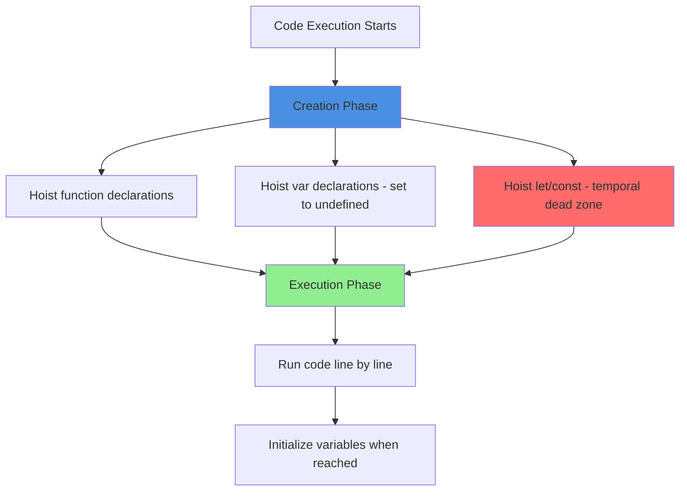

# Hoisting in JavaScript

## What is Hoisting?

Hoisting is JavaScript's behavior of moving variable and function declarations to the top of their scope before code execution. This means you can use variables and functions before they're declared in your code.

It's like JavaScript reads through your entire code first, notes where things are declared, and then runs the code. But here's the catch - only declarations are hoisted, not initializations.

## Why does Hoisting happen?

JavaScript runs code in two phases:
1. **Creation phase** - Scans code and allocates memory for declarations
2. **Execution phase** - Actually runs your code line by line

During the creation phase, JavaScript "hoists" declarations to the top of their scope.

## Function Hoisting

Functions declared with the `function` keyword are fully hoisted:

```javascript
greet(); // Works! Prints "Hello"

function greet() {
  console.log('Hello');
}
```

The function is available before its declaration in the code.

## var Hoisting

Variables declared with `var` are hoisted, but their value is `undefined` until the assignment:

```javascript
console.log(name); // undefined (not an error!)
var name = 'John';
console.log(name); // 'John'
```

What JavaScript actually does:

```javascript
var name; // Declaration hoisted to top
console.log(name); // undefined
name = 'John'; // Assignment stays here
console.log(name); // 'John'
```

## let and const Hoisting

`let` and `const` are also hoisted, but they're in a "temporal dead zone" until the declaration is reached:

```javascript
console.log(age); // ReferenceError: Cannot access 'age' before initialization
let age = 25;
```

They exist but can't be accessed before the line where they're declared.

```javascript
console.log(city); // ReferenceError
const city = 'NYC';
```

## Visual Flow



## Temporal Dead Zone

The period between entering a scope and the variable declaration is called the Temporal Dead Zone (TDZ):

```javascript
{
  // TDZ starts
  console.log(x); // ReferenceError
  
  let x = 10; // TDZ ends, x is initialized
  console.log(x); // 10
}
```


## Function Expressions vs Declarations

**Function declarations are hoisted:**

```javascript
sayHi(); // Works!

function sayHi() {
  console.log('Hi');
}
```

**Function expressions are NOT hoisted:**

```javascript
sayBye(); // TypeError: sayBye is not a function

var sayBye = function() {
  console.log('Bye');
};
```

With `var`, the variable is hoisted but not the function:

```javascript
var sayBye; // Hoisted, value is undefined
sayBye(); // TypeError: undefined is not a function
sayBye = function() {
  console.log('Bye');
};
```

## Class Hoisting

Classes are hoisted like `let` and `const` - they exist but can't be accessed before declaration:

```javascript
const obj = new MyClass(); // ReferenceError

class MyClass {
  constructor() {
    this.name = 'Test';
  }
}
```

## Common Patterns and Issues

### Issue 1: var in loops

```javascript
for (var i = 0; i < 3; i++) {
  setTimeout(() => {
    console.log(i); // Prints 3, 3, 3
  }, 100);
}

// Why? var is hoisted to function scope
// Becomes:
var i;
for (i = 0; i < 3; i++) {
  setTimeout(() => {
    console.log(i); // All callbacks share same i
  }, 100);
}
```

**Fix with let:**

```javascript
for (let i = 0; i < 3; i++) {
  setTimeout(() => {
    console.log(i); // Prints 0, 1, 2
  }, 100);
}
```

### Issue 2: Accidental globals

```javascript
function test() {
  x = 10; // No var/let/const - creates global!
}

test();
console.log(x); // 10 - accessible globally
```

**Fix:**

```javascript
function test() {
  let x = 10; // Properly scoped
}

test();
console.log(x); // ReferenceError - not accessible
```

### Issue 3: Variable shadowing

```javascript
var name = 'Global';

function greet() {
  console.log(name); // undefined (not 'Global')
  var name = 'Local';
  console.log(name); // 'Local'
}

greet();
```

The local `var name` declaration is hoisted, shadowing the global variable.

## Scope and Hoisting

### Function scope (var)

```javascript
function example() {
  console.log(x); // undefined
  
  if (true) {
    var x = 10;
  }
  
  console.log(x); // 10 - var ignores block scope
}
```

`var` is hoisted to the function scope:

```javascript
function example() {
  var x; // Hoisted to top of function
  console.log(x); // undefined
  
  if (true) {
    x = 10;
  }
  
  console.log(x); // 10
}
```

### Block scope (let/const)

```javascript
function example() {
  console.log(x); // ReferenceError
  
  if (true) {
    let x = 10;
    console.log(x); // 10
  }
  
  console.log(x); // ReferenceError - x doesn't exist here
}
```

## Best Practices

**1. Always declare variables at the top**

```javascript
// Good - clear and predictable
function calculate() {
  let x = 5;
  let y = 10;
  return x + y;
}

// Confusing - relies on hoisting
function calculate() {
  console.log(x); // undefined
  var x = 5;
  return x + 10;
}
```

**2. Use let and const instead of var**

```javascript
// Avoid
var name = 'John';

// Better
let name = 'John';

// Best (if value won't change)
const name = 'John';
```

**3. Declare functions before using them**

```javascript
// Good - readable
function greet() {
  console.log('Hello');
}

greet();

// Works but less clear
greet(); // Relies on hoisting

function greet() {
  console.log('Hello');
}
```

**4. Use strict mode**

```javascript
'use strict';

function test() {
  x = 10; // ReferenceError in strict mode
}
```

Strict mode prevents accidental globals.

## Interview Questions Explained

**Q: What does this print?**

```javascript
var x = 1;

function test() {
  console.log(x);
  var x = 2;
}

test();
```

**Answer:** `undefined`

The local `var x` is hoisted to the top of the function, shadowing the global `x`.

**Q: What's the difference?**

```javascript
// Example 1
foo();
function foo() {
  console.log('Hello');
}

// Example 2
bar();
var bar = function() {
  console.log('Hi');
};
```

**Answer:**
- Example 1 works - function declaration is hoisted
- Example 2 throws TypeError - only `var bar` is hoisted (as undefined)

## Real-world Implications

### Module pattern

```javascript
var counter = (function() {
  var count = 0; // Private variable
  
  return {
    increment: function() {
      return ++count;
    },
    getCount: function() {
      return count;
    }
  };
})();

// Works because function is executed immediately
console.log(counter.increment()); // 1
```

### Initialization order matters

```javascript
// Wrong - config not ready
var app = new App(config);
var config = { theme: 'dark' };

// Correct
var config = { theme: 'dark' };
var app = new App(config);
```

## Modern JavaScript Approach

With ES6+, many hoisting issues are avoided:

```javascript
// Old way (prone to hoisting issues)
var x = 10;
var getName = function() {
  return name;
};

// Modern way (clearer, safer)
const x = 10;
const getName = () => name;
```

## Things to Remember

1. Hoisting moves declarations to the top, not initializations
2. `var` is hoisted and initialized with `undefined`
3. `let` and `const` are hoisted but in temporal dead zone
4. Function declarations are fully hoisted
5. Function expressions are NOT hoisted
6. Classes behave like `let/const` - can't access before declaration
7. Always declare variables before use for clarity
8. Use `let` and `const` instead of `var`

## Related Topics

- Scope - Understanding where variables are accessible
- Closures - How functions remember their scope
- Execution Context - How JavaScript runs code
- Temporal Dead Zone - The period before let/const initialization