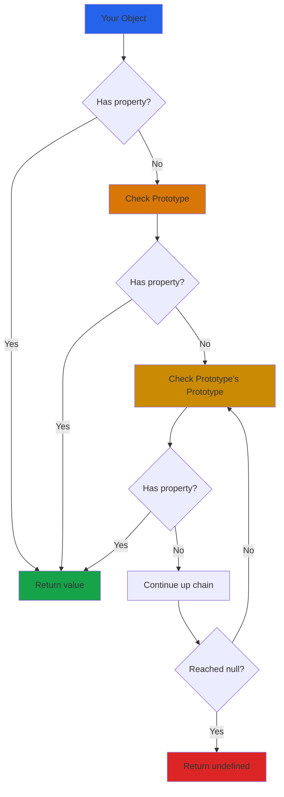

# Prototypes & Inheritance in JavaScript

## What are Prototypes?

In JavaScript, every object has a hidden internal property called `[[Prototype]]` (often accessed via `__proto__`). This prototype is a reference to another object, and JavaScript uses it to inherit properties and methods.

Think of prototypes like a family tree - if you don't have something, JavaScript looks at your parent, then your grandparent, and so on, until it finds what it needs or reaches the end.

## Why do Prototypes matter?

JavaScript is a prototype-based language, not a class-based one (even though we have `class` syntax now). Understanding prototypes helps you:

- Understand how inheritance works in JavaScript
- Know how objects share methods efficiently
- Debug property lookup issues
- Write more efficient code
- Understand what classes are doing under the hood

## The Prototype Chain

When you try to access a property on an object:

1. JavaScript checks the object itself
2. If not found, checks the object's prototype
3. If still not found, checks the prototype's prototype
4. Continues until it reaches `null` (end of chain)

```javascript
const person = {
  name: 'John'
};

console.log(person.name);         // 'John' - found on object
console.log(person.toString());   // [object Object] - found on prototype
console.log(person.nonExistent);  // undefined - not found anywhere
```

## Visual Flow



## Creating Objects with Prototypes

### Constructor functions

```javascript
function Person(name, age) {
  this.name = name;
  this.age = age;
}

Person.prototype.greet = function() {
  return 'Hello, I am ' + this.name;
};

const john = new Person('John', 25);
console.log(john.greet()); // 'Hello, I am John'
```

All instances share the same `greet` method from the prototype.

### Object.create()

```javascript
const personPrototype = {
  greet: function() {
    return 'Hello, I am ' + this.name;
  }
};

const john = Object.create(personPrototype);
john.name = 'John';

console.log(john.greet()); // 'Hello, I am John'
```

### Class syntax (syntactic sugar)

```javascript
class Person {
  constructor(name, age) {
    this.name = name;
    this.age = age;
  }
  
  greet() {
    return 'Hello, I am ' + this.name;
  }
}

const john = new Person('John', 25);
console.log(john.greet()); // 'Hello, I am John'
```

Under the hood, this uses prototypes.

## Prototype Chain Example

```javascript
function Animal(name) {
  this.name = name;
}

Animal.prototype.eat = function() {
  return this.name + ' is eating';
};

function Dog(name, breed) {
  Animal.call(this, name);
  this.breed = breed;
}

// Set up inheritance
Dog.prototype = Object.create(Animal.prototype);
Dog.prototype.constructor = Dog;

Dog.prototype.bark = function() {
  return this.name + ' says woof!';
};

const rex = new Dog('Rex', 'Labrador');

console.log(rex.bark());  // 'Rex says woof!' - from Dog.prototype
console.log(rex.eat());   // 'Rex is eating' - from Animal.prototype
console.log(rex.name);    // 'Rex' - from object itself
```

## Understanding the Chain


## Checking Prototypes

### Object.getPrototypeOf()

```javascript
const obj = {};
console.log(Object.getPrototypeOf(obj) === Object.prototype); // true
```

### instanceof

```javascript
function Person(name) {
  this.name = name;
}

const john = new Person('John');
console.log(john instanceof Person); // true
console.log(john instanceof Object); // true
```

### hasOwnProperty()

```javascript
const person = { name: 'John' };

console.log(person.hasOwnProperty('name'));     // true - own property
console.log(person.hasOwnProperty('toString')); // false - inherited
```

## Prototype vs Own Properties

```javascript
function Car(brand) {
  this.brand = brand; // Own property
}

Car.prototype.drive = function() { // Prototype property
  return this.brand + ' is driving';
};

const toyota = new Car('Toyota');

console.log(toyota.brand);  // 'Toyota' - own property
console.log(toyota.drive()); // 'Toyota is driving' - prototype method

// Check
console.log(toyota.hasOwnProperty('brand')); // true
console.log(toyota.hasOwnProperty('drive')); // false
```

## Inheritance with Classes

```javascript
class Animal {
  constructor(name) {
    this.name = name;
  }
  
  speak() {
    return this.name + ' makes a sound';
  }
}

class Dog extends Animal {
  constructor(name, breed) {
    super(name); // Call parent constructor
    this.breed = breed;
  }
  
  speak() {
    return this.name + ' barks';
  }
  
  getInfo() {
    return this.name + ' is a ' + this.breed;
  }
}

const rex = new Dog('Rex', 'Labrador');
console.log(rex.speak());   // 'Rex barks'
console.log(rex.getInfo()); // 'Rex is a Labrador'
```

## Common Patterns

### Method sharing

```javascript
function User(name) {
  this.name = name;
}

// Add methods to prototype, not constructor
User.prototype.greet = function() {
  return 'Hi, ' + this.name;
};

User.prototype.goodbye = function() {
  return 'Bye, ' + this.name;
};

const user1 = new User('Alice');
const user2 = new User('Bob');

// Both share the same methods (memory efficient)
console.log(user1.greet === user2.greet); // true
```

### Property delegation

```javascript
const defaults = {
  theme: 'light',
  fontSize: 14
};

const userSettings = Object.create(defaults);
userSettings.theme = 'dark';

console.log(userSettings.theme);    // 'dark' - own property
console.log(userSettings.fontSize); // 14 - from prototype
```

### Mixin pattern

```javascript
const canEat = {
  eat: function() {
    return this.name + ' is eating';
  }
};

const canWalk = {
  walk: function() {
    return this.name + ' is walking';
  }
};

function Person(name) {
  this.name = name;
}

// Add mixins to prototype
Object.assign(Person.prototype, canEat, canWalk);

const john = new Person('John');
console.log(john.eat());  // 'John is eating'
console.log(john.walk()); // 'John is walking'
```

## Common Mistakes

**1. Modifying Object.prototype**

```javascript
// Don't do this!
Object.prototype.myMethod = function() {
  return 'bad idea';
};

// This affects ALL objects
const obj = {};
console.log(obj.myMethod()); // 'bad idea'
```

Never modify built-in prototypes.

**2. Forgetting to reset constructor**

```javascript
function Animal(name) {
  this.name = name;
}

function Dog(name) {
  Animal.call(this, name);
}

// Wrong
Dog.prototype = Object.create(Animal.prototype);
console.log(new Dog('Rex').constructor); // Animal - wrong!

// Correct
Dog.prototype = Object.create(Animal.prototype);
Dog.prototype.constructor = Dog;
console.log(new Dog('Rex').constructor); // Dog - correct!
```

**3. Adding methods in constructor**

```javascript
// Inefficient - creates new function for each instance
function User(name) {
  this.name = name;
  this.greet = function() {
    return 'Hi, ' + this.name;
  };
}

// Better - shared across all instances
function User(name) {
  this.name = name;
}

User.prototype.greet = function() {
  return 'Hi, ' + this.name;
};
```

**4. Shadowing prototype properties**

```javascript
function Counter() {
  this.count = 0;
}

Counter.prototype.count = 100;

const counter = new Counter();
console.log(counter.count); // 0 - own property shadows prototype
```

## Prototype vs Class

```javascript
// Using prototypes
function PersonProto(name) {
  this.name = name;
}

PersonProto.prototype.greet = function() {
  return 'Hello, ' + this.name;
};

// Using class (does the same thing)
class PersonClass {
  constructor(name) {
    this.name = name;
  }
  
  greet() {
    return 'Hello, ' + this.name;
  }
}

// Both work the same way
const p1 = new PersonProto('John');
const p2 = new PersonClass('Jane');

console.log(p1.greet()); // 'Hello, John'
console.log(p2.greet()); // 'Hello, Jane'
```

Classes are syntactic sugar over prototypes.

## Real-world Examples

**Example 1: Custom error classes**

```javascript
class ValidationError extends Error {
  constructor(message, field) {
    super(message);
    this.name = 'ValidationError';
    this.field = field;
  }
}

function validateEmail(email) {
  if (!email.includes('@')) {
    throw new ValidationError('Invalid email format', 'email');
  }
  return true;
}

try {
  validateEmail('invalid');
} catch (error) {
  if (error instanceof ValidationError) {
    console.log('Validation failed:', error.field);
  }
}
```

**Example 2: Plugin system**

```javascript
class Plugin {
  constructor(name) {
    this.name = name;
  }
  
  init() {
    console.log(this.name + ' initialized');
  }
}

class NotificationPlugin extends Plugin {
  constructor() {
    super('Notifications');
  }
  
  notify(message) {
    console.log('Notification: ' + message);
  }
}

const plugin = new NotificationPlugin();
plugin.init();
plugin.notify('Hello!');
```

**Example 3: Data models**

```javascript
class Model {
  constructor(data) {
    Object.assign(this, data);
  }
  
  save() {
    console.log('Saving:', this);
  }
  
  delete() {
    console.log('Deleting:', this);
  }
}

class User extends Model {
  constructor(data) {
    super(data);
    this.type = 'user';
  }
  
  login() {
    console.log(this.name + ' logged in');
  }
}

const user = new User({ name: 'Alice', email: 'alice@example.com' });
user.save();
user.login();
```

## Best Practices

**Use classes for new code:**
```javascript
// Modern and clean
class Animal {
  constructor(name) {
    this.name = name;
  }
}
```

**Add methods to prototype, not constructor:**
```javascript
// Good - memory efficient
Person.prototype.greet = function() { };

// Avoid - creates new function each time
function Person() {
  this.greet = function() { };
}
```

**Don't modify built-in prototypes:**
```javascript
// Never do this
Array.prototype.myMethod = function() { };
```

**Use Object.create() for inheritance without classes:**
```javascript
const parent = { greet() { return 'hello'; } };
const child = Object.create(parent);
```

## Things to Remember

1. Every object has a prototype (except Object.prototype)
2. Prototypes are used for property lookup
3. Methods on prototype are shared across instances
4. Classes are syntactic sugar over prototypes
5. Use `hasOwnProperty()` to check own properties
6. Never modify built-in prototypes
7. Always reset constructor after setting prototype
8. Prototype chain ends at null

## Related Topics

- this keyword - Used in constructor functions and methods
- Closures - Private properties pattern
- Classes - Modern syntax for prototypes
- Object methods - Object.create, Object.getPrototypeOf