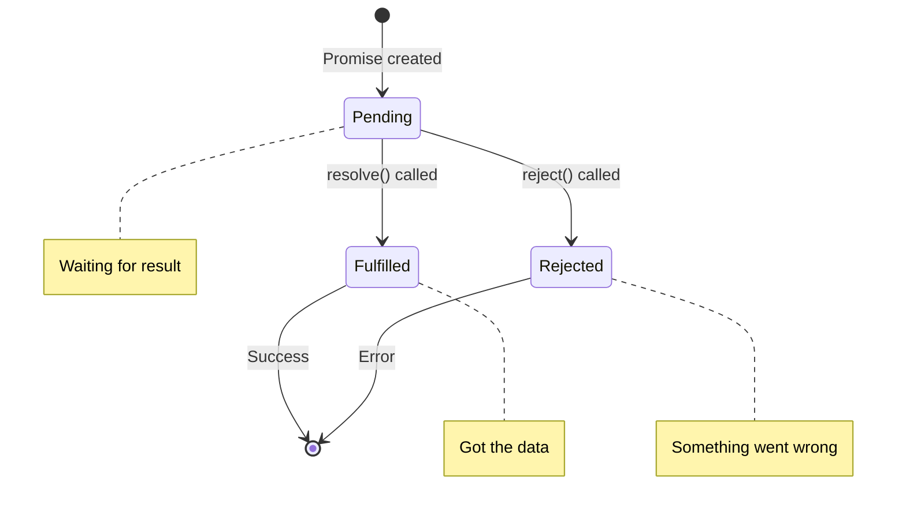
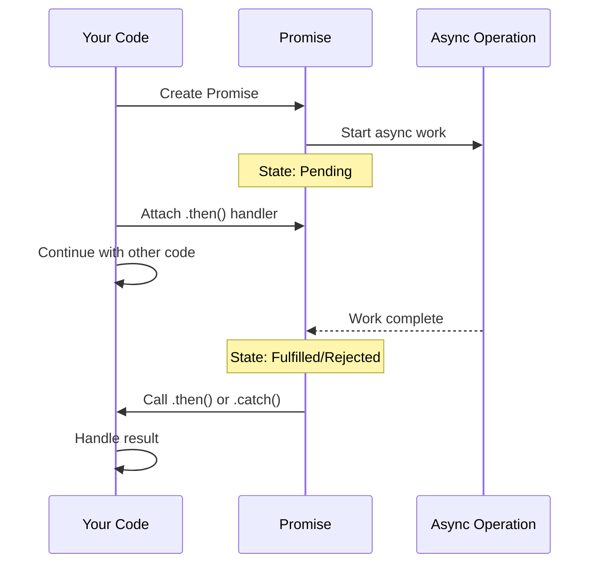

# Promises in JavaScript

## What are Promises?

A Promise is JavaScript's way of handling asynchronous operations. It represents a value that might not be available yet but will be at some point in the future.

Think of ordering food online - you place the order (create a Promise), the restaurant prepares it (pending state), and eventually either you get your food (resolved) or they cancel your order (rejected).

## Why use Promises?

Before Promises, we had callback hell:

```javascript
getData(function(a) {
  getMoreData(a, function(b) {
    getMoreData(b, function(c) {
      // This gets messy fast
    });
  });
});
```

With Promises:

```javascript
getData()
  .then(a => getMoreData(a))
  .then(b => getMoreData(b))
  .then(c => console.log(c));
```

Much cleaner and easier to follow.

## Promise States

A Promise can be in one of three states:



**Important:** Once a Promise is fulfilled or rejected, it's settled and can't change state again.

## How it works

Here's the lifecycle of a Promise:



## Basic syntax

Creating a Promise:

```javascript
const myPromise = new Promise((resolve, reject) => {
  // Do async work
  
  if (success) {
    resolve('Success data');
  } else {
    reject('Error message');
  }
});
```

Using a Promise:

```javascript
myPromise
  .then(result => {
    console.log(result);  // If resolved
  })
  .catch(error => {
    console.error(error); // If rejected
  });
```

## Promise chaining

You can chain multiple `.then()` calls:

```javascript
fetchUser()
  .then(user => {
    console.log('Got user');
    return fetchPosts(user.id);  // Return another Promise
  })
  .then(posts => {
    console.log('Got posts');
    return fetchComments(posts[0].id);
  })
  .then(comments => {
    console.log('Got comments');
  })
  .catch(error => {
    console.error('Something failed:', error);
  });
```

The `.catch()` at the end catches errors from any step in the chain.

## Common mistakes

**1. Forgetting to return in `.then()`**

```javascript
// Wrong - breaks the chain
promise
  .then(result => {
    doSomething(result); // Not returning anything
  })
  .then(data => {
    console.log(data); // data is undefined
  });

// Correct
promise
  .then(result => {
    return doSomething(result);
  })
  .then(data => {
    console.log(data); // data has the value
  });
```

**2. Not handling errors**

```javascript
// Wrong - unhandled rejection
fetchData()
  .then(data => console.log(data));

// Correct
fetchData()
  .then(data => console.log(data))
  .catch(error => console.error(error));
```

**3. Nesting Promises (callback hell returns)**

```javascript
// Wrong - don't do this
getData()
  .then(a => {
    getMoreData(a)
      .then(b => {
        // Getting messy again
      });
  });

// Correct - flat chain
getData()
  .then(a => getMoreData(a))
  .then(b => console.log(b));
```

## Promise static methods

**Promise.all() - Run multiple Promises in parallel**

Waits for all Promises to resolve. If any fails, the whole thing fails.

```javascript
Promise.all([
  fetch('/users'),
  fetch('/posts'),
  fetch('/comments')
])
  .then(([users, posts, comments]) => {
    console.log('All done!');
  })
  .catch(error => {
    console.error('One or more failed:', error);
  });
```

**Promise.race() - First one wins**

Returns the result of whichever Promise finishes first.

```javascript
Promise.race([
  fetch('/api/v1/data'),
  fetch('/api/v2/data')
])
  .then(result => {
    console.log('Got result from fastest API');
  });
```

**Promise.allSettled() - Wait for all, regardless of success/failure**

```javascript
Promise.allSettled([
  Promise.resolve('Success'),
  Promise.reject('Failed'),
  Promise.resolve('Another success')
])
  .then(results => {
    results.forEach(result => {
      if (result.status === 'fulfilled') {
        console.log('Success:', result.value);
      } else {
        console.log('Failed:', result.reason);
      }
    });
  });
```

**Promise.any() - First successful one wins**

Similar to race, but ignores rejections until all fail.

```javascript
Promise.any([
  fetch('/mirror1/data'),
  fetch('/mirror2/data'),
  fetch('/mirror3/data')
])
  .then(result => {
    console.log('Got data from first available mirror');
  });
```

## Converting callbacks to Promises

Old callback style:

```javascript
function readFile(path, callback) {
  fs.readFile(path, (error, data) => {
    if (error) callback(error);
    else callback(null, data);
  });
}
```

Wrapped in a Promise:

```javascript
function readFilePromise(path) {
  return new Promise((resolve, reject) => {
    fs.readFile(path, (error, data) => {
      if (error) reject(error);
      else resolve(data);
    });
  });
}

// Now you can use it with .then() or async/await
readFilePromise('file.txt')
  .then(data => console.log(data))
  .catch(error => console.error(error));
```

## Promises vs Async/Await

Same operation, different syntax:

```javascript
// With Promises
function getUserData() {
  return fetchUser()
    .then(user => fetchPosts(user.id))
    .then(posts => fetchComments(posts[0].id))
    .catch(error => console.error(error));
}

// With async/await (much cleaner)
async function getUserData() {
  try {
    const user = await fetchUser();
    const posts = await fetchPosts(user.id);
    const comments = await fetchComments(posts[0].id);
    return comments;
  } catch (error) {
    console.error(error);
  }
}
```

Async/await is built on top of Promises - it's just syntactic sugar that makes Promises easier to work with.

## Best practices

**Always handle rejections:**

```javascript
promise
  .then(result => handleResult(result))
  .catch(error => handleError(error));
```

**Return Promises in chains:**

```javascript
function getData() {
  return fetch('/api/data')  // Return the Promise
    .then(res => res.json());
}
```

**Use Promise.all() for parallel operations:**

```javascript
// Good - runs in parallel
const [users, posts] = await Promise.all([
  fetchUsers(),
  fetchPosts()
]);

// Bad - runs sequentially (slower)
const users = await fetchUsers();
const posts = await fetchPosts();
```

## Things to remember

1. Promises have three states: pending, fulfilled, rejected
2. Use `.then()` for success and `.catch()` for errors
3. Always return values in `.then()` chains
4. Promise.all() fails if any Promise fails
5. Async/await is just cleaner Promise syntax
6. Once settled, a Promise can't change state

## Related topics

- Async/Await - Modern way to work with Promises
- Event Loop - How JavaScript handles async operations
- Fetch API - Returns Promises for HTTP requests