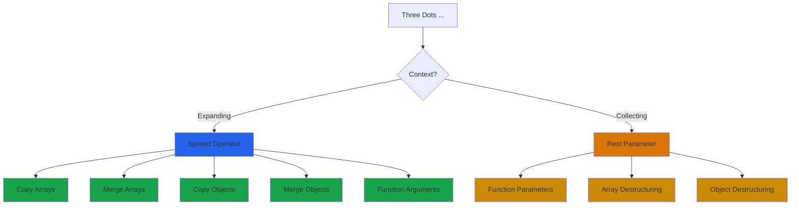

# Spread & Rest Operators

## What are they?

Both spread and rest use the same syntax (`...`) but do opposite things:

- **Spread** - Expands an array or object into individual elements
- **Rest** - Collects multiple elements into an array

Think of spread as "unpacking" and rest as "packing".

## The Spread Operator

### Spreading arrays

```javascript
const numbers = [1, 2, 3];
const moreNumbers = [...numbers, 4, 5];

console.log(moreNumbers); // [1, 2, 3, 4, 5]
```

The spread operator takes all elements from `numbers` and places them individually in the new array.

### Spreading objects

```javascript
const user = { name: 'John', age: 25 };
const updatedUser = { ...user, city: 'NYC' };

console.log(updatedUser); 
// { name: 'John', age: 25, city: 'NYC' }
```

### Why use spread?

**Copying arrays:**
```javascript
const original = [1, 2, 3];
const copy = [...original];

copy.push(4);
console.log(original); // [1, 2, 3] - unchanged
console.log(copy);     // [1, 2, 3, 4]
```

**Merging arrays:**
```javascript
const arr1 = [1, 2];
const arr2 = [3, 4];
const merged = [...arr1, ...arr2];

console.log(merged); // [1, 2, 3, 4]
```

**Copying objects:**
```javascript
const original = { name: 'Alice', age: 30 };
const copy = { ...original };

copy.age = 31;
console.log(original.age); // 30 - unchanged
console.log(copy.age);     // 31
```

## The Rest Parameter

### In function parameters

```javascript
function sum(...numbers) {
  return numbers.reduce((total, num) => total + num, 0);
}

console.log(sum(1, 2, 3));       // 6
console.log(sum(1, 2, 3, 4, 5)); // 15
```

The rest parameter collects all arguments into an array.

### With destructuring

```javascript
const [first, second, ...rest] = [1, 2, 3, 4, 5];

console.log(first);  // 1
console.log(second); // 2
console.log(rest);   // [3, 4, 5]
```

### In objects

```javascript
const user = { name: 'Bob', age: 25, city: 'LA', country: 'USA' };
const { name, ...details } = user;

console.log(name);    // 'Bob'
console.log(details); // { age: 25, city: 'LA', country: 'USA' }
```

## Visual Flow



## Spread vs Rest

```javascript
// Spread - expanding
const numbers = [1, 2, 3];
console.log(...numbers); // 1 2 3

// Rest - collecting
function example(...args) {
  console.log(args); // [1, 2, 3]
}
example(1, 2, 3);
```

**Remember:** 
- Spread expands (unpacks)
- Rest collects (packs)

## Common Use Cases

### 1. Combining arrays

```javascript
const fruits = ['apple', 'banana'];
const vegetables = ['carrot', 'lettuce'];

const food = [...fruits, ...vegetables];
// ['apple', 'banana', 'carrot', 'lettuce']
```

### 2. Adding to arrays

```javascript
const numbers = [2, 3, 4];

const withStart = [1, ...numbers];      // [1, 2, 3, 4]
const withEnd = [...numbers, 5];        // [2, 3, 4, 5]
const withBoth = [0, ...numbers, 5, 6]; // [0, 2, 3, 4, 5, 6]
```

### 3. Converting to array

```javascript
const str = 'hello';
const chars = [...str];

console.log(chars); // ['h', 'e', 'l', 'l', 'o']
```

### 4. Function arguments

```javascript
const numbers = [5, 2, 8, 1, 9];

console.log(Math.max(...numbers)); // 9
console.log(Math.min(...numbers)); // 1
```

### 5. Updating objects

```javascript
const user = { name: 'John', age: 25 };

// Update existing property
const older = { ...user, age: 26 };

// Add new property
const withCity = { ...user, city: 'NYC' };
```

### 6. Merging objects

```javascript
const defaults = { theme: 'light', language: 'en' };
const userPrefs = { theme: 'dark' };

const settings = { ...defaults, ...userPrefs };
// { theme: 'dark', language: 'en' }
```

**Note:** Later values override earlier ones.

## Function Parameters

### Rest parameter must be last

```javascript
// Correct
function example(first, second, ...rest) {
  console.log(first, second, rest);
}

// Wrong - syntax error
function wrong(...rest, last) { }
```

### Combining with regular parameters

```javascript
function greet(greeting, ...names) {
  return names.map(name => `${greeting}, ${name}!`);
}

console.log(greet('Hello', 'Alice', 'Bob', 'Charlie'));
// ['Hello, Alice!', 'Hello, Bob!', 'Hello, Charlie!']
```

## Common Patterns

### Removing item from array

```javascript
const numbers = [1, 2, 3, 4, 5];
const index = 2;

const newArray = [
  ...numbers.slice(0, index),
  ...numbers.slice(index + 1)
];

console.log(newArray); // [1, 2, 4, 5]
```

### Toggling array items

```javascript
const items = ['a', 'b', 'c'];
const newItem = 'd';

const withNew = [...items, newItem];

const withoutB = items.filter(item => item !== 'b');
```

### Conditional spreading

```javascript
const includeExtra = true;

const data = {
  name: 'John',
  age: 25,
  ...(includeExtra && { city: 'NYC', country: 'USA' })
};

console.log(data);
// If includeExtra is true: { name: 'John', age: 25, city: 'NYC', country: 'USA' }
// If includeExtra is false: { name: 'John', age: 25 }
```

### Default object values

```javascript
const defaults = { theme: 'light', fontSize: 14 };
const userSettings = { theme: 'dark' };

const settings = { ...defaults, ...userSettings };
// { theme: 'dark', fontSize: 14 }
```

## React Usage

Spread and rest are heavily used in React:

```javascript
// Passing props
function ParentComponent() {
  const props = { name: 'John', age: 25, city: 'NYC' };
  return <ChildComponent {...props} />;
}

// Receiving props with rest
function ChildComponent({ name, ...otherProps }) {
  return <div {...otherProps}>{name}</div>;
}

// State updates
const [user, setUser] = useState({ name: 'John', age: 25 });
setUser({ ...user, age: 26 });
```

## Common Mistakes

**1. Shallow copy issue**

```javascript
const original = { 
  name: 'John', 
  address: { city: 'NYC' } 
};

const copy = { ...original };
copy.address.city = 'LA';

console.log(original.address.city); // 'LA' - modified!
```

Spread only does shallow copy. Nested objects are still referenced.

**2. Spreading null or undefined**

```javascript
// Wrong - will throw error
const data = null;
const result = { ...data }; // Error!

// Correct - provide fallback
const result = { ...(data || {}) };
```

**3. Using rest parameter incorrectly**

```javascript
// Wrong - rest must be last
function wrong(...args, last) { } // Syntax error

// Correct
function correct(first, ...args) { }
```

**4. Modifying after spreading**

```javascript
const original = [1, 2, 3];
const copy = [...original];

// This doesn't affect original
copy.push(4);

// But if array contains objects
const users = [{ name: 'John' }];
const usersCopy = [...users];

usersCopy[0].name = 'Jane';
console.log(users[0].name); // 'Jane' - modified!
```

## Spread with Different Types

### Arrays

```javascript
const arr = [1, 2, 3];
const spread = [...arr];        // [1, 2, 3]
const withExtra = [...arr, 4];  // [1, 2, 3, 4]
```

### Strings

```javascript
const str = 'hello';
const chars = [...str];         // ['h', 'e', 'l', 'l', 'o']
```

### Sets

```javascript
const set = new Set([1, 2, 3]);
const arr = [...set];           // [1, 2, 3]
```

### Maps

```javascript
const map = new Map([['a', 1], ['b', 2]]);
const entries = [...map];       // [['a', 1], ['b', 2]]
```

## Real-world Examples

**Example 1: API data merging**

```javascript
function updateUser(userId, updates) {
  const existingUser = { id: userId, name: 'John', age: 25 };
  return { ...existingUser, ...updates, updatedAt: Date.now() };
}

const updated = updateUser(1, { age: 26, city: 'NYC' });
// { id: 1, name: 'John', age: 26, city: 'NYC', updatedAt: 1234567890 }
```

**Example 2: Array operations**

```javascript
function addItem(items, newItem) {
  return [...items, newItem];
}

function removeItem(items, index) {
  return [...items.slice(0, index), ...items.slice(index + 1)];
}

function updateItem(items, index, newValue) {
  return [
    ...items.slice(0, index),
    newValue,
    ...items.slice(index + 1)
  ];
}
```

**Example 3: Configuration merging**

```javascript
const defaultConfig = {
  timeout: 5000,
  retries: 3,
  headers: { 'Content-Type': 'application/json' }
};

function makeRequest(url, userConfig = {}) {
  const config = {
    ...defaultConfig,
    ...userConfig,
    headers: {
      ...defaultConfig.headers,
      ...userConfig.headers
    }
  };
  
  return config;
}
```

## Best Practices

**Use spread for shallow copies:**
```javascript
const copy = { ...original };
const arrCopy = [...original];
```

**Use rest for flexible functions:**
```javascript
function log(level, ...messages) {
  console.log(`[${level}]`, ...messages);
}
```

**Avoid deep spreading:**
```javascript
// For nested objects, use a deep clone library
// Or manually spread nested levels
const copy = {
  ...original,
  nested: { ...original.nested }
};
```

**Combine with destructuring:**
```javascript
const { id, ...userData } = user;
const [first, ...rest] = array;
```

## Things to Remember

1. Same syntax (...) but different purposes
2. Spread expands, rest collects
3. Only creates shallow copies
4. Rest parameter must be last in function
5. Can spread any iterable (arrays, strings, sets)
6. Later object properties override earlier ones
7. Can't spread null or undefined
8. Commonly used in React for props and state

## Related Topics

- Destructuring - Often used together with spread/rest
- Array Methods - Spread helps with array operations
- Immutability - Spread creates new references
- React - Heavy use in components and state