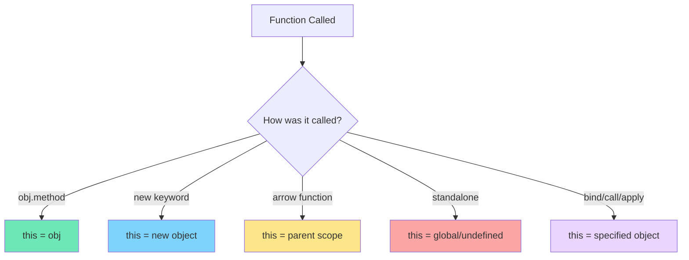

# The this Keyword in JavaScript

## What is this?

The `this` keyword refers to the context in which a function is executed. It's basically asking "who called me?" or "what am I working with right now?"

The tricky part: `this` changes depending on how and where the function is called. It's not about where the function is written, but how it's invoked.

Think of `this` like the word "me" in a conversation - it refers to whoever is speaking. In JavaScript, `this` refers to whoever (or whatever) is calling the function.

## Why does this matter?

Understanding `this` helps you:
- Work with objects and methods
- Handle event listeners properly
- Use classes correctly
- Debug confusing errors
- Write clean object-oriented code

## The golden rule

**`this` is determined by HOW a function is called, not WHERE it's defined.**

## How this works in different contexts

### 1. In a regular function

```javascript
function showThis() {
  console.log(this);
}

showThis(); // Window (browser) or global (Node.js)
```

In non-strict mode, `this` defaults to the global object. In strict mode, it's `undefined`.

### 2. As an object method

```javascript
const person = {
  name: 'John',
  greet: function() {
    console.log(this.name); // 'John'
  }
};

person.greet(); // this = person
```

When a function is called as a method, `this` refers to the object.

### 3. With arrow functions

```javascript
const person = {
  name: 'John',
  greet: () => {
    console.log(this.name); // undefined
  }
};

person.greet(); // this = global/window (not person!)
```

**Important:** Arrow functions don't have their own `this`. They inherit it from the surrounding scope.

### 4. In a constructor

```javascript
function Person(name) {
  this.name = name;
}

const john = new Person('John');
console.log(john.name); // 'John'
```

With the `new` keyword, `this` refers to the newly created object.

### 5. In event handlers

```javascript
button.addEventListener('click', function() {
  console.log(this); // the button element
});

button.addEventListener('click', () => {
  console.log(this); // window/global (arrow function!)
});
```

Regular functions get `this` as the element. Arrow functions inherit from outer scope.

## Visual flow



## Common patterns

### Pattern 1: Losing this context

```javascript
const person = {
  name: 'John',
  greet: function() {
    console.log(this.name);
  }
};

person.greet(); // 'John' - works!

const greetFunction = person.greet;
greetFunction(); // undefined - lost context!
```

The function loses its context when assigned to a variable.

### Pattern 2: Callback functions

```javascript
const person = {
  name: 'John',
  greet: function() {
    setTimeout(function() {
      console.log(this.name); // undefined
    }, 1000);
  }
};
```

The callback loses the context. Solutions below.

### Pattern 3: Nested functions

```javascript
const person = {
  name: 'John',
  friends: ['Jane', 'Bob'],
  listFriends: function() {
    this.friends.forEach(function(friend) {
      console.log(this.name + ' knows ' + friend);
      // Error: this.name is undefined
    });
  }
};
```

Each function has its own `this`.

## Fixing this issues

### Solution 1: Arrow functions

```javascript
const person = {
  name: 'John',
  greet: function() {
    setTimeout(() => {
      console.log(this.name); // 'John' - works!
    }, 1000);
  }
};
```

Arrow functions inherit `this` from the parent scope.

### Solution 2: Store this in a variable

```javascript
const person = {
  name: 'John',
  greet: function() {
    const self = this; // Save reference
    setTimeout(function() {
      console.log(self.name); // 'John' - works!
    }, 1000);
  }
};
```

Common pattern before arrow functions existed.

### Solution 3: bind()

```javascript
const person = {
  name: 'John',
  greet: function() {
    console.log(this.name);
  }
};

const greetFunction = person.greet.bind(person);
greetFunction(); // 'John' - works!
```

`.bind()` creates a new function with `this` permanently set.

### Solution 4: call() and apply()

```javascript
const person = {
  name: 'John'
};

function greet(greeting) {
  console.log(greeting + ', ' + this.name);
}

greet.call(person, 'Hello'); // Hello, John
greet.apply(person, ['Hi']); // Hi, John
```

`.call()` and `.apply()` invoke the function with a specific `this` value.

## bind vs call vs apply

```javascript
const person = { name: 'John' };

function greet(greeting, punctuation) {
  return greeting + ', ' + this.name + punctuation;
}

// bind - returns new function
const boundGreet = greet.bind(person);
console.log(boundGreet('Hello', '!')); // Hello, John!

// call - invokes immediately, args separately
console.log(greet.call(person, 'Hello', '!')); // Hello, John!

// apply - invokes immediately, args as array
console.log(greet.apply(person, ['Hello', '!'])); // Hello, John!
```

**Difference:**
- `bind()` - Returns a new function (doesn't call it)
- `call()` - Calls immediately with arguments listed
- `apply()` - Calls immediately with arguments as array

## Arrow functions and this

```javascript
const person = {
  name: 'John',
  regularFunction: function() {
    console.log(this.name); // 'John'
  },
  arrowFunction: () => {
    console.log(this.name); // undefined
  }
};

person.regularFunction(); // Works
person.arrowFunction(); // Doesn't work as expected
```

**Rule:** Don't use arrow functions as object methods if you need `this`.

**Good use of arrow functions:**

```javascript
const person = {
  name: 'John',
  friends: ['Jane', 'Bob'],
  listFriends: function() {
    this.friends.forEach(friend => {
      console.log(this.name + ' knows ' + friend); // Works!
    });
  }
};
```

Use arrow functions inside methods to preserve `this`.

## Common mistakes

**1. Using arrow functions as methods**

```javascript
// Wrong
const person = {
  name: 'John',
  greet: () => {
    console.log(this.name); // undefined
  }
};

// Correct
const person = {
  name: 'John',
  greet: function() {
    console.log(this.name); // 'John'
  }
};
```

**2. Forgetting to bind in event handlers**

```javascript
class Button {
  constructor() {
    this.count = 0;
  }
  
  // Wrong
  handleClick() {
    this.count++; // Error: this is undefined
  }
  
  // Correct - bind in constructor
  constructor() {
    this.count = 0;
    this.handleClick = this.handleClick.bind(this);
  }
  
  // Or use arrow function
  handleClick = () => {
    this.count++; // Works!
  }
}
```

**3. Not understanding method extraction**

```javascript
const obj = {
  value: 42,
  getValue: function() {
    return this.value;
  }
};

const getValue = obj.getValue;
console.log(getValue()); // undefined - lost context
console.log(obj.getValue()); // 42 - has context
```

## Class syntax and this

```javascript
class Person {
  constructor(name) {
    this.name = name;
  }
  
  greet() {
    console.log('Hello, ' + this.name);
  }
  
  // Arrow function - binds this automatically
  greetArrow = () => {
    console.log('Hello, ' + this.name);
  }
}

const john = new Person('John');
john.greet(); // Works

const greetFunc = john.greet;
greetFunc(); // Error - lost this

const greetArrowFunc = john.greetArrow;
greetArrowFunc(); // Works - arrow function preserves this
```

## Strict mode difference

```javascript
// Non-strict mode
function showThis() {
  console.log(this); // window/global
}

// Strict mode
'use strict';
function showThis() {
  console.log(this); // undefined
}
```

In strict mode, `this` is `undefined` in standalone functions instead of defaulting to global.

## Real-world examples

**Example 1: Event handling**

```javascript
class Counter {
  constructor() {
    this.count = 0;
    this.button = document.getElementById('btn');
    
    // Must bind or use arrow function
    this.button.addEventListener('click', this.increment.bind(this));
  }
  
  increment() {
    this.count++;
    console.log(this.count);
  }
}
```

**Example 2: Method borrowing**

```javascript
const person1 = {
  name: 'John',
  greet: function() {
    return 'Hello, ' + this.name;
  }
};

const person2 = { name: 'Jane' };

// Borrow person1's method for person2
console.log(person1.greet.call(person2)); // Hello, Jane
```

**Example 3: Factory functions**

```javascript
function createCounter() {
  return {
    count: 0,
    increment: function() {
      this.count++;
      return this.count;
    },
    decrement: function() {
      this.count--;
      return this.count;
    }
  };
}

const counter = createCounter();
console.log(counter.increment()); // 1
```

## Best practices

**Use arrow functions for callbacks:**
```javascript
// Good
setTimeout(() => {
  console.log(this.value);
}, 1000);

// Avoid
setTimeout(function() {
  console.log(this.value); // Lost context
}, 1000);
```

**Use regular functions for methods:**
```javascript
// Good
const obj = {
  method: function() {
    console.log(this);
  }
};

// Avoid
const obj = {
  method: () => {
    console.log(this); // Wrong this
  }
};
```

**Bind in constructors for class methods:**
```javascript
class MyClass {
  constructor() {
    this.method = this.method.bind(this);
  }
  
  method() {
    console.log(this);
  }
}
```

## Things to remember

1. `this` depends on how a function is called, not where it's defined
2. Arrow functions inherit `this` from parent scope
3. Regular functions as methods get `this` as the object
4. Use `.bind()` to permanently set `this`
5. `.call()` and `.apply()` invoke with specific `this`
6. Event listeners set `this` to the element (regular functions)
7. In strict mode, standalone functions have `this` as undefined
8. Don't use arrow functions as object methods

## Related topics

- Closures - Both deal with scope and context
- Arrow Functions - Different behavior with this
- Classes - Heavy use of this keyword
- Prototypes - this in prototype methods