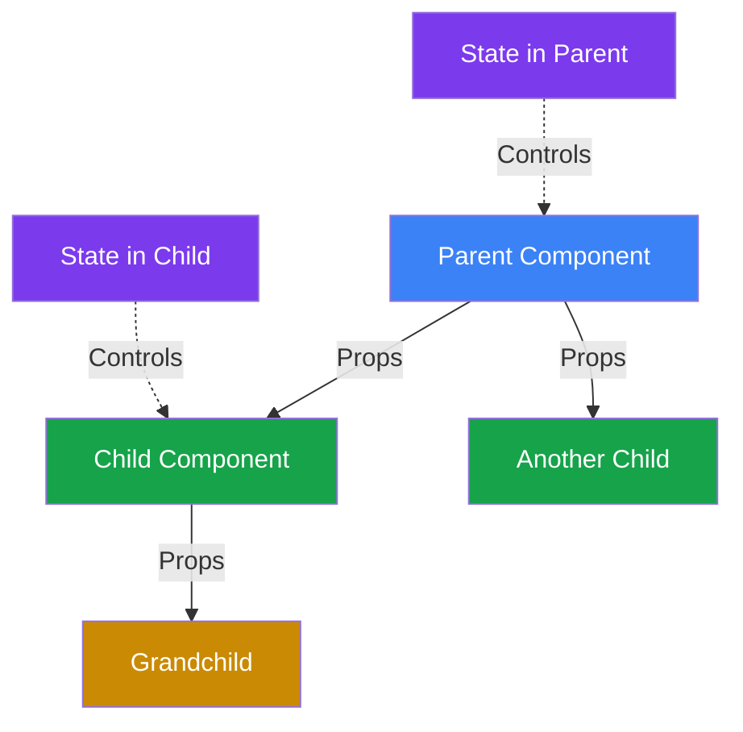
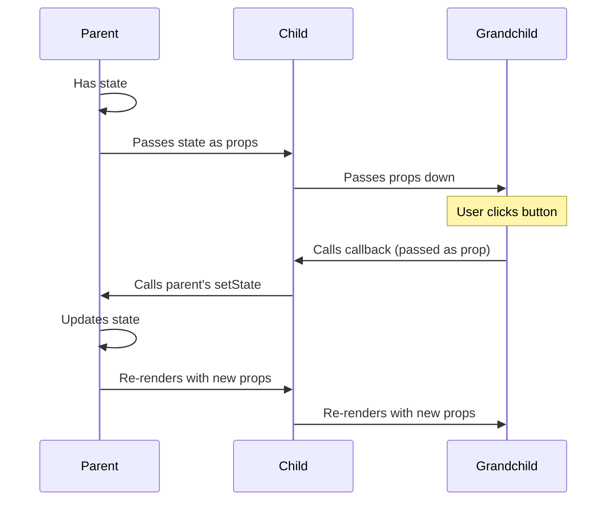
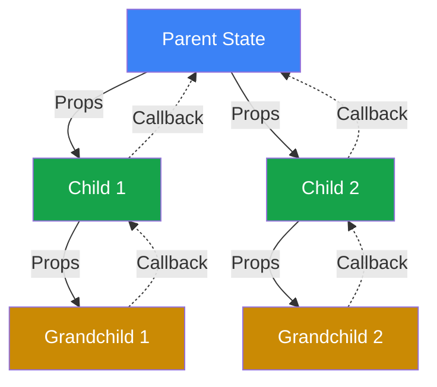

# State & Props in React

## What are State and Props?

**State** - Data that belongs to a component and can change over time. When state changes, the component re-renders.

**Props** - Data passed from a parent component to a child component. Props are read-only and cannot be modified by the child.

Think of it like this:
- **State** = Your personal notes that you can edit
- **Props** = Messages someone else sent you that you can read but not change

## The Key Difference

```javascript
// State - component owns and controls it
function Counter() {
  const [count, setCount] = useState(0); // This component's state
  return <button onClick={() => setCount(count + 1)}>{count}</button>;
}

// Props - received from parent, read-only
function Display({ count }) { // Received as prop
  // count = 10; // ERROR! Can't modify props
  return <div>Count: {count}</div>;
}

function Parent() {
  const [count, setCount] = useState(0);
  return <Display count={count} />; // Passing state as prop
}
```

## State vs Props Comparison

| Feature | State | Props |
|---------|-------|-------|
| **Owned by** | The component itself | Parent component |
| **Can change?** | Yes (via setState) | No (read-only) |
| **Triggers re-render?** | Yes | Yes (when parent changes it) |
| **Used for** | Internal component data | Passing data to children |
| **Think of it as** | Component's memory | Function parameters |

## Data Flow: The Big Picture



## How Data Flows in React



## State Basics

### Creating state

```javascript
import { useState } from 'react';

function Counter() {
  // [currentValue, functionToUpdateIt] = useState(initialValue)
  const [count, setCount] = useState(0);
  
  return (
    <div>
      <p>Count: {count}</p>
      <button onClick={() => setCount(count + 1)}>Increment</button>
    </div>
  );
}
```

### Multiple state variables

```javascript
function UserForm() {
  const [name, setName] = useState('');
  const [age, setAge] = useState(0);
  const [email, setEmail] = useState('');
  
  return (
    <div>
      <input value={name} onChange={e => setName(e.target.value)} />
      <input value={age} onChange={e => setAge(e.target.value)} />
      <input value={email} onChange={e => setEmail(e.target.value)} />
    </div>
  );
}
```

### State with objects

```javascript
function Profile() {
  const [user, setUser] = useState({
    name: 'John',
    age: 25,
    email: 'john@example.com'
  });
  
  const updateName = (newName) => {
    setUser({ ...user, name: newName }); // Spread to keep other properties
  };
  
  return <div>{user.name}</div>;
}
```

### State with arrays

```javascript
function TodoList() {
  const [todos, setTodos] = useState(['Buy milk', 'Walk dog']);
  
  const addTodo = (todo) => {
    setTodos([...todos, todo]); // Add to end
  };
  
  const removeTodo = (index) => {
    setTodos(todos.filter((_, i) => i !== index)); // Remove by index
  };
  
  return <div>{/* render todos */}</div>;
}
```

## Props Basics

### Passing props

```javascript
function Parent() {
  return (
    <Child 
      name="John" 
      age={25} 
      isActive={true}
      hobbies={['reading', 'gaming']}
    />
  );
}

function Child({ name, age, isActive, hobbies }) {
  return (
    <div>
      <p>{name} is {age} years old</p>
      <p>Active: {isActive ? 'Yes' : 'No'}</p>
      <p>Hobbies: {hobbies.join(', ')}</p>
    </div>
  );
}
```

### Default props

```javascript
function Greeting({ name = 'Guest', message = 'Hello' }) {
  return <h1>{message}, {name}!</h1>;
}

// Usage
<Greeting /> // Hello, Guest!
<Greeting name="John" /> // Hello, John!
<Greeting name="Jane" message="Hi" /> // Hi, Jane!
```

### Props with children

```javascript
function Card({ children, title }) {
  return (
    <div className="card">
      <h2>{title}</h2>
      {children}
    </div>
  );
}

// Usage
<Card title="Profile">
  <p>This is the content inside the card</p>
  <button>Click me</button>
</Card>
```

## Lifting State Up

When two components need to share state, move it to their closest common parent:

```javascript
// Bad - state in wrong place
function ComponentA() {
  const [sharedData, setSharedData] = useState('');
  // How does ComponentB access this?
}

function ComponentB() {
  // Can't access ComponentA's state
}

// Good - state in parent
function Parent() {
  const [sharedData, setSharedData] = useState('');
  
  return (
    <>
      <ComponentA data={sharedData} setData={setSharedData} />
      <ComponentB data={sharedData} setData={setSharedData} />
    </>
  );
}

function ComponentA({ data, setData }) {
  return <input value={data} onChange={e => setData(e.target.value)} />;
}

function ComponentB({ data, setData }) {
  return <div>Shared data: {data}</div>;
}
```

## Passing Functions as Props

### Callback props

```javascript
function Parent() {
  const [message, setMessage] = useState('');
  
  const handleButtonClick = (text) => {
    setMessage(text);
  };
  
  return (
    <div>
      <Child onButtonClick={handleButtonClick} />
      <p>Message: {message}</p>
    </div>
  );
}

function Child({ onButtonClick }) {
  return (
    <button onClick={() => onButtonClick('Hello from child!')}>
      Click me
    </button>
  );
}
```

### Event handlers

```javascript
function TodoApp() {
  const [todos, setTodos] = useState([]);
  
  const addTodo = (text) => {
    setTodos([...todos, { id: Date.now(), text, done: false }]);
  };
  
  const toggleTodo = (id) => {
    setTodos(todos.map(todo =>
      todo.id === id ? { ...todo, done: !todo.done } : todo
    ));
  };
  
  return (
    <div>
      <AddTodoForm onAdd={addTodo} />
      <TodoList todos={todos} onToggle={toggleTodo} />
    </div>
  );
}
```

## Common Patterns

### Controlled components

```javascript
function SearchBar() {
  const [query, setQuery] = useState('');
  
  return (
    <input 
      value={query} // Controlled by state
      onChange={e => setQuery(e.target.value)}
      placeholder="Search..."
    />
  );
}
```

### Derived state

```javascript
function ShoppingCart({ items }) {
  // Don't store total in state, calculate it
  const total = items.reduce((sum, item) => sum + item.price, 0);
  
  return <div>Total: ${total}</div>;
}
```

### State initialization from props

```javascript
function EditForm({ initialUser }) {
  // Initialize state from props only once
  const [user, setUser] = useState(initialUser);
  
  return (
    <input 
      value={user.name}
      onChange={e => setUser({ ...user, name: e.target.value })}
    />
  );
}
```

## One-Way Data Flow



**Data flows down** (via props)  
**Events flow up** (via callbacks)

## Common Mistakes

**1. Modifying props directly**

```javascript
// Wrong - props are read-only
function Child({ user }) {
  user.name = 'New Name'; // ERROR! Mutation
  return <div>{user.name}</div>;
}

// Correct - use state if you need to modify
function Child({ initialUser }) {
  const [user, setUser] = useState(initialUser);
  
  const updateName = () => {
    setUser({ ...user, name: 'New Name' });
  };
  
  return <div>{user.name}</div>;
}
```

**2. Mutating state directly**

```javascript
// Wrong - mutating state
function TodoList() {
  const [todos, setTodos] = useState([]);
  
  const addTodo = (text) => {
    todos.push(text); // ERROR! Mutation
    setTodos(todos); // Won't trigger re-render
  };
}

// Correct - create new array
function TodoList() {
  const [todos, setTodos] = useState([]);
  
  const addTodo = (text) => {
    setTodos([...todos, text]); // New array
  };
}
```

**3. Using stale state in updates**

```javascript
// Wrong - using stale state
function Counter() {
  const [count, setCount] = useState(0);
  
  const increment = () => {
    setCount(count + 1);
    setCount(count + 1); // Still uses old count!
    // Result: count increases by 1, not 2
  };
}

// Correct - use functional update
function Counter() {
  const [count, setCount] = useState(0);
  
  const increment = () => {
    setCount(prev => prev + 1);
    setCount(prev => prev + 1);
    // Result: count increases by 2
  };
}
```

**4. Unnecessary state**

```javascript
// Wrong - storing derived values in state
function ProductPage({ price }) {
  const [priceWithTax, setPriceWithTax] = useState(price * 1.18);
  
  return <div>${priceWithTax}</div>;
}

// Correct - calculate during render
function ProductPage({ price }) {
  const priceWithTax = price * 1.18;
  
  return <div>${priceWithTax}</div>;
}
```

**5. Not spreading when updating objects**

```javascript
// Wrong - loses other properties
function Profile() {
  const [user, setUser] = useState({ name: 'John', age: 25, email: 'john@example.com' });
  
  const updateName = () => {
    setUser({ name: 'Jane' }); // Lost age and email!
  };
}

// Correct - spread existing properties
function Profile() {
  const [user, setUser] = useState({ name: 'John', age: 25, email: 'john@example.com' });
  
  const updateName = () => {
    setUser({ ...user, name: 'Jane' }); // Keeps age and email
  };
}
```

## When to Use State vs Props

**Use State when:**
- Data changes over time
- Component controls the data
- Data is specific to this component
- Examples: form inputs, toggles, counters

**Use Props when:**
- Passing data from parent to child
- Component needs to receive configuration
- Sharing data between siblings (lift to parent)
- Examples: user info, settings, callbacks

## Props Drilling Problem

```javascript
// Props drilling - passing props through many levels
function App() {
  const [user, setUser] = useState({ name: 'John' });
  
  return <Dashboard user={user} />;
}

function Dashboard({ user }) {
  return <Sidebar user={user} />; // Just passing through
}

function Sidebar({ user }) {
  return <UserProfile user={user} />; // Just passing through
}

function UserProfile({ user }) {
  return <div>{user.name}</div>; // Finally used here
}

// Solution: Use Context API for deeply nested components
```

## State Updates are Asynchronous

```javascript
function Counter() {
  const [count, setCount] = useState(0);
  
  const handleClick = () => {
    setCount(count + 1);
    console.log(count); // Still shows old value!
    // State updates are batched and async
  };
  
  return <button onClick={handleClick}>{count}</button>;
}
```

## Best Practices

**1. Keep state minimal**
```javascript
// Bad - redundant state
const [firstName, setFirstName] = useState('');
const [lastName, setLastName] = useState('');
const [fullName, setFullName] = useState(''); // Derived, don't store!

// Good - calculate derived values
const [firstName, setFirstName] = useState('');
const [lastName, setLastName] = useState('');
const fullName = `${firstName} ${lastName}`;
```

**2. State should be normalized**
```javascript
// Bad - duplicated data
const [users, setUsers] = useState([
  { id: 1, name: 'John' },
  { id: 2, name: 'Jane' }
]);
const [selectedUser, setSelectedUser] = useState({ id: 1, name: 'John' });

// Good - store ID only
const [users, setUsers] = useState([
  { id: 1, name: 'John' },
  { id: 2, name: 'Jane' }
]);
const [selectedUserId, setSelectedUserId] = useState(1);
const selectedUser = users.find(u => u.id === selectedUserId);
```

**3. Name props clearly**
```javascript
// Bad - unclear prop names
<Button click={handleClick} txt="Submit" />

// Good - clear, descriptive names
<Button onClick={handleClick} text="Submit" />
```

**4. Use destructuring for props**
```javascript
// Bad - repetitive props.
function User(props) {
  return <div>{props.name} - {props.age} - {props.email}</div>;
}

// Good - destructure in parameters
function User({ name, age, email }) {
  return <div>{name} - {age} - {email}</div>;
}
```

## Things to Remember

1. State belongs to a component, props are passed to it
2. Props are read-only, never modify them
3. State updates trigger re-renders
4. Always use setState, never mutate state directly
5. Data flows down (props), events flow up (callbacks)
6. Lift state up to share between siblings
7. State updates are asynchronous
8. Don't store derived values in state
9. Use functional updates for state based on previous state
10. Keep state as close as possible to where it's used

## Related Topics

- useState - Hook for managing state in functional components
- useEffect - Syncing with external systems based on state/props
- useContext - Avoiding prop drilling for deeply nested data
- React.memo - Preventing re-renders when props haven't changed