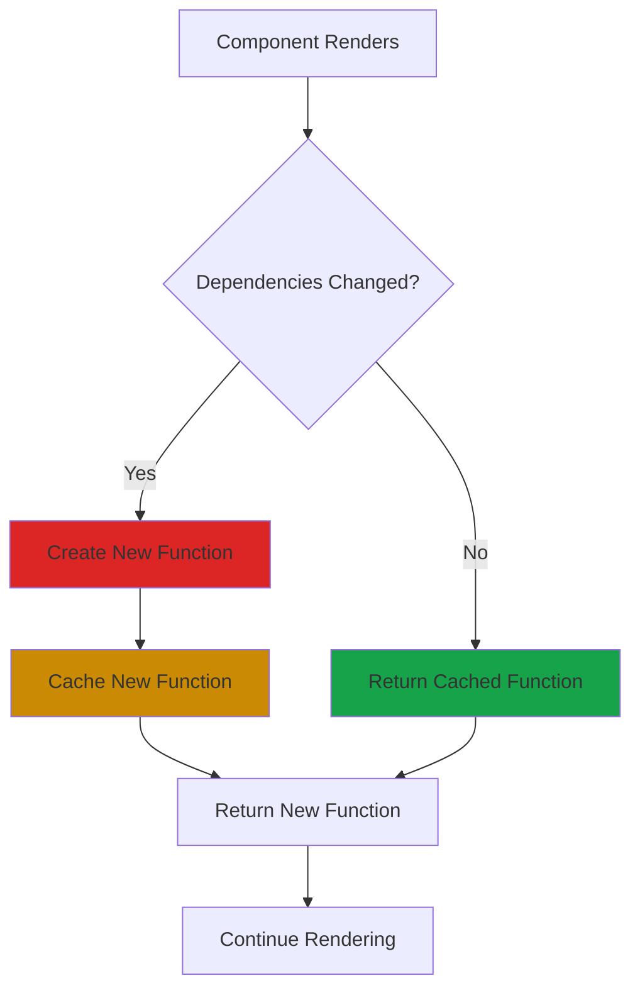
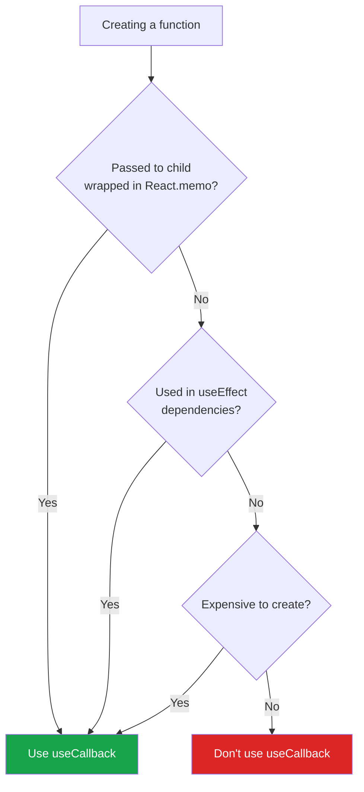

# useCallback Hook in React

## What is useCallback?

`useCallback` is a React Hook that lets you cache a function definition between re-renders. It returns a memoized version of the callback function that only changes when its dependencies change.

Think of it like bookmarking a recipe. Instead of rewriting the recipe every time you cook, you keep the same bookmark and only update it when the ingredients change.

## The Problem: Functions Created on Every Render

Every time a component re-renders, all functions inside it are recreated:

```javascript
function Parent() {
  const [count, setCount] = useState(0);
  
  // This function is recreated on every render
  const handleClick = () => {
    console.log('Clicked');
  };
  
  return <Child onClick={handleClick} />;
}

const Child = React.memo(({ onClick }) => {
  console.log('Child rendered');
  return <button onClick={onClick}>Click</button>;
});

// Problem: Child re-renders every time Parent re-renders
// because handleClick is a new function each time
```

Even though `Child` is wrapped in `React.memo`, it still re-renders because `handleClick` is a different function reference each time.

## The Solution: useCallback

```javascript
function Parent() {
  const [count, setCount] = useState(0);
  
  // Function is only recreated when dependencies change
  const handleClick = useCallback(() => {
    console.log('Clicked');
  }, []); // Empty array = never changes
  
  return <Child onClick={handleClick} />;
}

const Child = React.memo(({ onClick }) => {
  console.log('Child rendered'); // Only renders once now!
  return <button onClick={onClick}>Click</button>;
});
```

## Basic Syntax

```javascript
import { useCallback } from 'react';

const cachedFunction = useCallback(() => {
  // Function logic
}, [dependencies]); // Dependencies array
```

**Two parts:**
1. **Function definition** - The function to cache
2. **Dependency array** - When to recreate the function

## How useCallback Works



## useCallback vs useMemo

They're similar but cache different things:

```javascript
// useCallback - caches the FUNCTION itself
const handleClick = useCallback(() => {
  doSomething(a, b);
}, [a, b]);

// useMemo - caches the RESULT of a function
const result = useMemo(() => {
  return computeExpensiveValue(a, b);
}, [a, b]);

// useCallback is actually useMemo for functions
const handleClick = useMemo(() => {
  return () => doSomething(a, b);
}, [a, b]);
```

## When to Use vs Not Use



## Basic Examples

### Preventing child re-renders

```javascript
function Parent() {
  const [count, setCount] = useState(0);
  const [text, setText] = useState('');
  
  const handleReset = useCallback(() => {
    setCount(0);
  }, []);
  
  return (
    <>
      <button onClick={() => setCount(count + 1)}>Count: {count}</button>
      <input value={text} onChange={e => setText(e.target.value)} />
      <ExpensiveChild onReset={handleReset} />
    </>
  );
}

const ExpensiveChild = React.memo(({ onReset }) => {
  console.log('ExpensiveChild rendered');
  return <button onClick={onReset}>Reset</button>;
});
```

### useEffect dependencies

```javascript
function SearchComponent({ query }) {
  const [results, setResults] = useState([]);
  
  const fetchResults = useCallback(async () => {
    const data = await searchAPI(query);
    setResults(data);
  }, [query]);
  
  useEffect(() => {
    fetchResults();
  }, [fetchResults]); // fetchResults won't change unless query changes
  
  return <div>{results.length} results</div>;
}
```

### Event handlers with dependencies

```javascript
function TodoList() {
  const [todos, setTodos] = useState([]);
  
  const handleToggle = useCallback((id) => {
    setTodos(prevTodos =>
      prevTodos.map(todo =>
        todo.id === id ? { ...todo, done: !todo.done } : todo
      )
    );
  }, []); // No dependencies needed with functional update
  
  return (
    <ul>
      {todos.map(todo => (
        <TodoItem key={todo.id} todo={todo} onToggle={handleToggle} />
      ))}
    </ul>
  );
}

const TodoItem = React.memo(({ todo, onToggle }) => {
  return (
    <li onClick={() => onToggle(todo.id)}>
      {todo.text}
    </li>
  );
});
```

## Common Patterns

### Form handlers

```javascript
function ContactForm() {
  const [formData, setFormData] = useState({
    name: '',
    email: '',
    message: ''
  });
  
  const handleChange = useCallback((field) => {
    return (e) => {
      setFormData(prev => ({ ...prev, [field]: e.target.value }));
    };
  }, []);
  
  const handleSubmit = useCallback(() => {
    console.log('Submitting:', formData);
  }, [formData]);
  
  return (
    <>
      <input value={formData.name} onChange={handleChange('name')} />
      <input value={formData.email} onChange={handleChange('email')} />
      <textarea value={formData.message} onChange={handleChange('message')} />
      <button onClick={handleSubmit}>Submit</button>
    </>
  );
}
```

### API calls

```javascript
function UserProfile({ userId }) {
  const [user, setUser] = useState(null);
  
  const fetchUser = useCallback(async () => {
    const response = await fetch(`/api/users/${userId}`);
    const data = await response.json();
    setUser(data);
  }, [userId]);
  
  useEffect(() => {
    fetchUser();
  }, [fetchUser]);
  
  const refetch = useCallback(() => {
    fetchUser();
  }, [fetchUser]);
  
  return (
    <div>
      {user && <div>{user.name}</div>}
      <button onClick={refetch}>Refresh</button>
    </div>
  );
}
```

### Debounced functions

```javascript
function SearchBar() {
  const [query, setQuery] = useState('');
  const [results, setResults] = useState([]);
  
  const debouncedSearch = useCallback(
    debounce((searchQuery) => {
      searchAPI(searchQuery).then(setResults);
    }, 500),
    []
  );
  
  const handleChange = useCallback((e) => {
    const value = e.target.value;
    setQuery(value);
    debouncedSearch(value);
  }, [debouncedSearch]);
  
  return (
    <>
      <input value={query} onChange={handleChange} />
      <ResultsList results={results} />
    </>
  );
}
```

## With React.memo

useCallback is most useful with `React.memo`:

```javascript
// Without useCallback
function Parent() {
  const [count, setCount] = useState(0);
  
  const handleClick = () => console.log('Clicked');
  
  return (
    <>
      <button onClick={() => setCount(count + 1)}>Count: {count}</button>
      <Child onClick={handleClick} /> {/* Re-renders every time */}
    </>
  );
}

// With useCallback
function Parent() {
  const [count, setCount] = useState(0);
  
  const handleClick = useCallback(() => {
    console.log('Clicked');
  }, []);
  
  return (
    <>
      <button onClick={() => setCount(count + 1)}>Count: {count}</button>
      <Child onClick={handleClick} /> {/* Only renders once */}
    </>
  );
}

const Child = React.memo(({ onClick }) => {
  console.log('Child rendered');
  return <button onClick={onClick}>Click me</button>;
});
```

## Common Mistakes

**1. Not using React.memo**

```javascript
// Bad - useCallback without React.memo is useless
function Parent() {
  const handleClick = useCallback(() => {
    console.log('Clicked');
  }, []);
  
  return <Child onClick={handleClick} />; // Child not memoized!
}

function Child({ onClick }) {
  return <button onClick={onClick}>Click</button>;
}

// Good - Child is memoized
const Child = React.memo(({ onClick }) => {
  return <button onClick={onClick}>Click</button>;
});
```

**2. Missing dependencies**

```javascript
// Bad - missing 'count' in dependencies
function Component() {
  const [count, setCount] = useState(0);
  
  const handleClick = useCallback(() => {
    console.log(count); // Stale closure - always logs 0
  }, []); // Missing count!
  
  return <button onClick={handleClick}>Log Count</button>;
}

// Good - include all dependencies
function Component() {
  const [count, setCount] = useState(0);
  
  const handleClick = useCallback(() => {
    console.log(count); // Always logs current count
  }, [count]);
  
  return <button onClick={handleClick}>Log Count</button>;
}
```

**3. Overusing useCallback**

```javascript
// Bad - useCallback for every function
function Component() {
  const handleClick1 = useCallback(() => {}, []);
  const handleClick2 = useCallback(() => {}, []);
  const handleClick3 = useCallback(() => {}, []);
  const handleChange1 = useCallback(() => {}, []);
  const handleChange2 = useCallback(() => {}, []);
  // ... more unnecessary callbacks
}

// Good - only where it matters
function Component() {
  // Regular functions for local use
  const handleClick = () => {};
  
  // useCallback only for props passed to memoized children
  const handleSubmit = useCallback(() => {}, []);
  
  return <MemoizedChild onSubmit={handleSubmit} />;
}
```

**4. Using inline functions**

```javascript
// Bad - inline function defeats useCallback
function Parent() {
  const handleClick = useCallback((id) => {
    console.log(id);
  }, []);
  
  return items.map(item => (
    <Child onClick={() => handleClick(item.id)} /> // New function each render!
  ));
}

// Good - pass function directly
function Parent() {
  const handleClick = useCallback((id) => {
    console.log(id);
  }, []);
  
  return items.map(item => (
    <Child id={item.id} onClick={handleClick} />
  ));
}

const Child = React.memo(({ id, onClick }) => {
  return <button onClick={() => onClick(id)}>Click</button>;
});
```

**5. Not using functional updates**

```javascript
// Bad - state in dependencies
function Component() {
  const [count, setCount] = useState(0);
  
  const increment = useCallback(() => {
    setCount(count + 1); // Uses closure over count
  }, [count]); // Function recreated every time count changes
}

// Good - functional update
function Component() {
  const [count, setCount] = useState(0);
  
  const increment = useCallback(() => {
    setCount(prev => prev + 1); // No dependency on count
  }, []); // Function never recreated
}
```

## When NOT to Use useCallback

**Don't use useCallback for:**

1. **Functions not passed as props**
   ```javascript
   // Bad
   const handleClick = useCallback(() => {
     console.log('Local function');
   }, []);
   
   return <button onClick={handleClick}>Click</button>;
   
   // Good - just use regular function
   const handleClick = () => console.log('Local function');
   return <button onClick={handleClick}>Click</button>;
   ```

2. **Props to non-memoized components**
   ```javascript
   // Bad - Child is not memoized
   const handleClick = useCallback(() => {}, []);
   return <Child onClick={handleClick} />;
   
   // Good - no useCallback needed
   const handleClick = () => {};
   return <Child onClick={handleClick} />;
   ```

3. **Simple event handlers**
   ```javascript
   // Bad - unnecessary for simple handlers
   const handleClick = useCallback(() => {
     console.log('Clicked');
   }, []);
   
   // Good - inline is fine
   return <button onClick={() => console.log('Clicked')}>Click</button>;
   ```

## Performance Considerations

useCallback has its own overhead:

```javascript
// Cost of useCallback:
// 1. Memory to store the function
// 2. Comparison of dependencies on every render
// 3. Additional code complexity

// Only use if the cost of re-creating function + re-rendering children
// is greater than the cost of useCallback itself
```

**Profile first, optimize later:**
- Measure render times with React DevTools
- Identify actual performance bottlenecks
- Add useCallback only where needed

## useCallback with Custom Hooks

```javascript
function useDebounce(callback, delay) {
  const callbackRef = useRef(callback);
  
  useEffect(() => {
    callbackRef.current = callback;
  }, [callback]);
  
  return useCallback((...args) => {
    const timeoutId = setTimeout(() => {
      callbackRef.current(...args);
    }, delay);
    
    return () => clearTimeout(timeoutId);
  }, [delay]);
}

// Usage
function SearchComponent() {
  const [query, setQuery] = useState('');
  
  const debouncedSearch = useDebounce((value) => {
    searchAPI(value);
  }, 500);
  
  const handleChange = useCallback((e) => {
    setQuery(e.target.value);
    debouncedSearch(e.target.value);
  }, [debouncedSearch]);
  
  return <input value={query} onChange={handleChange} />;
}
```

## Real-World Example

```javascript
function Dashboard({ userId }) {
  const [data, setData] = useState(null);
  const [filters, setFilters] = useState({});
  
  // Fetch data when userId changes
  const fetchData = useCallback(async () => {
    const response = await fetch(`/api/dashboard/${userId}`);
    const result = await response.json();
    setData(result);
  }, [userId]);
  
  useEffect(() => {
    fetchData();
  }, [fetchData]);
  
  // Filter handler with functional update
  const updateFilter = useCallback((key, value) => {
    setFilters(prev => ({ ...prev, [key]: value }));
  }, []);
  
  // Refresh handler
  const handleRefresh = useCallback(() => {
    fetchData();
  }, [fetchData]);
  
  // Export handler with dependencies
  const handleExport = useCallback(() => {
    exportData(data, filters);
  }, [data, filters]);
  
  return (
    <div>
      <FilterPanel filters={filters} onFilterChange={updateFilter} />
      <DataGrid data={data} />
      <button onClick={handleRefresh}>Refresh</button>
      <button onClick={handleExport}>Export</button>
    </div>
  );
}

const FilterPanel = React.memo(({ filters, onFilterChange }) => {
  console.log('FilterPanel rendered');
  return <div>{/* filter UI */}</div>;
});

const DataGrid = React.memo(({ data }) => {
  console.log('DataGrid rendered');
  return <div>{/* data display */}</div>;
});
```

## Best Practices

**1. Always use with React.memo**
```javascript
// useCallback is most effective with memoized children
const Child = React.memo(({ onClick }) => {
  return <button onClick={onClick}>Click</button>;
});

function Parent() {
  const handleClick = useCallback(() => {}, []);
  return <Child onClick={handleClick} />;
}
```

**2. Use functional updates**
```javascript
// Avoid state in dependencies
const increment = useCallback(() => {
  setCount(prev => prev + 1); // No count dependency
}, []);
```

**3. Include all dependencies**
```javascript
// ESLint exhaustive-deps will help
const handleClick = useCallback(() => {
  doSomething(value);
}, [value]); // Include everything used
```

**4. Don't over-optimize**
```javascript
// Only use where it provides actual benefit
// Not every function needs useCallback
```

## Things to Remember

1. useCallback caches a function definition between re-renders
2. Only recreates function when dependencies change
3. Most useful with React.memo to prevent child re-renders
4. Also useful for useEffect dependencies
5. Don't use without React.memo on children
6. Always include all dependencies
7. Use functional updates to reduce dependencies
8. Has its own overhead - don't overuse
9. Profile before optimizing
10. useCallback = useMemo for functions

## Related Topics

- useMemo - Memoize values instead of functions
- React.memo - Prevent component re-renders
- useEffect - Often uses useCallback for dependencies
- useRef - Alternative for stable function references