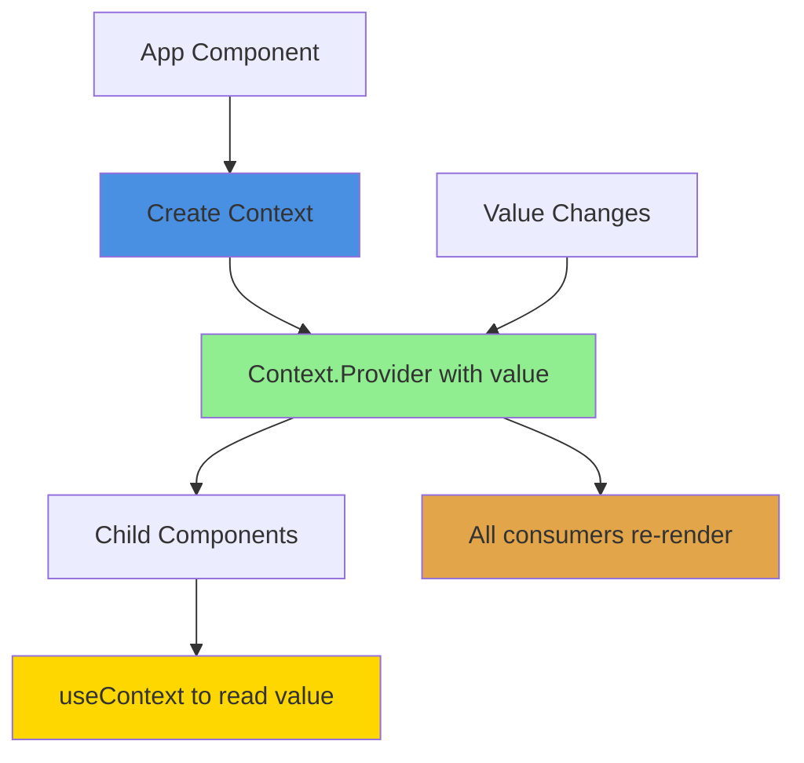
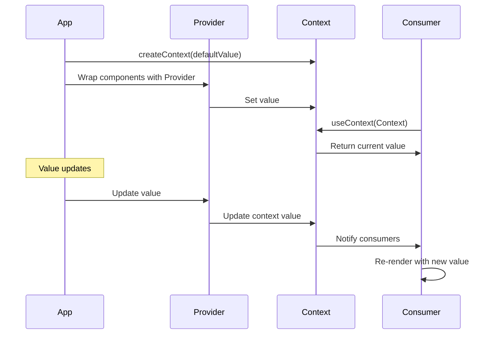

# useContext Hook in React

## What is useContext?

`useContext` is a React Hook that lets you read and subscribe to context from your component. Context provides a way to pass data through the component tree without having to pass props down manually at every level.

Think of context like a broadcasting station - you set up the station once, and any component can tune in to receive the signal, no matter how deep in the tree it is.

## The Problem: Prop Drilling

Without context, you have to pass props through every level:

```javascript
function App() {
  const user = { name: 'John', age: 25 };
  return <Parent user={user} />;
}

function Parent({ user }) {
  return <Child user={user} />; // Just passing through
}

function Child({ user }) {
  return <GrandChild user={user} />; // Still passing through
}

function GrandChild({ user }) {
  return <div>{user.name}</div>; // Finally used here!
}
```

This is called "prop drilling" and it's tedious.

## The Solution: Context

With context, you can skip the intermediate components:

```javascript
const UserContext = createContext();

function App() {
  const user = { name: 'John', age: 25 };
  
  return (
    <UserContext.Provider value={user}>
      <Parent />
    </UserContext.Provider>
  );
}

function GrandChild() {
  const user = useContext(UserContext);
  return <div>{user.name}</div>; // Direct access!
}
```

## How Context Works



## Context Flow



## Basic Usage

### Step 1: Create Context

```javascript
import { createContext } from 'react';

const ThemeContext = createContext('light'); // default value
```

### Step 2: Provide Context

```javascript
function App() {
  const [theme, setTheme] = useState('light');
  
  return (
    <ThemeContext.Provider value={theme}>
      <Toolbar />
    </ThemeContext.Provider>
  );
}
```

### Step 3: Consume Context

```javascript
import { useContext } from 'react';

function Button() {
  const theme = useContext(ThemeContext);
  
  return (
    <button style={{ background: theme === 'dark' ? '#333' : '#fff' }}>
      Click me
    </button>
  );
}
```

## Complete Example

```javascript
import { createContext, useContext, useState } from 'react';

// 1. Create context
const UserContext = createContext();

// 2. Provider component
function App() {
  const [user, setUser] = useState({ name: 'John', role: 'admin' });
  
  return (
    <UserContext.Provider value={{ user, setUser }}>
      <Dashboard />
    </UserContext.Provider>
  );
}

// 3. Consumer components
function Dashboard() {
  return (
    <div>
      <Header />
      <Profile />
    </div>
  );
}

function Header() {
  const { user } = useContext(UserContext);
  return <h1>Welcome, {user.name}</h1>;
}

function Profile() {
  const { user, setUser } = useContext(UserContext);
  
  return (
    <div>
      <p>Role: {user.role}</p>
      <button onClick={() => setUser({ ...user, role: 'user' })}>
        Change Role
      </button>
    </div>
  );
}
```

## Context with Custom Provider

It's common to create a custom provider component:

```javascript
const ThemeContext = createContext();

export function ThemeProvider({ children }) {
  const [theme, setTheme] = useState('light');
  
  const toggleTheme = () => {
    setTheme(prev => prev === 'light' ? 'dark' : 'light');
  };
  
  const value = {
    theme,
    toggleTheme
  };
  
  return (
    <ThemeContext.Provider value={value}>
      {children}
    </ThemeContext.Provider>
  );
}

export function useTheme() {
  const context = useContext(ThemeContext);
  
  if (context === undefined) {
    throw new Error('useTheme must be used within ThemeProvider');
  }
  
  return context;
}

// Usage
function App() {
  return (
    <ThemeProvider>
      <Page />
    </ThemeProvider>
  );
}

function Page() {
  const { theme, toggleTheme } = useTheme();
  
  return (
    <div style={{ background: theme === 'dark' ? '#333' : '#fff' }}>
      <button onClick={toggleTheme}>Toggle Theme</button>
    </div>
  );
}
```

## Multiple Contexts

You can use multiple contexts in one component:

```javascript
const ThemeContext = createContext();
const UserContext = createContext();

function App() {
  return (
    <ThemeProvider>
      <UserProvider>
        <Dashboard />
      </UserProvider>
    </ThemeProvider>
  );
}

function Dashboard() {
  const { theme } = useContext(ThemeContext);
  const { user } = useContext(UserContext);
  
  return (
    <div style={{ background: theme === 'dark' ? '#333' : '#fff' }}>
      Welcome, {user.name}
    </div>
  );
}
```

## Common Patterns

### Authentication context

```javascript
const AuthContext = createContext();

export function AuthProvider({ children }) {
  const [user, setUser] = useState(null);
  const [isLoading, setIsLoading] = useState(true);
  
  useEffect(() => {
    // Check if user is logged in
    const token = localStorage.getItem('token');
    if (token) {
      fetchUser(token).then(setUser);
    }
    setIsLoading(false);
  }, []);
  
  const login = async (email, password) => {
    const user = await loginAPI(email, password);
    setUser(user);
  };
  
  const logout = () => {
    localStorage.removeItem('token');
    setUser(null);
  };
  
  const value = {
    user,
    isLoading,
    login,
    logout,
    isAuthenticated: !!user
  };
  
  return (
    <AuthContext.Provider value={value}>
      {children}
    </AuthContext.Provider>
  );
}

export function useAuth() {
  return useContext(AuthContext);
}
```

### Settings/Preferences context

```javascript
const SettingsContext = createContext();

export function SettingsProvider({ children }) {
  const [settings, setSettings] = useState({
    theme: 'light',
    language: 'en',
    notifications: true
  });
  
  const updateSetting = (key, value) => {
    setSettings(prev => ({ ...prev, [key]: value }));
  };
  
  return (
    <SettingsContext.Provider value={{ settings, updateSetting }}>
      {children}
    </SettingsContext.Provider>
  );
}
```

### Shopping cart context

```javascript
const CartContext = createContext();

export function CartProvider({ children }) {
  const [items, setItems] = useState([]);
  
  const addItem = (product) => {
    setItems(prev => [...prev, { ...product, quantity: 1 }]);
  };
  
  const removeItem = (id) => {
    setItems(prev => prev.filter(item => item.id !== id));
  };
  
  const updateQuantity = (id, quantity) => {
    setItems(prev => prev.map(item =>
      item.id === id ? { ...item, quantity } : item
    ));
  };
  
  const total = items.reduce((sum, item) => 
    sum + (item.price * item.quantity), 0
  );
  
  const value = {
    items,
    addItem,
    removeItem,
    updateQuantity,
    total,
    itemCount: items.length
  };
  
  return (
    <CartContext.Provider value={value}>
      {children}
    </CartContext.Provider>
  );
}

export function useCart() {
  return useContext(CartContext);
}
```

## Default Values

The default value is only used when a component doesn't have a matching Provider:

```javascript
const ThemeContext = createContext('light'); // Default

function Button() {
  const theme = useContext(ThemeContext);
  return <button>{theme}</button>; // 'light' if no Provider
}

// No provider - uses default
function App() {
  return <Button />; // theme is 'light'
}

// With provider - uses provided value
function App() {
  return (
    <ThemeContext.Provider value="dark">
      <Button /> {/* theme is 'dark' */}
    </ThemeContext.Provider>
  );
}
```

## Performance Considerations

Context re-renders all consumers when value changes:

```javascript
// Bad - creates new object every render
function App() {
  const [user, setUser] = useState({ name: 'John' });
  
  return (
    <UserContext.Provider value={{ user, setUser }}>
      {/* All consumers re-render on every App render */}
      <Children />
    </UserContext.Provider>
  );
}

// Better - memoize the value
function App() {
  const [user, setUser] = useState({ name: 'John' });
  
  const value = useMemo(() => ({
    user,
    setUser
  }), [user]);
  
  return (
    <UserContext.Provider value={value}>
      {/* Only re-renders when user changes */}
      <Children />
    </UserContext.Provider>
  );
}
```

## Common Mistakes

**1. Using context outside Provider**

```javascript
// Wrong - context used before Provider
function App() {
  return (
    <div>
      <ComponentUsingContext /> {/* Error! */}
      <UserContext.Provider value={user}>
        <OtherComponent />
      </UserContext.Provider>
    </div>
  );
}

// Correct - all consumers inside Provider
function App() {
  return (
    <UserContext.Provider value={user}>
      <ComponentUsingContext />
      <OtherComponent />
    </UserContext.Provider>
  );
}
```

**2. Not providing error handling**

```javascript
// Bad - no error if used outside Provider
function useUser() {
  return useContext(UserContext);
}

// Good - throws helpful error
function useUser() {
  const context = useContext(UserContext);
  
  if (context === undefined) {
    throw new Error('useUser must be used within UserProvider');
  }
  
  return context;
}
```

**3. Creating new objects in value**

```javascript
// Bad - new object every render
<UserContext.Provider value={{ user, setUser }}>

// Good - memoized
const value = useMemo(() => ({ user, setUser }), [user]);
<UserContext.Provider value={value}>
```

**4. Overusing context**

```javascript
// Bad - context for data only used in one place
<ColorContext.Provider value={color}>
  <Parent>
    <Child>
      <GrandChild /> {/* Only component using color */}
    </Child>
  </Parent>
</ColorContext.Provider>

// Good - just pass as prop
<Parent>
  <Child>
    <GrandChild color={color} />
  </Child>
</Parent>
```

## Context vs Props

| Use Context When | Use Props When |
|-----------------|---------------|
| Data needed by many components | Data only used by direct children |
| Data used at different nesting levels | Linear data flow |
| Global app state (theme, auth, language) | Component-specific data |
| Avoiding prop drilling | Props are manageable |

## Combining Context with useReducer

For complex state logic:

```javascript
const TodoContext = createContext();

function todoReducer(state, action) {
  switch (action.type) {
    case 'ADD':
      return [...state, action.todo];
    case 'REMOVE':
      return state.filter(t => t.id !== action.id);
    case 'TOGGLE':
      return state.map(t =>
        t.id === action.id ? { ...t, done: !t.done } : t
      );
    default:
      return state;
  }
}

export function TodoProvider({ children }) {
  const [todos, dispatch] = useReducer(todoReducer, []);
  
  return (
    <TodoContext.Provider value={{ todos, dispatch }}>
      {children}
    </TodoContext.Provider>
  );
}

export function useTodos() {
  return useContext(TodoContext);
}
```

## Best Practices

**Split contexts by concern:**
```javascript
// Good - separate contexts
<ThemeProvider>
  <AuthProvider>
    <SettingsProvider>
      <App />
    </SettingsProvider>
  </AuthProvider>
</ThemeProvider>

// Avoid - one massive context
<AppStateProvider> {/* Everything in one context */}
```

**Provide custom hooks:**
```javascript
// Good
export function useAuth() {
  const context = useContext(AuthContext);
  if (!context) throw new Error('Must use within AuthProvider');
  return context;
}

// Users call: const { user } = useAuth();
```

**Keep context values minimal:**
```javascript
// Good - only what's needed
const value = { user, setUser };

// Avoid - too much data
const value = { 
  user, setUser, 
  internalState, 
  helperFunction1, 
  helperFunction2 
};
```

## Things to Remember

1. Context is for data needed by many components
2. Creates a Provider-Consumer relationship
3. All consumers re-render when context value changes
4. Can have multiple contexts in one app
5. Default value only used without Provider
6. Don't overuse - props are often better
7. Memoize context value for performance
8. Provide helpful error messages in custom hooks

## Related Topics

- useState - Often combined with context
- useReducer - For complex context state
- useMemo - Optimize context performance
- Component Composition - Alternative to context