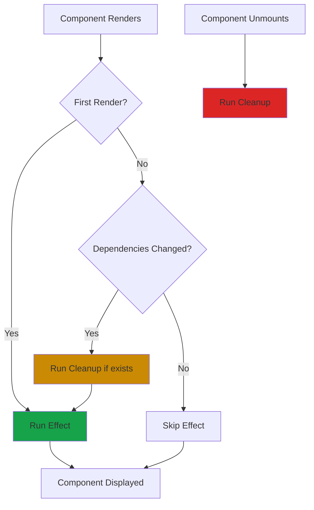
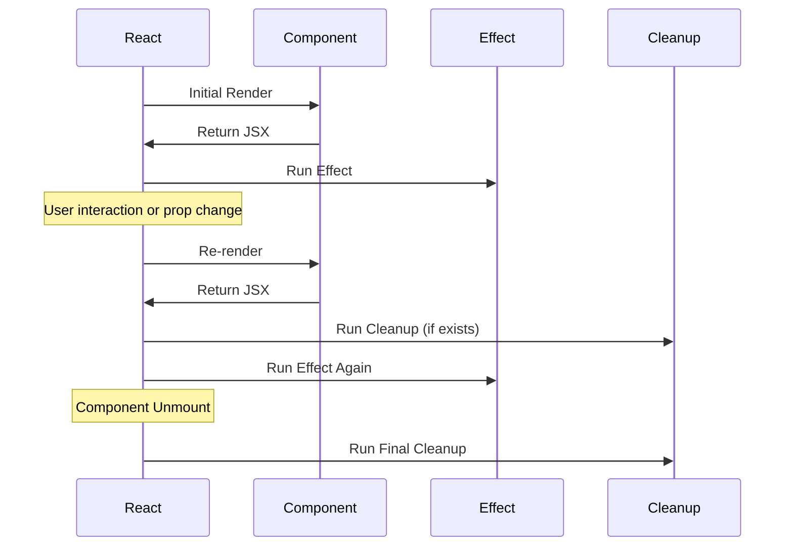

# useEffect Hook in React

## What is useEffect?

`useEffect` is a React Hook that lets you perform side effects in functional components. Side effects are operations that interact with the outside world or affect things outside the component.

Think of useEffect as a way to tell React: "After you render this component, I need you to do something extra."

## What are Side Effects?

Side effects are anything that affects something outside the component:

- Fetching data from an API
- Setting up subscriptions or timers
- Manually changing the DOM
- Reading from localStorage
- Logging to console

## Why do we need useEffect?

In class components, we had lifecycle methods like `componentDidMount`, `componentDidUpdate`, and `componentWillUnmount`. useEffect combines all three:

```javascript
// Without useEffect (class component)
class UserProfile extends React.Component {
  componentDidMount() {
    fetchUserData();
  }
  
  componentDidUpdate(prevProps) {
    if (prevProps.userId !== this.props.userId) {
      fetchUserData();
    }
  }
  
  componentWillUnmount() {
    cleanup();
  }
}

// With useEffect (functional component)
function UserProfile({ userId }) {
  useEffect(() => {
    fetchUserData();
    return () => cleanup();
  }, [userId]);
}
```

## Basic Syntax

```javascript
useEffect(() => {
  // Side effect code here
  
  return () => {
    // Cleanup code (optional)
  };
}, [dependencies]);
```

**Three parts:**
1. **Effect function** - Runs after render
2. **Cleanup function** (optional) - Runs before next effect or unmount
3. **Dependency array** - Controls when effect runs

## How useEffect Works



## Component Lifecycle with useEffect



## Dependency Array Behavior

### No dependency array - runs after every render

```javascript
useEffect(() => {
  console.log('Runs after every render');
});
```

### Empty array - runs only once (on mount)

```javascript
useEffect(() => {
  console.log('Runs only once when component mounts');
}, []);
```

### With dependencies - runs when dependencies change

```javascript
useEffect(() => {
  console.log('Runs when count changes');
}, [count]);
```

## Basic Examples

### Run once on mount

```javascript
function App() {
  useEffect(() => {
    console.log('Component mounted');
  }, []);
  
  return <div>Hello World</div>;
}
```

### Run on every render

```javascript
function Counter() {
  const [count, setCount] = useState(0);
  
  useEffect(() => {
    console.log('Component rendered, count is:', count);
  }); // No dependency array
  
  return <button onClick={() => setCount(count + 1)}>{count}</button>;
}
```

### Run when specific value changes

```javascript
function SearchResults({ query }) {
  const [results, setResults] = useState([]);
  
  useEffect(() => {
    // Fetch results when query changes
    fetchResults(query).then(data => setResults(data));
  }, [query]);
  
  return <div>{results.length} results</div>;
}
```

## Cleanup Function

Some effects need cleanup to prevent memory leaks:

### Timer cleanup

```javascript
function Timer() {
  const [seconds, setSeconds] = useState(0);
  
  useEffect(() => {
    const interval = setInterval(() => {
      setSeconds(s => s + 1);
    }, 1000);
    
    // Cleanup: stop the timer when component unmounts
    return () => {
      clearInterval(interval);
    };
  }, []);
  
  return <div>Seconds: {seconds}</div>;
}
```

### Event listener cleanup

```javascript
function WindowSize() {
  const [width, setWidth] = useState(window.innerWidth);
  
  useEffect(() => {
    function handleResize() {
      setWidth(window.innerWidth);
    }
    
    window.addEventListener('resize', handleResize);
    
    // Cleanup: remove listener when component unmounts
    return () => {
      window.removeEventListener('resize', handleResize);
    };
  }, []);
  
  return <div>Width: {width}px</div>;
}
```

## Data Fetching

### Basic API call

```javascript
function UserProfile({ userId }) {
  const [user, setUser] = useState(null);
  const [loading, setLoading] = useState(true);
  
  useEffect(() => {
    setLoading(true);
    
    fetch(`/api/users/${userId}`)
      .then(res => res.json())
      .then(data => {
        setUser(data);
        setLoading(false);
      });
  }, [userId]);
  
  if (loading) return <div>Loading...</div>;
  return <div>{user.name}</div>;
}
```

### With async/await

```javascript
function UserData({ userId }) {
  const [user, setUser] = useState(null);
  
  useEffect(() => {
    async function fetchUser() {
      const response = await fetch(`/api/users/${userId}`);
      const data = await response.json();
      setUser(data);
    }
    
    fetchUser();
  }, [userId]);
  
  return user ? <div>{user.name}</div> : <div>Loading...</div>;
}
```

### With error handling

```javascript
function UserProfile({ userId }) {
  const [user, setUser] = useState(null);
  const [error, setError] = useState(null);
  const [loading, setLoading] = useState(true);
  
  useEffect(() => {
    async function fetchUser() {
      try {
        setLoading(true);
        const response = await fetch(`/api/users/${userId}`);
        
        if (!response.ok) {
          throw new Error('Failed to fetch user');
        }
        
        const data = await response.json();
        setUser(data);
        setError(null);
      } catch (err) {
        setError(err.message);
        setUser(null);
      } finally {
        setLoading(false);
      }
    }
    
    fetchUser();
  }, [userId]);
  
  if (loading) return <div>Loading...</div>;
  if (error) return <div>Error: {error}</div>;
  return <div>{user.name}</div>;
}
```

## Common Patterns

### Document title update

```javascript
function PageTitle({ title }) {
  useEffect(() => {
    document.title = title;
  }, [title]);
  
  return <h1>{title}</h1>;
}
```

### LocalStorage sync

```javascript
function Counter() {
  const [count, setCount] = useState(() => {
    const saved = localStorage.getItem('count');
    return saved ? JSON.parse(saved) : 0;
  });
  
  useEffect(() => {
    localStorage.setItem('count', JSON.stringify(count));
  }, [count]);
  
  return <button onClick={() => setCount(count + 1)}>{count}</button>;
}
```

### Scroll to top

```javascript
function ScrollToTop() {
  useEffect(() => {
    window.scrollTo(0, 0);
  }, []);
  
  return <div>Content</div>;
}
```

### Subscription

```javascript
function ChatRoom({ roomId }) {
  const [messages, setMessages] = useState([]);
  
  useEffect(() => {
    const subscription = chatAPI.subscribe(roomId, (message) => {
      setMessages(msgs => [...msgs, message]);
    });
    
    return () => {
      subscription.unsubscribe();
    };
  }, [roomId]);
  
  return <div>{messages.map(msg => <p key={msg.id}>{msg.text}</p>)}</div>;
}
```

## Multiple useEffect Hooks

You can use multiple useEffect hooks in one component:

```javascript
function Profile({ userId }) {
  const [user, setUser] = useState(null);
  const [posts, setPosts] = useState([]);
  
  // Fetch user data
  useEffect(() => {
    fetchUser(userId).then(setUser);
  }, [userId]);
  
  // Fetch user's posts
  useEffect(() => {
    fetchPosts(userId).then(setPosts);
  }, [userId]);
  
  // Update document title
  useEffect(() => {
    if (user) {
      document.title = user.name;
    }
  }, [user]);
  
  return <div>...</div>;
}
```

## Common Mistakes

**1. Missing dependencies**

```javascript
// Wrong - missing 'count' in dependency array
function Counter() {
  const [count, setCount] = useState(0);
  
  useEffect(() => {
    const interval = setInterval(() => {
      setCount(count + 1); // Uses stale count
    }, 1000);
    
    return () => clearInterval(interval);
  }, []); // Missing count!
  
  return <div>{count}</div>;
}

// Correct - use functional update
function Counter() {
  const [count, setCount] = useState(0);
  
  useEffect(() => {
    const interval = setInterval(() => {
      setCount(c => c + 1); // Always uses latest count
    }, 1000);
    
    return () => clearInterval(interval);
  }, []);
  
  return <div>{count}</div>;
}
```

**2. Forgetting cleanup**

```javascript
// Wrong - memory leak
useEffect(() => {
  const interval = setInterval(() => {
    console.log('Running...');
  }, 1000);
  // Missing cleanup!
}, []);

// Correct
useEffect(() => {
  const interval = setInterval(() => {
    console.log('Running...');
  }, 1000);
  
  return () => clearInterval(interval);
}, []);
```

**3. Infinite loop**

```javascript
// Wrong - infinite loop
function App() {
  const [count, setCount] = useState(0);
  
  useEffect(() => {
    setCount(count + 1); // Causes re-render, which runs effect again
  }); // No dependency array = runs every render
  
  return <div>{count}</div>;
}

// Correct
function App() {
  const [count, setCount] = useState(0);
  
  useEffect(() => {
    setCount(count + 1);
  }, []); // Runs only once
  
  return <div>{count}</div>;
}
```

**4. Using async directly in useEffect**

```javascript
// Wrong - useEffect can't be async
useEffect(async () => {
  const data = await fetchData();
  setData(data);
}, []);

// Correct - create async function inside
useEffect(() => {
  async function fetchData() {
    const data = await fetch('/api/data');
    setData(data);
  }
  
  fetchData();
}, []);
```

**5. Stale closures**

```javascript
// Wrong - console.log uses stale count
function Counter() {
  const [count, setCount] = useState(0);
  
  useEffect(() => {
    const interval = setInterval(() => {
      console.log(count); // Always logs 0
    }, 1000);
    
    return () => clearInterval(interval);
  }, []); // count not in dependencies
  
  return <button onClick={() => setCount(c => c + 1)}>{count}</button>;
}

// Correct - add count to dependencies
useEffect(() => {
  const interval = setInterval(() => {
    console.log(count); // Logs current count
  }, 1000);
  
  return () => clearInterval(interval);
}, [count]);
```

## Race Conditions

When fetching data based on changing props, handle race conditions:

```javascript
function UserProfile({ userId }) {
  const [user, setUser] = useState(null);
  
  useEffect(() => {
    let cancelled = false;
    
    async function fetchUser() {
      const response = await fetch(`/api/users/${userId}`);
      const data = await response.json();
      
      if (!cancelled) {
        setUser(data);
      }
    }
    
    fetchUser();
    
    return () => {
      cancelled = true;
    };
  }, [userId]);
  
  return user ? <div>{user.name}</div> : <div>Loading...</div>;
}
```

## Best Practices

**Separate concerns:**
```javascript
// Good - each effect has one purpose
useEffect(() => {
  fetchUserData();
}, [userId]);

useEffect(() => {
  document.title = userName;
}, [userName]);

// Avoid - mixing concerns
useEffect(() => {
  fetchUserData();
  document.title = userName;
}, [userId, userName]);
```

**Use descriptive variable names:**
```javascript
// Good
useEffect(() => {
  const subscription = chatAPI.subscribe(roomId, handleMessage);
  return () => subscription.unsubscribe();
}, [roomId]);

// Less clear
useEffect(() => {
  const s = chatAPI.subscribe(roomId, handleMessage);
  return () => s.unsubscribe();
}, [roomId]);
```

**Always include cleanup:**
```javascript
// If you set up something, clean it up
useEffect(() => {
  // Setup
  const timer = setInterval(tick, 1000);
  window.addEventListener('resize', handleResize);
  
  // Cleanup
  return () => {
    clearInterval(timer);
    window.removeEventListener('resize', handleResize);
  };
}, []);
```

## Things to Remember

1. useEffect runs after render, not during
2. Cleanup runs before next effect or unmount
3. Empty dependency array = runs once on mount
4. Missing dependency array = runs on every render
5. Always cleanup subscriptions, timers, listeners
6. Can't use async directly in useEffect
7. Use functional updates to avoid stale state
8. Handle race conditions in data fetching
9. Each effect should have one clear purpose

## Related Topics

- useState - Managing component state
- useRef - Persisting values without re-renders
- useCallback - Memoizing functions for effects
- Custom Hooks - Extracting reusable effect logic