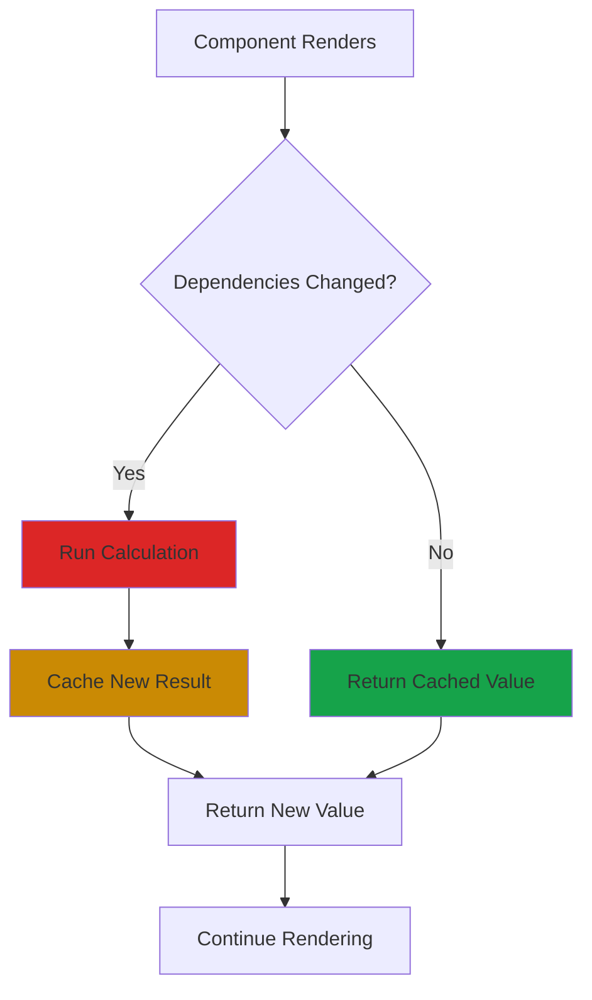
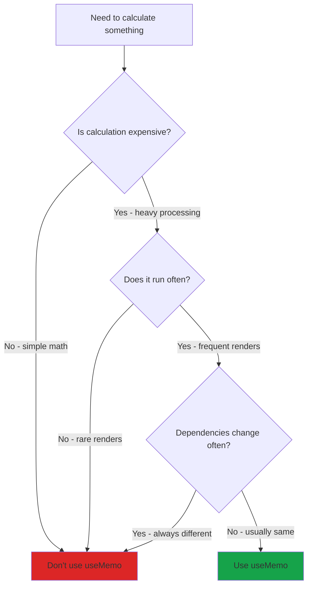

# useMemo Hook in React

## What is useMemo?

`useMemo` is a React Hook that lets you cache the result of a calculation between re-renders. It only recalculates when its dependencies change.

Think of it like a smart calculator that remembers previous answers. If you ask it the same question again, it gives you the stored answer instead of recalculating.

## The Problem: Expensive Calculations

Without useMemo, React recalculates everything on every render:

```javascript
function ProductList({ products, filter }) {
  // This runs on EVERY render, even if products haven't changed
  const expensiveCalculation = products
    .filter(p => p.category === filter)
    .map(p => ({ ...p, price: p.price * 1.18 }))
    .sort((a, b) => b.price - a.price);
  
  return <div>{/* render products */}</div>;
}
```

If the component re-renders because of some unrelated state change, this expensive calculation runs again unnecessarily.

## The Solution: useMemo

```javascript
function ProductList({ products, filter }) {
  // Only recalculates when products or filter changes
  const expensiveCalculation = useMemo(() => {
    return products
      .filter(p => p.category === filter)
      .map(p => ({ ...p, price: p.price * 1.18 }))
      .sort((a, b) => b.price - a.price);
  }, [products, filter]);
  
  return <div>{/* render products */}</div>;
}
```

## Basic Syntax

```javascript
import { useMemo } from 'react';

const cachedValue = useMemo(() => {
  // Expensive calculation
  return computeExpensiveValue(a, b);
}, [a, b]); // Dependencies
```

**Two parts:**
1. **Calculation function** - Returns the value to cache
2. **Dependency array** - When to recalculate

## How useMemo Works



## When to Use vs Not Use



## Basic Examples

### Expensive calculation

```javascript
function NumberList({ numbers }) {
  const sum = useMemo(() => {
    console.log('Calculating sum...');
    return numbers.reduce((total, num) => total + num, 0);
  }, [numbers]);
  
  return <div>Sum: {sum}</div>;
}
```

### Filtering large arrays

```javascript
function UserList({ users, searchTerm }) {
  const filteredUsers = useMemo(() => {
    console.log('Filtering users...');
    return users.filter(user => 
      user.name.toLowerCase().includes(searchTerm.toLowerCase())
    );
  }, [users, searchTerm]);
  
  return (
    <ul>
      {filteredUsers.map(user => (
        <li key={user.id}>{user.name}</li>
      ))}
    </ul>
  );
}
```

### Sorting data

```javascript
function ProductGrid({ products, sortBy }) {
  const sortedProducts = useMemo(() => {
    console.log('Sorting products...');
    return [...products].sort((a, b) => {
      if (sortBy === 'price') return a.price - b.price;
      if (sortBy === 'name') return a.name.localeCompare(b.name);
      return 0;
    });
  }, [products, sortBy]);
  
  return <div>{/* render sorted products */}</div>;
}
```

## useMemo vs useCallback

Both are for optimization, but they cache different things:

```javascript
// useMemo - caches a VALUE
const expensiveValue = useMemo(() => {
  return computeValue(a, b);
}, [a, b]);

// useCallback - caches a FUNCTION
const expensiveFunction = useCallback(() => {
  doSomething(a, b);
}, [a, b]);

// useCallback is actually useMemo for functions
const expensiveFunction = useMemo(() => {
  return () => doSomething(a, b);
}, [a, b]);
```

**Use useMemo when:** You want to cache a calculated value
**Use useCallback when:** You want to cache a function definition

## Performance Comparison

### Without useMemo

```javascript
function App() {
  const [count, setCount] = useState(0);
  const [text, setText] = useState('');
  
  // Runs on EVERY render (even when just text changes)
  const expensiveCalculation = heavyComputation(count);
  
  return (
    <>
      <button onClick={() => setCount(count + 1)}>Count: {count}</button>
      <input value={text} onChange={e => setText(e.target.value)} />
      <div>{expensiveCalculation}</div>
    </>
  );
}
```

**Problem:** Typing in input triggers re-render, runs expensive calculation even though `count` didn't change.

### With useMemo

```javascript
function App() {
  const [count, setCount] = useState(0);
  const [text, setText] = useState('');
  
  // Only runs when count changes
  const expensiveCalculation = useMemo(() => {
    return heavyComputation(count);
  }, [count]);
  
  return (
    <>
      <button onClick={() => setCount(count + 1)}>Count: {count}</button>
      <input value={text} onChange={e => setText(e.target.value)} />
      <div>{expensiveCalculation}</div>
    </>
  );
}
```

**Solution:** Typing in input doesn't recalculate, only changing count does.

## Common Use Cases

### 1. Derived state from props

```javascript
function Statistics({ data }) {
  const stats = useMemo(() => ({
    total: data.length,
    average: data.reduce((sum, n) => sum + n, 0) / data.length,
    max: Math.max(...data),
    min: Math.min(...data)
  }), [data]);
  
  return (
    <div>
      <p>Total: {stats.total}</p>
      <p>Average: {stats.average}</p>
      <p>Max: {stats.max}</p>
      <p>Min: {stats.min}</p>
    </div>
  );
}
```

### 2. Preventing unnecessary re-renders

```javascript
function Parent() {
  const [count, setCount] = useState(0);
  
  // Without useMemo, creates new object every render
  // Causes Child to re-render even if data is same
  const config = useMemo(() => ({
    theme: 'dark',
    language: 'en'
  }), []); // Empty deps = never changes
  
  return (
    <>
      <button onClick={() => setCount(count + 1)}>Count: {count}</button>
      <Child config={config} />
    </>
  );
}

const Child = React.memo(({ config }) => {
  console.log('Child rendered');
  return <div>{config.theme}</div>;
});
```

### 3. Complex transformations

```javascript
function DataDashboard({ rawData }) {
  const processedData = useMemo(() => {
    return rawData
      .filter(item => item.active)
      .map(item => ({
        ...item,
        formattedDate: new Date(item.timestamp).toLocaleDateString(),
        percentage: (item.value / item.total) * 100
      }))
      .sort((a, b) => b.percentage - a.percentage)
      .slice(0, 10); // Top 10
  }, [rawData]);
  
  return <Table data={processedData} />;
}
```

### 4. Searching and filtering

```javascript
function SearchableList({ items, searchQuery, filters }) {
  const filteredItems = useMemo(() => {
    return items
      .filter(item => {
        const matchesSearch = item.name
          .toLowerCase()
          .includes(searchQuery.toLowerCase());
        const matchesCategory = !filters.category || 
          item.category === filters.category;
        const matchesPrice = item.price >= filters.minPrice && 
          item.price <= filters.maxPrice;
        
        return matchesSearch && matchesCategory && matchesPrice;
      });
  }, [items, searchQuery, filters]);
  
  return (
    <ul>
      {filteredItems.map(item => (
        <li key={item.id}>{item.name}</li>
      ))}
    </ul>
  );
}
```

## Common Mistakes

**1. Overusing useMemo**

```javascript
// Bad - useMemo for simple calculations
function Component({ a, b }) {
  const sum = useMemo(() => a + b, [a, b]); // Overhead > Benefit
  return <div>{sum}</div>;
}

// Good - just calculate directly
function Component({ a, b }) {
  const sum = a + b; // Fast enough without memoization
  return <div>{sum}</div>;
}
```

**2. Missing dependencies**

```javascript
// Bad - missing 'multiplier' in dependencies
function Component({ numbers, multiplier }) {
  const total = useMemo(() => {
    return numbers.reduce((sum, n) => sum + n, 0) * multiplier;
  }, [numbers]); // Stale multiplier!
  
  return <div>{total}</div>;
}

// Good - include all dependencies
function Component({ numbers, multiplier }) {
  const total = useMemo(() => {
    return numbers.reduce((sum, n) => sum + n, 0) * multiplier;
  }, [numbers, multiplier]);
  
  return <div>{total}</div>;
}
```

**3. Memoizing everything**

```javascript
// Bad - unnecessary memoization everywhere
function Component({ name, age }) {
  const greeting = useMemo(() => `Hello ${name}`, [name]);
  const isAdult = useMemo(() => age >= 18, [age]);
  const displayAge = useMemo(() => `Age: ${age}`, [age]);
  
  return <div>{greeting} - {displayAge}</div>;
}

// Good - only memoize expensive operations
function Component({ name, age, largeDataset }) {
  const greeting = `Hello ${name}`;
  const isAdult = age >= 18;
  const displayAge = `Age: ${age}`;
  
  // Only this is worth memoizing
  const processedData = useMemo(() => {
    return expensiveProcessing(largeDataset);
  }, [largeDataset]);
  
  return <div>{greeting} - {displayAge}</div>;
}
```

**4. Creating new objects/arrays in dependencies**

```javascript
// Bad - dependency array with new object
function Component({ user }) {
  const userData = useMemo(() => {
    return processUser(user);
  }, [{ id: user.id, name: user.name }]); // New object every time!
  
  return <div>{userData.name}</div>;
}

// Good - use primitive values
function Component({ user }) {
  const userData = useMemo(() => {
    return processUser(user);
  }, [user.id, user.name]); // Primitive values
  
  return <div>{userData.name}</div>;
}
```

**5. Forgetting useMemo doesn't guarantee caching**

```javascript
// useMemo is a hint, not a guarantee
// React may discard cached values in low memory situations
const value = useMemo(() => expensiveCalc(), [deps]);

// Don't rely on useMemo for correctness
// Only use it for performance
```

## When NOT to Use useMemo

**Don't use useMemo for:**

1. **Simple calculations**
   ```javascript
   // Bad
   const sum = useMemo(() => a + b, [a, b]);
   
   // Good
   const sum = a + b;
   ```

2. **Values that change frequently**
   ```javascript
   // Bad - recalculates on every keystroke anyway
   const filtered = useMemo(() => {
     return items.filter(i => i.name.includes(searchTerm));
   }, [items, searchTerm]); // searchTerm changes constantly
   ```

3. **First optimization attempt**
   - Profile first, optimize later
   - Don't prematurely optimize
   - useMemo adds its own overhead

4. **All calculations**
   - React is fast by default
   - Most calculations are cheap
   - Only memoize proven bottlenecks

## Measuring Performance

Use React DevTools Profiler to see if useMemo helps:

```javascript
function Component({ data }) {
  // Add console.log to see when it runs
  const processed = useMemo(() => {
    console.log('Processing data...');
    return expensiveProcessing(data);
  }, [data]);
  
  return <div>{processed}</div>;
}
```

**Before adding useMemo:**
- Record component performance
- Identify slow renders
- Find expensive calculations

**After adding useMemo:**
- Compare render times
- Check if recalculations reduced
- Ensure dependencies are correct

## useMemo with Context

Prevent unnecessary re-renders in context consumers:

```javascript
function Provider({ children }) {
  const [state, setState] = useState(initialState);
  
  // Without useMemo, creates new object every render
  // All consumers re-render even if state hasn't changed
  const value = useMemo(() => ({
    state,
    setState
  }), [state]);
  
  return (
    <MyContext.Provider value={value}>
      {children}
    </MyContext.Provider>
  );
}
```

## Best Practices

**1. Only memoize expensive operations**
```javascript
// Good candidates for useMemo:
- Large array transformations
- Complex calculations
- Expensive object creation
- Recursive operations
- Heavy data processing

// Bad candidates:
- Simple math (a + b)
- String concatenation
- Basic conditionals
- Primitive operations
```

**2. Include all dependencies**
```javascript
// Always include everything used inside useMemo
const result = useMemo(() => {
  return calculate(a, b, c);
}, [a, b, c]); // All variables used
```

**3. Profile before optimizing**
```javascript
// 1. Measure first
// 2. Find bottleneck
// 3. Add useMemo
// 4. Measure again
// 5. Keep only if it helps
```

**4. Keep memoized functions pure**
```javascript
// Good - pure function
const result = useMemo(() => {
  return data.map(item => item.value * 2);
}, [data]);

// Bad - side effects
const result = useMemo(() => {
  console.log('Calculating...'); // Side effect
  apiCall(); // Side effect
  return data.map(item => item.value * 2);
}, [data]);
```

## Real-World Example

```javascript
function Dashboard({ userId, dateRange, filters }) {
  // Fetch user data
  const [userData, setUserData] = useState(null);
  
  useEffect(() => {
    fetchUserData(userId).then(setUserData);
  }, [userId]);
  
  // Expensive calculations only when needed
  const analytics = useMemo(() => {
    if (!userData) return null;
    
    return {
      totalSpent: calculateTotal(userData.transactions, dateRange),
      topCategories: findTopCategories(userData.transactions, 5),
      monthlyTrend: calculateTrend(userData.transactions, dateRange),
      averageTransaction: calculateAverage(userData.transactions)
    };
  }, [userData, dateRange]);
  
  const filteredTransactions = useMemo(() => {
    if (!userData) return [];
    
    return userData.transactions
      .filter(t => matchesFilters(t, filters))
      .sort((a, b) => b.date - a.date);
  }, [userData, filters]);
  
  if (!userData) return <div>Loading...</div>;
  
  return (
    <div>
      <AnalyticsCard data={analytics} />
      <TransactionList transactions={filteredTransactions} />
    </div>
  );
}
```

## Things to Remember

1. useMemo caches calculation results between re-renders
2. Only recalculates when dependencies change
3. Don't overuse - adds its own overhead
4. Profile before optimizing
5. Include all dependencies in the array
6. useMemo is for performance, not correctness
7. React may discard cache in low memory
8. Use for expensive calculations, not simple math
9. Works great with large data transformations
10. Prevents unnecessary re-renders when used with React.memo

## Related Topics

- useCallback - Memoize functions instead of values
- React.memo - Prevent component re-renders
- useEffect - Similar dependency array concept
- useState - Often used together with useMemo