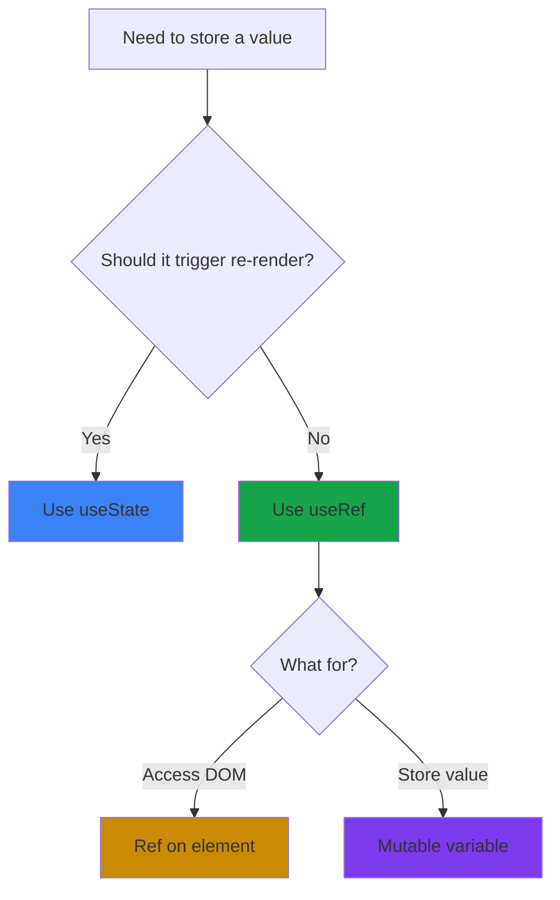
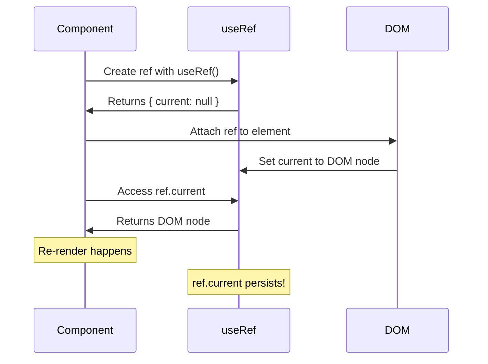

# useRef Hook in React

## What is useRef?

`useRef` is a React Hook that lets you reference a value that's not needed for rendering. It returns a mutable object with a `.current` property that persists across re-renders.

Think of it like a box where you can store something that React won't track for re-rendering.

## Why do we need useRef?

There are two main uses:

1. **Accessing DOM elements** - Get direct access to DOM nodes
2. **Storing mutable values** - Keep values between renders without triggering re-renders

## useRef vs useState



**useState:**
- Triggers re-render when updated
- Used for values that affect the UI
- Asynchronous updates

**useRef:**
- Doesn't trigger re-render when updated
- Used for values that don't affect the UI
- Synchronous updates

## Basic Syntax

```javascript
import { useRef } from 'react';

const ref = useRef(initialValue);

// Access the value
ref.current

// Update the value
ref.current = newValue
```

## How useRef Works



## Accessing DOM Elements

### Focus an input

```javascript
import { useRef } from 'react';

function SearchBar() {
  const inputRef = useRef(null);
  
  const handleFocus = () => {
    inputRef.current.focus();
  };
  
  return (
    <div>
      <input ref={inputRef} type="text" />
      <button onClick={handleFocus}>Focus Input</button>
    </div>
  );
}
```

### Scroll to element

```javascript
function ScrollExample() {
  const sectionRef = useRef(null);
  
  const scrollToSection = () => {
    sectionRef.current.scrollIntoView({ behavior: 'smooth' });
  };
  
  return (
    <>
      <button onClick={scrollToSection}>Scroll Down</button>
      <div style={{ height: '100vh' }}></div>
      <div ref={sectionRef}>Target Section</div>
    </>
  );
}
```

### Play/Pause video

```javascript
function VideoPlayer() {
  const videoRef = useRef(null);
  
  const play = () => {
    videoRef.current.play();
  };
  
  const pause = () => {
    videoRef.current.pause();
  };
  
  return (
    <div>
      <video ref={videoRef} src="video.mp4" />
      <button onClick={play}>Play</button>
      <button onClick={pause}>Pause</button>
    </div>
  );
}
```

## Storing Mutable Values

### Previous value tracking

```javascript
function Counter() {
  const [count, setCount] = useState(0);
  const prevCountRef = useRef();
  
  useEffect(() => {
    prevCountRef.current = count;
  });
  
  return (
    <div>
      <p>Current: {count}</p>
      <p>Previous: {prevCountRef.current}</p>
      <button onClick={() => setCount(count + 1)}>Increment</button>
    </div>
  );
}
```

### Storing timer ID

```javascript
function Stopwatch() {
  const [time, setTime] = useState(0);
  const intervalRef = useRef(null);
  
  const start = () => {
    intervalRef.current = setInterval(() => {
      setTime(t => t + 1);
    }, 1000);
  };
  
  const stop = () => {
    clearInterval(intervalRef.current);
  };
  
  return (
    <div>
      <p>Time: {time}s</p>
      <button onClick={start}>Start</button>
      <button onClick={stop}>Stop</button>
    </div>
  );
}
```

### Tracking component mount

```javascript
function Component() {
  const isFirstRender = useRef(true);
  
  useEffect(() => {
    if (isFirstRender.current) {
      isFirstRender.current = false;
      console.log('First render');
    } else {
      console.log('Subsequent render');
    }
  });
  
  return <div>Component</div>;
}
```

## useRef vs useState Example

```javascript
function ComparisonDemo() {
  const [stateCount, setStateCount] = useState(0);
  const refCount = useRef(0);
  
  const incrementState = () => {
    setStateCount(stateCount + 1);
    console.log('Component will re-render');
  };
  
  const incrementRef = () => {
    refCount.current = refCount.current + 1;
    console.log('No re-render, but value updated to:', refCount.current);
  };
  
  return (
    <div>
      <p>State Count: {stateCount}</p>
      <p>Ref Count: {refCount.current}</p>
      <button onClick={incrementState}>Increment State (re-renders)</button>
      <button onClick={incrementRef}>Increment Ref (no re-render)</button>
    </div>
  );
}
```

## Common Patterns

### Debounce with useRef

```javascript
function SearchInput() {
  const [query, setQuery] = useState('');
  const timeoutRef = useRef(null);
  
  const handleChange = (e) => {
    const value = e.target.value;
    setQuery(value);
    
    clearTimeout(timeoutRef.current);
    timeoutRef.current = setTimeout(() => {
      console.log('Searching for:', value);
    }, 500);
  };
  
  return <input value={query} onChange={handleChange} />;
}
```

### Click outside to close

```javascript
function Dropdown() {
  const [isOpen, setIsOpen] = useState(false);
  const dropdownRef = useRef(null);
  
  useEffect(() => {
    function handleClickOutside(event) {
      if (dropdownRef.current && !dropdownRef.current.contains(event.target)) {
        setIsOpen(false);
      }
    }
    
    document.addEventListener('mousedown', handleClickOutside);
    return () => {
      document.removeEventListener('mousedown', handleClickOutside);
    };
  }, []);
  
  return (
    <div ref={dropdownRef}>
      <button onClick={() => setIsOpen(!isOpen)}>Toggle</button>
      {isOpen && <div>Dropdown Content</div>}
    </div>
  );
}
```

### Storing callback ref

```javascript
function CallbackRefExample() {
  const [height, setHeight] = useState(0);
  
  const measureRef = useCallback(node => {
    if (node !== null) {
      setHeight(node.getBoundingClientRect().height);
    }
  }, []);
  
  return (
    <>
      <div ref={measureRef}>Content to measure</div>
      <p>Height: {height}px</p>
    </>
  );
}
```

## Forwarding Refs

Pass refs to child components:

```javascript
import { forwardRef, useRef } from 'react';

const CustomInput = forwardRef((props, ref) => {
  return <input ref={ref} {...props} />;
});

function Parent() {
  const inputRef = useRef(null);
  
  return (
    <>
      <CustomInput ref={inputRef} />
      <button onClick={() => inputRef.current.focus()}>
        Focus Input
      </button>
    </>
  );
}
```

## Common Mistakes

**1. Trying to render ref.current**

```javascript
// Wrong - ref changes don't trigger re-renders
function BadExample() {
  const countRef = useRef(0);
  
  return (
    <div>
      <p>{countRef.current}</p> {/* Won't update on screen */}
      <button onClick={() => countRef.current++}>Increment</button>
    </div>
  );
}

// Correct - use useState for values that affect UI
function GoodExample() {
  const [count, setCount] = useState(0);
  
  return (
    <div>
      <p>{count}</p>
      <button onClick={() => setCount(count + 1)}>Increment</button>
    </div>
  );
}
```

**2. Reading ref during render**

```javascript
// Wrong - ref.current might not be set yet
function BadExample() {
  const inputRef = useRef(null);
  const width = inputRef.current?.offsetWidth; // Might be null
  
  return <input ref={inputRef} />;
}

// Correct - read ref in useEffect or event handler
function GoodExample() {
  const inputRef = useRef(null);
  const [width, setWidth] = useState(0);
  
  useEffect(() => {
    setWidth(inputRef.current.offsetWidth);
  }, []);
  
  return <input ref={inputRef} />;
}
```

**3. Forgetting cleanup**

```javascript
// Wrong - memory leak
function BadTimer() {
  const intervalRef = useRef(null);
  
  const start = () => {
    intervalRef.current = setInterval(() => {
      console.log('Tick');
    }, 1000);
  };
  
  return <button onClick={start}>Start</button>;
  // No cleanup!
}

// Correct - cleanup in useEffect
function GoodTimer() {
  const intervalRef = useRef(null);
  
  const start = () => {
    intervalRef.current = setInterval(() => {
      console.log('Tick');
    }, 1000);
  };
  
  useEffect(() => {
    return () => {
      if (intervalRef.current) {
        clearInterval(intervalRef.current);
      }
    };
  }, []);
  
  return <button onClick={start}>Start</button>;
}
```

**4. Creating new ref on every render**

```javascript
// Wrong - creates new ref object each render
function BadExample() {
  const inputRef = { current: null }; // New object every render
  return <input ref={inputRef} />;
}

// Correct - useRef persists across renders
function GoodExample() {
  const inputRef = useRef(null); // Same object every render
  return <input ref={inputRef} />;
}
```

## When to use useRef

**Use useRef when you need to:**
- Access DOM elements directly
- Store timers, intervals, or subscriptions
- Keep track of previous values
- Store any mutable value that shouldn't trigger re-renders
- Implement imperative methods (focus, play, pause)

**Don't use useRef when:**
- The value affects what's rendered (use useState)
- You need the component to re-render on change
- You're trying to store data that should be in state

## useRef with TypeScript

```typescript
// DOM element ref
const inputRef = useRef<HTMLInputElement>(null);

// Mutable value ref
const countRef = useRef<number>(0);

// Timer ID ref
const timerRef = useRef<NodeJS.Timeout | null>(null);
```

## Best Practices

**1. Initialize refs properly**
```javascript
// Good - initialize with null for DOM refs
const divRef = useRef(null);

// Good - initialize with value for mutable refs
const countRef = useRef(0);
```

**2. Check if ref exists before using**
```javascript
// Good - check before accessing
if (inputRef.current) {
  inputRef.current.focus();
}

// Or use optional chaining
inputRef.current?.focus();
```

**3. Don't read/write refs during render**
```javascript
// Bad - reading during render
function BadComponent() {
  const ref = useRef(0);
  ref.current++; // Don't do this during render
  return <div>{ref.current}</div>;
}

// Good - read/write in effects or event handlers
function GoodComponent() {
  const ref = useRef(0);
  
  const handleClick = () => {
    ref.current++;
    console.log(ref.current);
  };
  
  return <button onClick={handleClick}>Click</button>;
}
```

**4. Clean up refs in useEffect**
```javascript
useEffect(() => {
  const timer = setInterval(() => {}, 1000);
  timerRef.current = timer;
  
  return () => {
    if (timerRef.current) {
      clearInterval(timerRef.current);
    }
  };
}, []);
```

## Things to Remember

1. useRef returns a mutable object that persists across re-renders
2. Changing ref.current doesn't trigger re-renders
3. Use refs for DOM access and storing mutable values
4. Don't read/write refs during rendering
5. Always check if ref.current exists before using it
6. Use useState for values that should trigger re-renders
7. Clean up timers and subscriptions stored in refs
8. Refs are perfect for imperative operations (focus, play, scroll)

## Related Topics

- useState - For values that should trigger re-renders
- useEffect - For side effects and cleanup
- useCallback - For memoizing callback functions
- forwardRef - For passing refs to child components