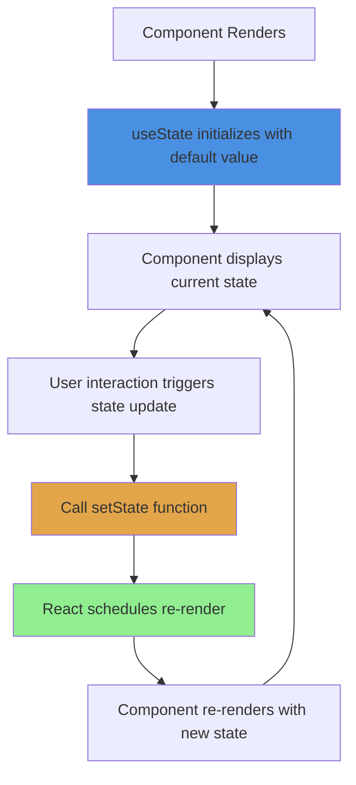
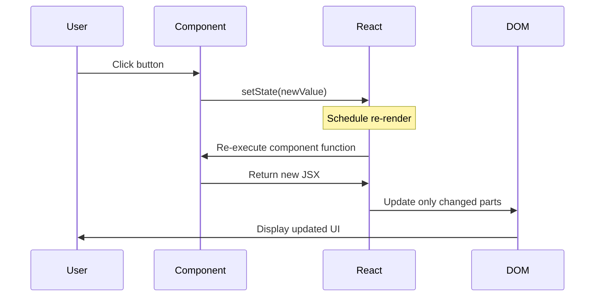

# useState Hook in React

## What is useState?

`useState` is a React Hook that lets you add state to functional components. State is data that can change over time, and when it changes, React re-renders your component to show the updated UI.

Think of state like a variable that React watches. When you update it, React knows to refresh that part of your UI.

## Why do we need State?

Regular variables don't cause re-renders:

```javascript
function Counter() {
  let count = 0; // This won't work!
  
  function increment() {
    count = count + 1;
    console.log(count); // Logs correctly, but UI doesn't update
  }
  
  return <button onClick={increment}>{count}</button>;
}
```

With `useState`, React tracks changes and updates the UI:

```javascript
function Counter() {
  const [count, setCount] = useState(0);
  
  function increment() {
    setCount(count + 1); // UI updates automatically!
  }
  
  return <button onClick={increment}>{count}</button>;
}
```

## Basic Syntax

```javascript
const [value, setValue] = useState(initialValue);
```

- `value` - The current state value
- `setValue` - Function to update the state
- `initialValue` - Starting value (can be any type)

## How useState Works



## State Update Flow



## Basic Examples

### Simple counter

```javascript
import { useState } from 'react';

function Counter() {
  const [count, setCount] = useState(0);
  
  return (
    <div>
      <p>Count: {count}</p>
      <button onClick={() => setCount(count + 1)}>Increment</button>
      <button onClick={() => setCount(count - 1)}>Decrement</button>
      <button onClick={() => setCount(0)}>Reset</button>
    </div>
  );
}
```

### Boolean state (toggle)

```javascript
function Toggle() {
  const [isOn, setIsOn] = useState(false);
  
  return (
    <div>
      <p>The switch is {isOn ? 'ON' : 'OFF'}</p>
      <button onClick={() => setIsOn(!isOn)}>
        Toggle
      </button>
    </div>
  );
}
```

### String state (input)

```javascript
function Greeting() {
  const [name, setName] = useState('');
  
  return (
    <div>
      <input 
        value={name}
        onChange={(e) => setName(e.target.value)}
        placeholder="Enter your name"
      />
      <p>Hello, {name}!</p>
    </div>
  );
}
```

## State with Objects

When state is an object, you need to spread the old state:

```javascript
function UserForm() {
  const [user, setUser] = useState({
    name: '',
    age: '',
    email: ''
  });
  
  function updateName(newName) {
    setUser({
      ...user,  // Keep other properties
      name: newName  // Update only name
    });
  }
  
  return (
    <input 
      value={user.name}
      onChange={(e) => updateName(e.target.value)}
    />
  );
}
```

**Important:** Always create a new object, don't mutate the existing one.

## State with Arrays

Similar to objects, create a new array instead of mutating:

```javascript
function TodoList() {
  const [todos, setTodos] = useState([]);
  
  function addTodo(text) {
    setTodos([...todos, { id: Date.now(), text }]);
  }
  
  function removeTodo(id) {
    setTodos(todos.filter(todo => todo.id !== id));
  }
  
  return (
    <div>
      {todos.map(todo => (
        <div key={todo.id}>
          {todo.text}
          <button onClick={() => removeTodo(todo.id)}>Delete</button>
        </div>
      ))}
    </div>
  );
}
```

## Multiple State Variables

You can use `useState` multiple times in one component:

```javascript
function Form() {
  const [name, setName] = useState('');
  const [age, setAge] = useState(0);
  const [email, setEmail] = useState('');
  
  return (
    <form>
      <input value={name} onChange={(e) => setName(e.target.value)} />
      <input value={age} onChange={(e) => setAge(e.target.value)} />
      <input value={email} onChange={(e) => setEmail(e.target.value)} />
    </form>
  );
}
```

## Functional Updates

When new state depends on previous state, use a function:

```javascript
function Counter() {
  const [count, setCount] = useState(0);
  
  // Wrong - can cause issues with async updates
  function increment() {
    setCount(count + 1);
    setCount(count + 1); // Doesn't add 2!
  }
  
  // Correct - use functional update
  function incrementTwice() {
    setCount(prevCount => prevCount + 1);
    setCount(prevCount => prevCount + 1); // Adds 2!
  }
  
  return <button onClick={incrementTwice}>{count}</button>;
}
```

## Lazy Initialization

If initial state is expensive to compute, use a function:

```javascript
// Bad - runs calculation on every render
const [data, setData] = useState(expensiveCalculation());

// Good - runs only once
const [data, setData] = useState(() => expensiveCalculation());
```

## Common Patterns

### Controlled inputs

```javascript
function SearchBox() {
  const [query, setQuery] = useState('');
  
  return (
    <input 
      value={query}
      onChange={(e) => setQuery(e.target.value)}
      placeholder="Search..."
    />
  );
}
```

### Form handling

```javascript
function ContactForm() {
  const [formData, setFormData] = useState({
    name: '',
    email: '',
    message: ''
  });
  
  function handleChange(field, value) {
    setFormData({
      ...formData,
      [field]: value
    });
  }
  
  function handleSubmit(e) {
    e.preventDefault();
    console.log('Submitted:', formData);
  }
  
  return (
    <form onSubmit={handleSubmit}>
      <input 
        value={formData.name}
        onChange={(e) => handleChange('name', e.target.value)}
      />
      <input 
        value={formData.email}
        onChange={(e) => handleChange('email', e.target.value)}
      />
      <button type="submit">Submit</button>
    </form>
  );
}
```

### Toggle functionality

```javascript
function Accordion() {
  const [isOpen, setIsOpen] = useState(false);
  
  return (
    <div>
      <button onClick={() => setIsOpen(!isOpen)}>
        {isOpen ? 'Hide' : 'Show'} Content
      </button>
      {isOpen && <div>Hidden content here</div>}
    </div>
  );
}
```

## Common Mistakes

**1. Mutating state directly**

```javascript
// Wrong - mutates state
function addItem() {
  todos.push(newItem);
  setTodos(todos); // React doesn't see the change
}

// Correct - create new array
function addItem() {
  setTodos([...todos, newItem]);
}
```

**2. Using state value immediately after setting**

```javascript
function handleClick() {
  setCount(count + 1);
  console.log(count); // Still old value!
  // State updates are asynchronous
}
```

**3. Not using functional updates**

```javascript
// Wrong - may use stale state
function increment() {
  setCount(count + 1);
}

// Correct - always uses latest state
function increment() {
  setCount(prevCount => prevCount + 1);
}
```

**4. Initializing with expensive computation**

```javascript
// Wrong - runs every render
const [data, setData] = useState(calculateData());

// Correct - runs only once
const [data, setData] = useState(() => calculateData());
```

## State vs Props

| State | Props |
|-------|-------|
| Owned by component | Passed from parent |
| Can be changed | Read-only |
| Causes re-render when changed | Component re-renders when props change |
| Use useState | Received as function parameters |

## Real-world Examples

### Shopping cart

```javascript
function ShoppingCart() {
  const [items, setItems] = useState([]);
  
  function addItem(product) {
    setItems([...items, { ...product, quantity: 1 }]);
  }
  
  function removeItem(id) {
    setItems(items.filter(item => item.id !== id));
  }
  
  function updateQuantity(id, quantity) {
    setItems(items.map(item => 
      item.id === id ? { ...item, quantity } : item
    ));
  }
  
  const total = items.reduce((sum, item) => 
    sum + (item.price * item.quantity), 0
  );
  
  return (
    <div>
      <h2>Total: ${total}</h2>
      {items.map(item => (
        <div key={item.id}>
          {item.name} - ${item.price} x {item.quantity}
          <button onClick={() => removeItem(item.id)}>Remove</button>
        </div>
      ))}
    </div>
  );
}
```

### Dark mode toggle

```javascript
function App() {
  const [isDark, setIsDark] = useState(false);
  
  return (
    <div style={{ 
      background: isDark ? '#333' : '#fff',
      color: isDark ? '#fff' : '#333'
    }}>
      <button onClick={() => setIsDark(!isDark)}>
        {isDark ? 'Light' : 'Dark'} Mode
      </button>
      <p>Content here</p>
    </div>
  );
}
```

## Best Practices

**Keep state minimal:**
```javascript
// Avoid - storing computed values
const [firstName, setFirstName] = useState('');
const [lastName, setLastName] = useState('');
const [fullName, setFullName] = useState(''); // Unnecessary!

// Better - compute on render
const [firstName, setFirstName] = useState('');
const [lastName, setLastName] = useState('');
const fullName = `${firstName} ${lastName}`;
```

**Group related state:**
```javascript
// Instead of separate states
const [x, setX] = useState(0);
const [y, setY] = useState(0);

// Consider grouping
const [position, setPosition] = useState({ x: 0, y: 0 });
```

**Use meaningful names:**
```javascript
// Good
const [isLoading, setIsLoading] = useState(false);
const [userList, setUserList] = useState([]);

// Avoid
const [flag, setFlag] = useState(false);
const [data, setData] = useState([]);
```

## Things to Remember

1. State is private to the component
2. Updating state triggers a re-render
3. State updates are asynchronous
4. Always use setter function, never mutate directly
5. Use functional updates when new state depends on old
6. Each useState call creates independent state
7. State persists between renders
8. Initial state is only used on first render

## Related Topics

- useEffect - Side effects when state changes
- useReducer - Complex state logic
- Props - Passing data to components
- Component Re-rendering - When and why components update